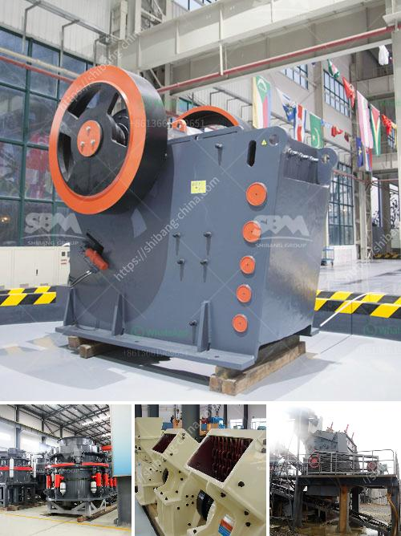

<h3>quarry and mining crusher equipment</h3>
Quarry and mining crusher equipment is an essential equipment in the construction and mining industry. For the quarry and mining industry, crushing equipment plays a vital role. It is the only way to reduce large stones into small pieces of rocks. An essential part of any quarry or mining operation is the crusher, and choosing the right one is critical.

Crushing rocks can be very demanding, in terms of time, manpower, and machine wear and tear. Therefore, crushers designed for purposes specifically in the quarry and mining industry have to be able to withstand the intense pressure and wear and tear. Crushing equipment should be able to produce the desired product sizes at high capacities, without compromising the quality of the materials.

There are various types of crushers available for different applications. Jaw crushers are commonly used for primary crushing, while impact crushers and cone crushers are commonly used for secondary and tertiary crushing. Each type of crusher has its own benefits and disadvantages, depending on the material being crushed and the desired product size.

In addition to the type of crusher, the selection of the right equipment also depends on the hardness, abrasiveness, moisture content, and shape of the material being crushed. Different crushers have different capacities, so it is important to choose a crusher that matches the required capacity of the quarry or mining operation.

Furthermore, the quality and reliability of crusher equipment are crucial. Equipment failure can result in costly downtime, so using reliable equipment from reputable manufacturers is vital. Regular maintenance and inspections should also be carried out to ensure optimal performance and prevent premature wear and tear.

In conclusion, quarry and mining crusher equipment is essential for the efficient and effective operation of any quarry or mining operation. Choosing the right crusher and maintaining it properly can ensure maximum productivity and minimize downtime. Therefore, investing in high-quality and reliable crusher equipment is a wise decision for any quarry or mining operation.
<h3>Contact us</h3><ul><li><strong>Whatsapp:&nbsp;<a href="https://wa.me/8613661969651">+8613661969651</a></strong></li><li><a href="https://swt.shibang-china.com/?git&amp;zhl&amp;quarry and mining crusher equipment"><strong>Online Service(chat now)</strong></a></li></ul><h3>Related</h3><ul><li><a href='italia dry production line supplier.md'>italia dry production line supplier</a></li><li><a href='manufacture of conveyor belts in mexico.md'>manufacture of conveyor belts in mexico</a></li><li><a href='washing plant supplier in mozambique.md'>washing plant supplier in mozambique</a></li><li><a href='diamond river mining equipment in china.md'>diamond river mining equipment in china</a></li><li><a href='diatomaceous earth processing machinery.md'>diatomaceous earth processing machinery</a></li></ul>