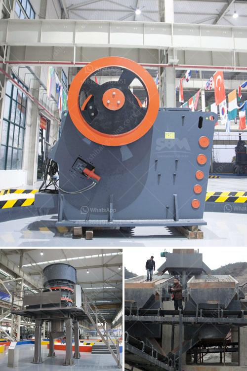

<h3>quarry business cost in india</h3>
Quarrying refers to the process of extracting stones and other minerals from the earth's crust. A quarry is often referred to as an open-pit mine where the rocks and minerals are extracted. India, being rich in natural resources, has ample reserves of Marble, Granite, Sandstone, and other varieties of stones. Starting a quarry business in India involves a considerable amount of capital investment, technical planning, and thorough understanding of the mining industry.

Starting a quarry business in India requires a substantial amount of capital. To begin with, the quarry owners need to identify the material, they want to extract and its specific application. Investment in machinery, such as excavation equipment, transportation vehicles, and a crushing unit, is crucial. Since the stones are heavy, it is critical to have efficient machinery to carry out the mining operations smoothly.

The total cost ranges from INR 20,00,000 to INR 2,00,00,000, depending upon the scale of operations, size of machinery deployed, and other factors. Land and machinery are the major fixed costs. The smaller the required capacity, the lower will be the investment requirement.

In addition to the capital investment, the business incurs operating costs such as electricity, fuel, salaries, and other daily expenses. These costs can vary depending on various factors such as location, size, and scale of operations.

India is known for its rich reserves of Marble, Granite, Sandstone, and other natural stones. The famous quarries such as Jaisalmer Yellow Marble, Ambaji White Marble, Abu Black Marble in Rajasthan, and Madurai Granite in Tamil Nadu are some of the top contributors to the total production of stones in India. The extraction and mining activities in these quarries are carried out using modern techniques and machinery.

Running a quarry business in India comes with its own set of challenges. Obtaining necessary permits and approvals from the government, particularly environmental clearances, can be a lengthy and complicated process. Quarries need to comply with various regulations, including safety standards, to ensure the well-being of the workers and the sustainable extraction of resources.

Moreover, there is fierce competition in the market, as there are numerous established players in the industry. Newcomers need to strive to offer competitive prices and maintain a high level of quality to establish themselves in the market.

Despite the challenges, the quarry business in India holds immense potential for growth. The demand for stones and minerals is constantly rising, driven by the construction and infrastructure development projects. India's booming real estate sector is a major consumer of raw materials, including stones, which opens up opportunities for quarry businesses.

Furthermore, the quarrying industry contributes significantly to the country's economy, providing employment to a large number of people. It has a multiplier effect on various related industries, such as transportation, equipment manufacturing, and construction.

Starting a quarry business in India is a capital-intensive endeavor that requires strategic planning, substantial investment, and compliance with regulations. However, it offers tremendous growth potential and opportunities in a country abundant with natural resources. With careful planning and efficient operations, a quarry business can be a lucrative venture for investors looking for long-term returns.
<h3>Contact us</h3><ul><li><strong>Whatsapp:&nbsp;<a href="https://wa.me/8613661969651">+8613661969651</a></strong></li><li><a href="https://swt.shibang-china.com/?git&amp;zhl&amp;quarry business cost in india"><strong>Online Service(chat now)</strong></a></li></ul><h3>Related</h3><ul><li><a href='quarry and mining crusher equipment.md'>quarry and mining crusher equipment</a></li><li><a href='vertical grinding mill machine in china.md'>vertical grinding mill machine in china</a></li><li><a href='cracker roller mill limestone.md'>cracker roller mill limestone</a></li><li><a href='lime plant manufacturer in turkey.md'>lime plant manufacturer in turkey</a></li><li><a href='mobile crusher triman.md'>mobile crusher triman</a></li></ul>