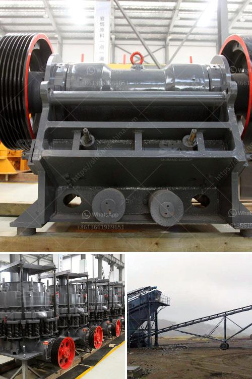

<h3>quarry crusher equipment for sale brisbane</h3>
Quarry operations require heavy machinery and equipment to efficiently process and transport materials. The quarry crusher equipment plays a vital role in the efficiency and profitability of quarry operations. With the increasing demand for quality aggregates, it is essential to invest in durable and reliable equipment. Brisbane, with its rich natural resources and construction projects, is a prime location for quarry operations. This article explores the importance of quarry crusher equipment and highlights the benefits of investing in high-quality equipment in Brisbane.

Quarry crusher equipment, also known as gravel crusher equipment, refers to the jaw crusher, impact crusher, cone crusher, and other machines used to crush the stones and rocks into smaller and more manageable sizes. The availability of the right equipment for a particular quarry operation significantly impacts its productivity, cost-efficiency, and overall success.

One of the primary benefits of investing in high-quality quarry crusher equipment is its long-term durability and reliability. Quarry operations involve heavy-duty tasks that put immense stress on the equipment. Inferior-quality machinery may break down frequently, leading to costly repairs, hampered production, and increased downtime. By choosing reputable and reliable brands, quarry operators in Brisbane can minimize breakdowns, increase production capacity, and ensure smooth operations.

Furthermore, investing in advanced crusher equipment enhances the overall safety of the quarry operation. Modern crushers come equipped with several safety features, such as automatic tramp release systems, overload protection, and advanced control systems. These features help prevent accidents, reduce the risk of equipment damage, and protect the well-being of the workers. Safety should always be a priority in any industrial setting, and investing in quality equipment promotes a safer working environment in quarries.

Additionally, high-quality quarry crusher equipment often incorporates advanced technology and innovative design, resulting in higher efficiency and throughput. Advanced crushers have improved crushing capabilities, allowing the quarry operators to produce more aggregates in less time. This increased production capacity not only meets the growing demand for construction materials but also boosts the profitability of the quarry operation.

Moreover, investing in reputable quarry crusher equipment ensures compliance with environmental regulations. Quarry operations must adhere to strict guidelines and minimize their impact on the environment. High-quality crushers produce fewer emissions, have lower noise levels, and consume less energy, reducing their carbon footprint. By choosing eco-friendly equipment, quarry operators can contribute to sustainable and responsible quarrying practices.

For quarry operators in Brisbane, finding reliable suppliers for quarry crusher equipment for sale is crucial. Reputable suppliers offer a wide range of equipment options to cater to the specific needs and requirements of a quarry operation. Additionally, they provide expert guidance, excellent after-sales service, and spare parts availability. Building a long-term relationship with a reputable supplier ensures ongoing support, timely maintenance, and easy access to any necessary repairs or replacements.

In conclusion, quarry crusher equipment plays a vital role in the success and profitability of quarry operations. Investing in high-quality and durable equipment brings numerous benefits, including increased productivity, improved safety, enhanced efficiency, and compliance with environmental regulations. Quarry operators in Brisbane should prioritize the selection of reliable suppliers who offer a wide range of equipment options and deliver exceptional service. By making smart investments in quality equipment, quarry operators can maximize their returns and contribute to the growth of the construction industry in Brisbane.
<h3>Contact us</h3><ul><li><strong>Whatsapp:&nbsp;<a href="https://wa.me/8613661969651">+8613661969651</a></strong></li><li><a href="https://swt.shibang-china.com/?git&amp;zhl&amp;quarry crusher equipment for sale brisbane"><strong>Online Service(chat now)</strong></a></li></ul><h3>Related</h3><ul><li><a href='professional granite cone crusher.md'>professional granite cone crusher</a></li><li><a href='ball mill in malaysia.md'>ball mill in malaysia</a></li><li><a href='portable cone crusher plant.md'>portable cone crusher plant</a></li><li><a href='how to build a gold washing plant.md'>how to build a gold washing plant</a></li><li><a href='iron ore crushing plant setup cost in india.md'>iron ore crushing plant setup cost in india</a></li></ul>