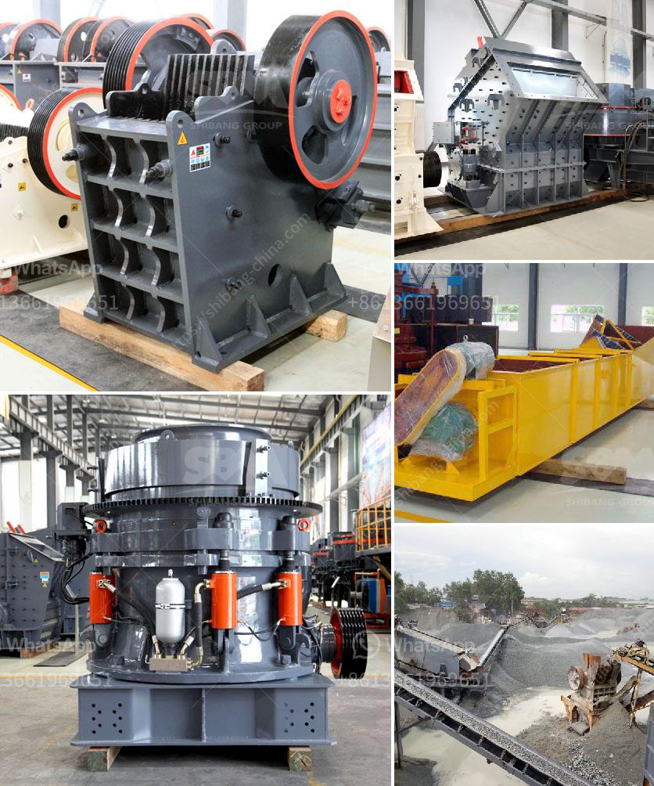

<h3>quarry crusher equipment for sale</h3>
Quarry operations and mining activities require a wide range of machinery and equipment. Like many other industries, quarrying also requires heavy machinery and equipment to carry out its operations. However, quarrying activities can cause significant environmental impacts, such as deforestation, erosion, and contamination of nearby water bodies. Therefore, it is essential to invest in high-quality quarry crusher equipment that can help minimize these negative impacts and ensure the efficient and sustainable operation of the quarry site.

One of the primary machines used in quarrying is the crusher. Crushers are used to break stones and rocks into smaller, more manageable sizes and to produce sand and aggregate materials for construction purposes. Quarry crusher equipment plays an important role in the quarrying process as the equipment reduces large-sized stones into smaller ones and helps in producing specific sizes of crushed stones.

There are various types of crushing machines available in the market, including impact crushers, jaw crushers, cone crushers, and hammer crushers. Each type of crusher comes with its own set of unique features and advantages, which makes it suitable for different types of quarry operations. For instance, impact crushers are ideal for tertiary crushing and producing cubical-shaped aggregates, while jaw crushers are well-suited for primary crushing of stones with high compressive strength.

When considering the purchase of quarry crusher equipment, several factors need to be taken into account. Firstly, it is essential to assess the quarry's specific requirements and the desired output. Different quarry operations may have different rock types, hardness levels, and sizes of the raw materials. Therefore, the equipment chosen should be able to handle these specific requirements.

Secondly, the durability and reliability of the equipment should be carefully evaluated. Quarry operations are often carried out under harsh conditions, including extreme temperature variations, dust, and heavy loads. Hence, the machinery and equipment used in quarrying must be designed and manufactured to withstand such conditions and to ensure uninterrupted and trouble-free operation.

Moreover, it is crucial to consider the maintenance and operating costs associated with the quarry crusher equipment. High-quality equipment may come at a higher initial cost but can prove to be more cost-effective in the long run due to its durability, efficiency, and lower maintenance requirements. On the other hand, cheaper equipment may save money initially but may require frequent repairs and replacements, resulting in higher operating costs.

Lastly, but equally important, is to select quarry crusher equipment from reputable manufacturers or suppliers. Reliable manufacturers have a proven track record of producing high-quality, durable, and efficient equipment. Moreover, they often provide comprehensive after-sales services, including technical support, spare parts availability, and repair services, to ensure the smooth functioning of the machinery and equipment throughout its lifespan.

In conclusion, investing in high-quality quarry crusher equipment is a necessary step towards ensuring the efficient and sustainable operation of a quarry site. With the right equipment, quarry operations can be carried out more efficiently, reducing environmental impacts and minimizing downtime. Therefore, it is essential to carefully consider all the factors mentioned above when procuring quarry crusher equipment to make an informed decision.
<h3>Contact us</h3><ul><li><strong>Whatsapp:&nbsp;<a href="https://wa.me/8613661969651">+8613661969651</a></strong></li><li><a href="https://swt.shibang-china.com/?git&amp;zhl&amp;quarry crusher equipment for sale"><strong>Online Service(chat now)</strong></a></li></ul><h3>Related</h3><ul><li><a href='small stone crusher machine.md'>small stone crusher machine</a></li><li><a href='chrome mining equipment for sale in south africa.md'>chrome mining equipment for sale in south africa</a></li><li><a href='ball mill ball manufacturer in mumbai.md'>ball mill ball manufacturer in mumbai</a></li><li><a href='products lm vertical grinding mills.md'>products lm vertical grinding mills</a></li><li><a href='mobile crushing plant hire product.md'>mobile crushing plant hire product</a></li></ul>