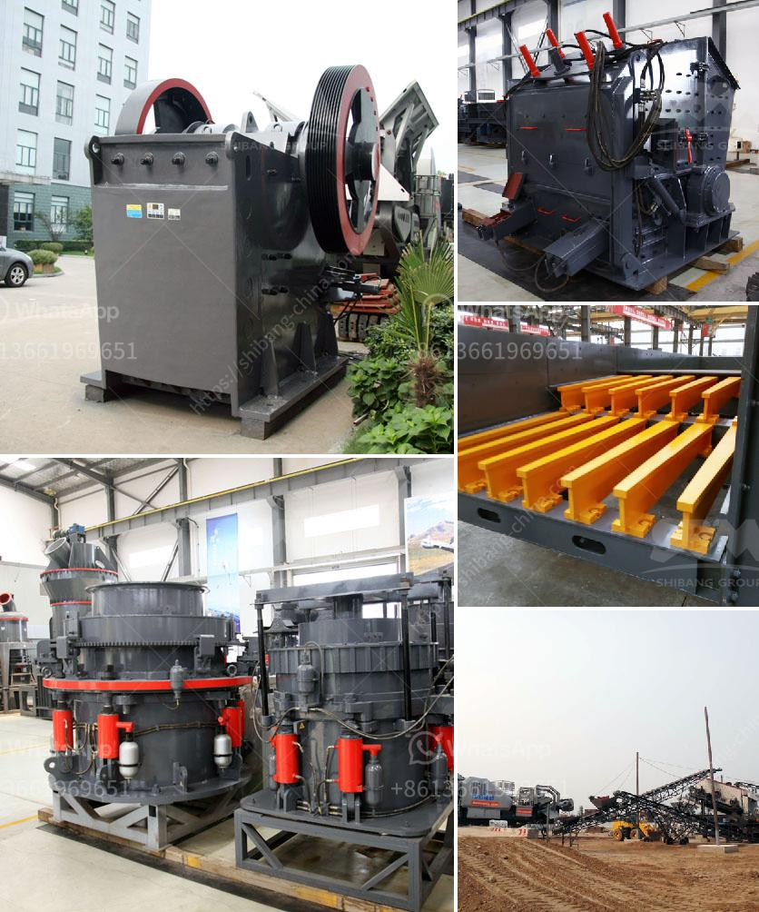

<h3>quarry crusher for sale</h3>
In the construction industry, quarries play a vital role in supplying raw materials for various projects. However, operating a quarry can be a challenging task as it involves extracting rock, crushing it into smaller pieces, and then transporting it to the desired location. To simplify this process, quarry crushers are used, which are heavy-duty machines designed to crush large rocks into smaller aggregates for construction purposes.

Quarry crushers are an essential part of the quarrying process as they help in reducing the size of large stones and make them suitable for various construction applications. These crushers are robust machines with high power that can handle immense pressure and are capable of crushing even the hardest rocks. They are equipped with powerful motors, sturdy linings, and advanced control systems, making them highly efficient and reliable.

One of the leading manufacturers of quarry crushers is ABC Machinery. They offer a wide range of quarry crushers for sale, catering to different requirements and specifications. Their crushers are known for their high-quality construction, durability, and efficient crushing capabilities. ABC Machinery's quarry crushers are designed to deliver consistent performance and maximize productivity while minimizing downtime and maintenance costs.

When considering a quarry crusher for sale, it is crucial to evaluate its key features and benefits. ABC Machinery's quarry crushers are built to last and deliver exceptional performance under demanding operating conditions. They are designed with safety features that ensure the protection of both the operator and the machine. These crushers are also equipped with advanced control systems that allow for precise adjustments and monitoring during the crushing process.

Another significant advantage of quarry crushers is their versatility. They can be used in a variety of applications, including road construction, railway ballast production, concrete production, and asphalt recycling. This versatility makes quarry crushers a valuable asset for companies involved in different construction projects.

Purchasing a quarry crusher for sale from ABC Machinery ensures a reliable and dependable machine that can withstand the rigors of quarrying operations. ABC Machinery also provides comprehensive after-sales support, including spare parts availability, technical assistance, and regular maintenance services. This ensures that the purchased crusher remains in optimal condition and operates efficiently throughout its lifespan.

Investing in a quarry crusher for sale can be a wise decision for quarrying businesses looking to improve productivity, reduce operational costs, and meet the growing demand for construction materials. ABC Machinery's range of quarry crushers offers a cost-effective solution to quarry operators, enabling them to unlock the value in their quarry manufacturing processes.

In conclusion, quarry crushers play a crucial role in the quarrying industry. They are powerful machines designed to crush large rocks into smaller aggregates, making them suitable for construction applications. ABC Machinery offers a wide range of quarry crushers for sale, providing reliable, efficient, and versatile solutions to quarry operators. Investing in a quarry crusher from ABC Machinery ensures a cost-effective and reliable machine that can optimize quarry manufacturing processes.
<h3>Contact us</h3><ul><li><strong>Whatsapp:&nbsp;<a href="https://wa.me/8613661969651">+8613661969651</a></strong></li><li><a href="https://swt.shibang-china.com/?git&amp;zhl&amp;quarry crusher for sale"><strong>Online Service(chat now)</strong></a></li></ul><h3>Related</h3><ul><li><a href='stone crusher rent based mobile machine.md'>stone crusher rent based mobile machine</a></li><li><a href='roller mill for ore.md'>roller mill for ore</a></li><li><a href='roller crusher equipment manufacturer.md'>roller crusher equipment manufacturer</a></li><li><a href='india stone crusher machine price in china.md'>india stone crusher machine price in china</a></li><li><a href='roller crusher for coal.md'>roller crusher for coal</a></li></ul>