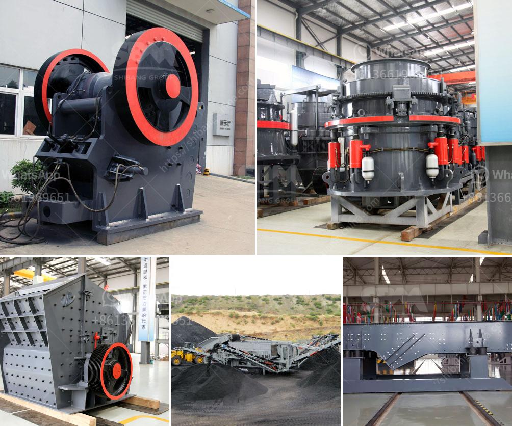

<h3>quarry crusher machine manufacturing company in malaysia</h3>
Quarry Crusher Machine Manufacturing Company in Malaysia: Providing Innovative Solutions for Construction Industry

In the past decade, Malaysia has witnessed a significant growth in the construction industry. This has led to a surge in demand for quarry crushers in the country. As a result, several manufacturing companies have emerged to meet the needs of this booming market. One such company that has established itself as a leader in providing innovative quarry crusher solutions is based in Malaysia.

This thriving manufacturing company specializes in designing and manufacturing high-quality quarry crushers that are used in various construction projects. With a strong commitment to delivering efficient and cost-effective solutions, they have gained a reputation for their superior craftsmanship and cutting-edge technology.

One of the key factors that sets this Malaysian manufacturing company apart from its competitors is its emphasis on research and development. They invest heavily in technological advancements, ensuring that their quarry crushers are equipped with the latest features and capabilities. This allows construction companies to improve their productivity and efficiency on the job site.

Additionally, the company places great importance on customer satisfaction. They work closely with their clients to understand their specific requirements, enabling them to provide tailor-made solutions that meet their exact needs. Whether it is a small-scale project or a large-scale construction venture, this manufacturing company ensures that their quarry crushers are built to withstand the demands of any job.

Furthermore, this Malaysia-based manufacturing company prioritizes sustainability in their operations. They are committed to developing eco-friendly solutions, utilizing energy-efficient manufacturing processes, and promoting the use of recyclable materials. By doing so, they aim to contribute to the long-term well-being of both the environment and the construction industry.

In conclusion, the quarry crusher manufacturing company in Malaysia has played a vital role in supporting the growth of the construction industry in the country. Through their commitment to innovation, customer satisfaction, and sustainability, they have become a reliable and trusted partner for construction companies nationwide. With their high-quality quarry crushers, they have not only contributed to the development of infrastructure but also helped propel Malaysia towards becoming a global construction hub.
<h3>Contact us</h3><ul><li><strong>Whatsapp:&nbsp;<a href="https://wa.me/8613661969651">+8613661969651</a></strong></li><li><a href="https://swt.shibang-china.com/?git&amp;zhl&amp;quarry crusher machine manufacturing company in malaysia"><strong>Online Service(chat now)</strong></a></li></ul><h3>Related</h3><ul><li><a href='mobile crushing price.md'>mobile crushing price</a></li><li><a href='chrome ore washing plant.md'>chrome ore washing plant</a></li><li><a href='crusher pew jaw crusher.md'>crusher pew jaw crusher</a></li><li><a href='how to pulverized limestone crusher.md'>how to pulverized limestone crusher</a></li><li><a href='grinding mill for red oxide ore.md'>grinding mill for red oxide ore</a></li></ul>