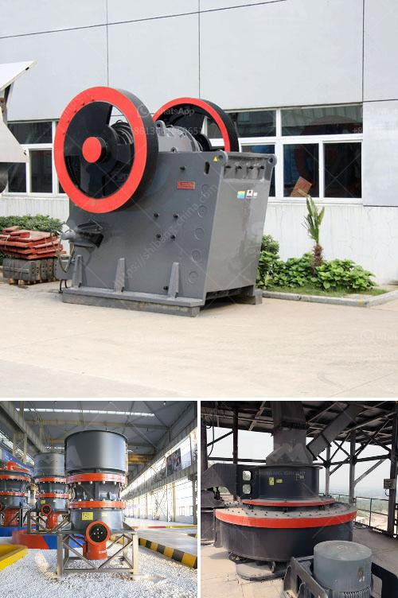

<h3>quarry crushing suppliers</h3>
When it comes to construction projects, having access to the right materials is crucial for ensuring the success and durability of the structure. One of the primary materials needed for these projects is aggregates, which are commonly sourced from quarry crushing suppliers.

Quarry crushing suppliers play a significant role in the construction industry by providing high-quality aggregates that are used for various applications, such as road construction, building foundations, and concrete production. These suppliers operate quarries, which are large open-pit mines where different types of rocks, such as limestone, granite, and sandstone, are extracted and crushed into smaller pieces.

The process of quarry crushing involves several stages. Initially, the rock is blasted from the quarry's surface using explosives, breaking it into manageable pieces. Next, heavy machinery, such as excavators and bulldozers, is used to transport the rocks to the crushing plant. The rocks are then fed into a primary crusher, which reduces their size further. From there, secondary and tertiary crushers are used to further refine the aggregates into specific sizes.

What sets quarry crushing suppliers apart is their commitment to producing high-quality materials. These suppliers have stringent quality control measures in place to ensure that the aggregates meet industry standards and specifications. They perform regular testing to determine the particle size distribution, shape, strength, and durability of the aggregates. By adhering to these quality control processes, quarry crushing suppliers can provide construction companies with aggregates that are reliable, consistent, and suitable for various applications.

In addition to providing high-quality materials, quarry crushing suppliers also offer a range of services to their customers. They typically have a fleet of trucks and delivery services, ensuring that the aggregates are transported to construction sites in a timely manner. This convenience saves construction companies the hassle of sourcing and transporting the materials themselves. Some quarry crushing suppliers may also offer onsite crushing services, where they bring their equipment to the construction site, allowing for easy and immediate access to aggregates.

It is worth noting that quarry crushing suppliers prioritize environmental sustainability. They operate in compliance with environmental regulations, implementing measures to minimize the impact of their activities on the surrounding ecosystem. Many suppliers use advanced technologies, such as dust suppression systems and water recycling methods, to ensure that their operations are as environmentally friendly as possible.

Quarry crushing suppliers form an integral part of the construction industry, providing the essential materials needed for infrastructure development. Their dedication to quality, convenience, and sustainability makes them a reliable partner for construction companies. Whether it's for road construction, building projects, or concrete production, quarry crushing suppliers ensure that the supply of high-quality aggregates is readily available, promoting successful and durable construction projects.

In conclusion, quarry crushing suppliers play a vital role in the construction industry by providing high-quality aggregates that meet industry standards. Their commitment to quality, convenience, and environmental sustainability makes them the go-to choice for construction companies in need of reliable materials. With their comprehensive range of services and adherence to strict quality control measures, quarry crushing suppliers ensure the success and durability of construction projects.
<h3>Contact us</h3><ul><li><strong>Whatsapp:&nbsp;<a href="https://wa.me/8613661969651">+8613661969651</a></strong></li><li><a href="https://swt.shibang-china.com/?git&amp;zhl&amp;quarry crushing suppliers"><strong>Online Service(chat now)</strong></a></li></ul><h3>Related</h3><ul><li><a href='best mill for wet grinding of calcium carbonate.md'>best mill for wet grinding of calcium carbonate</a></li><li><a href='prices of stone crushers.md'>prices of stone crushers</a></li><li><a href='mini cement plant tons per day.md'>mini cement plant tons per day</a></li><li><a href='hard rock ultrafine grinder in canada.md'>hard rock ultrafine grinder in canada</a></li><li><a href='business plan for crushing and screening.md'>business plan for crushing and screening</a></li></ul>