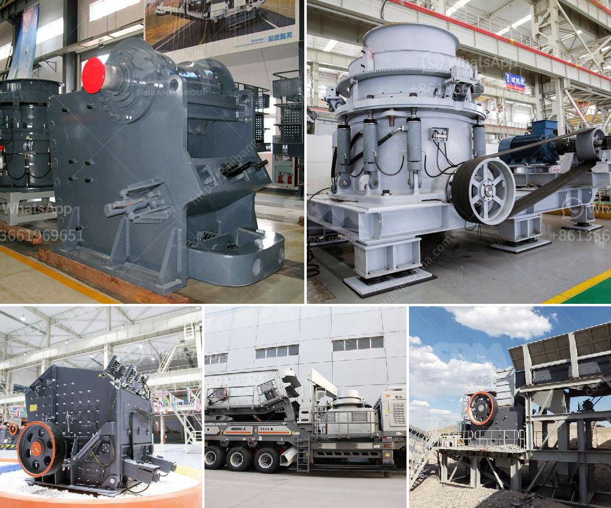

<h3>quarry equipment for hire in nigeria</h3>
Quarrying is a thriving industry in Nigeria, with the construction sector driving the demand for machinery and equipment. The heavy-duty quarrying equipment is essential for the efficient production of aggregates, road materials, and other construction materials. However, each quarrying operation has specific needs and challenges, which often require customized solutions to optimize the productivity and profits.

In Nigeria, quarrying equipment includes several types of machines such as crusher machines, grinding mills, belt conveyors, vibrating feeders, and screens. These machines are used in various capacities to break large chunks of raw material into smaller, more manageable sizes, reducing the overall workload for the quarrying process.

One of the main advantages of hiring quarry equipment in Nigeria is its versatility, enabling operators to perform a wide range of tasks. For instance, a crusher machine can be utilized to crush rocks into smaller sizes for the production of aggregates, while a grinding mill can grind limestone into fine powders to be used as additives in cement production. Similarly, belt conveyors can efficiently transport materials from one processing stage to another, simplifying the workflow.

Besides versatility, another key benefit of hiring quarry equipment in Nigeria is cost-effectiveness. Owning and maintaining heavy-duty machinery can be a considerable financial burden for businesses, especially those engaged in smaller quarrying operations. By opting for equipment for hire, companies can access the necessary machinery without the high acquisition costs, maintenance fees, and potential downtime associated with owning equipment.

Moreover, hiring quarry equipment allows businesses to tap into the expertise and support offered by equipment providers. Professional operators are usually on hand to train quarrying staff on how to utilize the machinery effectively, ensuring optimal performance. Additionally, if any issues arise, equipment providers can quickly provide technical support, minimizing downtime and maximizing productivity.

In conclusion, quarry equipment for hire in Nigeria plays a vital role in the production process of quarrying operations. The versatility and cost-effectiveness of hiring these machines provide businesses with the flexibility to meet their specific needs, optimize productivity, and ultimately boost their profits. With the support of equipment providers, quarrying businesses can navigate the challenges of their industry with ease.
<h3>Contact us</h3><ul><li><strong>Whatsapp:&nbsp;<a href="https://wa.me/8613661969651">+8613661969651</a></strong></li><li><a href="https://swt.shibang-china.com/?git&amp;zhl&amp;quarry equipment for hire in nigeria"><strong>Online Service(chat now)</strong></a></li></ul><h3>Related</h3><ul><li><a href='list of all the equipment for gold mining.md'>list of all the equipment for gold mining</a></li><li><a href='stone crushers supply.md'>stone crushers supply</a></li><li><a href='crusher plant in construction.md'>crusher plant in construction</a></li><li><a href='gold stamp mill manufacturer in china.md'>gold stamp mill manufacturer in china</a></li><li><a href='diagram of vertical hammer mill.md'>diagram of vertical hammer mill</a></li></ul>