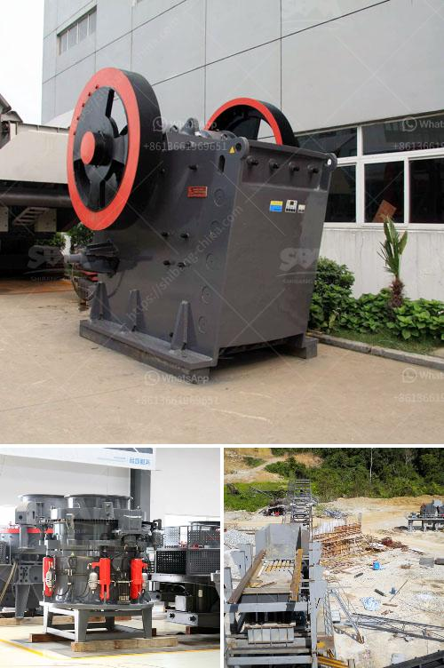

<h3>quarry equipment for sale in south africa</h3>
Quarrying is an essential activity in the construction and building industry. With the ever-increasing demand for building materials, quarry equipment plays a pivotal role in the supply chain. From excavation to crushing and screening, quarrying equipment is used in various stages of the process. As South Africa's economy continues to grow, the importance of quarry equipment is also more crucial than ever.

Quarry equipment for sale in South Africa has been widely recognized by many construction and building industries due to its excellent performance. With numerous quarrying equipment manufacturers, positive feedback from customers, and a strong after-sales service network, we can often see quarry equipment models in the production sites of many mines, industrial parks, and construction sites in South Africa.

The latest quarry equipment models in South Africa are designed to meet the varied needs of customers, and they are rigid, durable, and flexible enough to be used for all types of quarrying and stone processing applications. Whether you need stationary crushers, mobile crushers, or portable crushers, we have the right equipment for your project.

In addition to the crushers, we also offer a wide range of vibrating feeders, vibrating screens, and washing systems that are necessary for the processing of various materials such as granite, limestone, and gravel. Our quarry equipment for sale in South Africa is meticulously designed to produce quality products and meet customers' demand.

Furthermore, our quarry equipment for sale in South Africa has been proven by customers' high praise, and it is an ideal choice for customers who want to buy equipment that is reliable, durable, and high-yielding. We believe that through continuous efforts and pursuit, we will provide customers with more cost-effective quarry equipment in South Africa, making their businesses more profitable.

In conclusion, quarry equipment is a vital part of the construction industry in South Africa, and it plays a significant role in the extraction of valuable minerals or other geological materials. With the continued development of the country's infrastructure, the demand for quarrying equipment will only increase. By investing in reliable and efficient quarry equipment, businesses can maximize their productivity and profitability.
<h3>Contact us</h3><ul><li><strong>Whatsapp:&nbsp;<a href="https://wa.me/8613661969651">+8613661969651</a></strong></li><li><a href="https://swt.shibang-china.com/?git&amp;zhl&amp;quarry equipment for sale in south africa"><strong>Online Service(chat now)</strong></a></li></ul><h3>Related</h3><ul><li><a href='iron ore mines equipments.md'>iron ore mines equipments</a></li><li><a href='limestone manufacturing process.md'>limestone manufacturing process</a></li><li><a href='crusher gap crusher.md'>crusher gap crusher</a></li><li><a href='difference between pulveriser and.md'>difference between pulveriser and</a></li><li><a href='manufacturer of ultrafine machine india.md'>manufacturer of ultrafine machine india</a></li></ul>