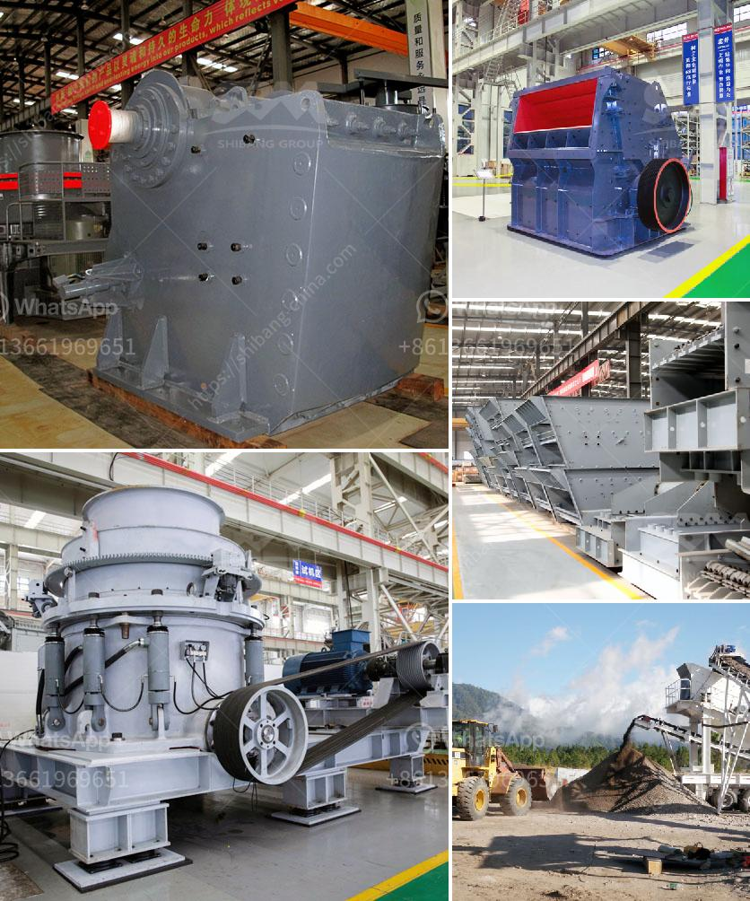

<h3>quarry equipment</h3>
In the mining industry, the success of any project depends on the efficiency and productivity of its machinery and equipment. Quarry equipment plays a vital role in the success of these operations, enabling companies to increase their output and meet customer demands efficiently. Whether it's removing large quantities of materials, extracting valuable minerals, or crushing rocks to produce aggregates, quarry equipment provides the essential capabilities to get the job done.

One of the key components in a quarry operation is the heavy machinery used to extract and transport materials. For instance, large excavators equipped with hydraulic systems are commonly used to extract granite, limestone, or sand. These robust machines can also handle the toughest terrains and weather conditions, ensuring minimal downtime and maximum productivity. The use of hydraulic systems allows for quick and precise movements, enabling operators to extract materials with precision and accuracy.

In addition to extraction, quarry equipment includes various types of crushers, screens, and feeders. Crushers are crucial for breaking down large rocks into smaller, more manageable sizes. They come in different varieties, such as jaw crushers, impact crushers, or cone crushers, each suitable for different quarrying applications. Screens and feeders are responsible for separating the extracted materials into different sizes, ensuring the end product meets specific requirements.

Modern quarry equipment also incorporates advanced technologies to improve overall efficiency and safety. For example, some machines are equipped with GPS systems, allowing operators to navigate the quarry accurately and optimize the extraction process. Additionally, remote-control systems enable operators to control the machinery from a safe distance, minimizing the risk of accidents.

Investing in high-quality quarry equipment is crucial for any mining or construction company seeking success. These machines not only streamline the extraction process but also significantly increase productivity, reducing overall costs and effectively meeting customer demands. Furthermore, by incorporating advanced technologies, quarry equipment manufacturers are continuously improving safety measures, ensuring operators work in a secure environment.

In conclusion, quarry equipment plays a pivotal role in the mining and construction industry by enabling companies to extract valuable minerals and produce high-quality aggregates efficiently. With advanced technologies and robust designs, this equipment is indispensable for any successful quarry operation. By investing in reliable machinery, mining and construction companies can ensure optimal productivity, reduce costs, and meet customer demands effectively.
<h3>Contact us</h3><ul><li><strong>Whatsapp:&nbsp;<a href="https://wa.me/8613661969651">+8613661969651</a></strong></li><li><a href="https://swt.shibang-china.com/?git&amp;zhl&amp;quarry equipment"><strong>Online Service(chat now)</strong></a></li></ul><h3>Related</h3><ul><li><a href='china shanghai zenith company.md'>china shanghai zenith company</a></li><li><a href='mobile crusher machine manufacturer.md'>mobile crusher machine manufacturer</a></li><li><a href='stone crushing plant use jaw crusher price list.md'>stone crushing plant use jaw crusher price list</a></li><li><a href='cement process making in ashaka.md'>cement process making in ashaka</a></li><li><a href='sand and gravel separator machine for sale philippines.md'>sand and gravel separator machine for sale philippines</a></li></ul>