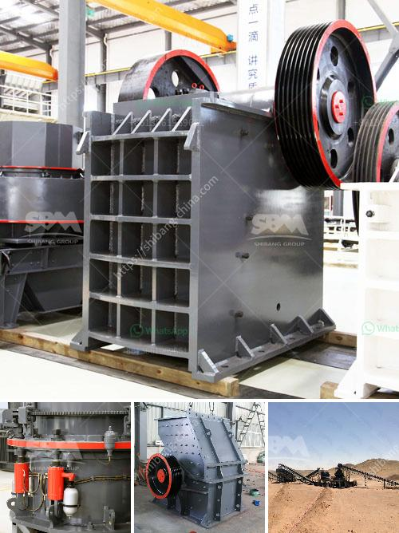

<h3>quarry machine and crusher plant sale in philippines</h3>
Quarry machine and crusher plant sale in Philippines is one of the hottest topics in engineering and construction industry. The following are the reasons why the Philippines is becoming a big market for these machines and its crushed stones are being used for infrastructure projects:

When it comes to construction, there are many materials needed. One important material is stones or aggregates. These are vital for the overall strength and stability of any structure. Aggregate is made up of different materials such as sand, gravel, crushed stone, and recycled concrete. These materials are widely used in the construction industry for various projects like buildings, bridges, roads, and highways.

In the Philippines, specifically, the demand for aggregates is increasing. This is due to the rapid growth of infrastructure projects in the country. The government’s focus on infrastructure development, such as the "Build, Build, Build" program, has led to a surge in construction activities. As a result, the need for construction materials, including aggregates, has also risen.

Quarry machines and crusher plants sale in the Philippines play a crucial role in the construction industry. They help in breaking down rocks into fine aggregates for use in concrete, asphalt, and other construction materials. Philippines aggregates can be used for various projects such as highways, railways, buildings, bridges, and water conservancy projects.

The sale of quarry machines and crusher plants in the Philippines is booming. With the expansion of infrastructure projects, the market demand for stone aggregates is simultaneously increasing. The Philippines government has allocated a large sum of money for infrastructure construction in the 2021 budget, including the "Build, Build, Build" program. This program aims to stimulate economic growth and improve the quality of life for Filipinos by developing essential infrastructure.

Moreover, the Philippines has vast mineral resources, making quarrying a lucrative industry. The country is abundant in natural resources, including limestone, marble, sand, and gravel. These resources are essential in the production of aggregates, making quarrying a profitable business.

Quarry machines and crusher plants sale in the Philippines can be customized according to client requirements. These machines come in different capacities, feeding sizes, and output sizes. They are also equipped with various features such as high crushing ratio, reliable operation, low energy consumption, and easy maintenance.

Additionally, the quarry machine and crusher plant sale in the Philippines are highly automated. This enables operators to work efficiently and safely, reducing the risk of accidents. Moreover, these machines are designed to be environmentally friendly. They have minimal noise and dust emissions, making them perfect for urban areas.

In conclusion, quarry machines and crusher plants sale in the Philippines are becoming increasingly popular. The booming construction industry, government investments in infrastructure projects, and abundant mineral resources contribute to the growing demand for aggregates. Quarry machines and crusher plants play a vital role in meeting this demand by breaking down rocks into fine aggregates. The customization options, automation, and environmental-friendly features of these machines make them ideal for the ever-evolving construction industry in the Philippines.
<h3>Contact us</h3><ul><li><strong>Whatsapp:&nbsp;<a href="https://wa.me/8613661969651">+8613661969651</a></strong></li><li><a href="https://swt.shibang-china.com/?git&amp;zhl&amp;quarry machine and crusher plant sale in philippines"><strong>Online Service(chat now)</strong></a></li></ul><h3>Related</h3><ul><li><a href='aggregate crushing process.md'>aggregate crushing process</a></li><li><a href='roll crusher for various size coal.md'>roll crusher for various size coal</a></li><li><a href='metal conveyor belts malaysia.md'>metal conveyor belts malaysia</a></li><li><a href='jaw crusher for sale philippines.md'>jaw crusher for sale philippines</a></li><li><a href='prices of copper smelting plant.md'>prices of copper smelting plant</a></li></ul>