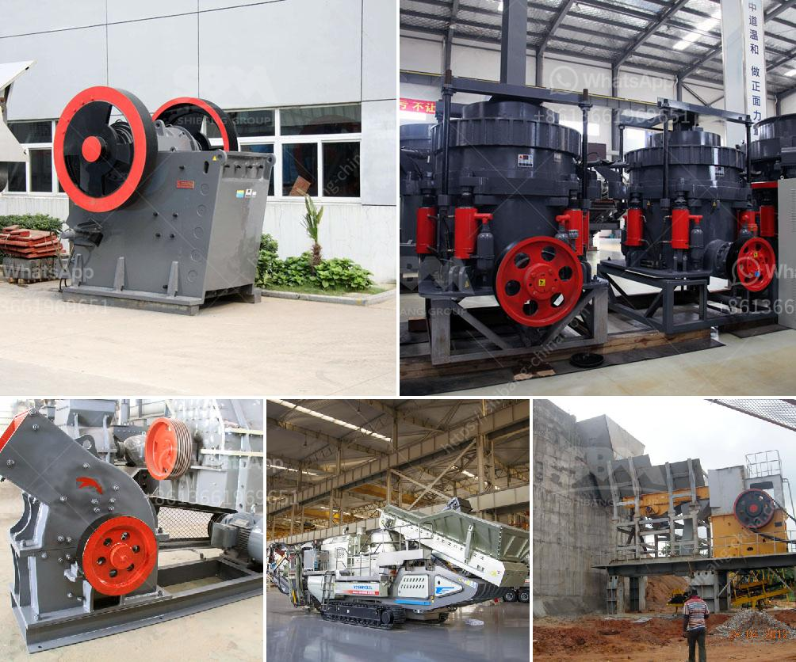

<h3>quarry machine manfacturer</h3>
Quarrying is a vital industry for economic development and construction material production. A quarry is a type of open-pit mine from which rock, sand, gravel, or other minerals are extracted for use in various products. As the demand for quarrying materials continues to increase, so does the need for efficient and reliable machinery. This is where a quarry machine manufacturer plays a crucial role.

A quarry machine manufacturer specializes in designing, manufacturing, and supplying equipment that is essential for the quarrying process. These machines are heavy-duty and robust to withstand the demanding conditions of a quarrying site. They are used for various tasks such as drilling, blasting, crushing, screening, and transportation of materials. Without these machines, the quarrying process would be arduous, time-consuming, and less productive.

One of the most important aspects of a quarry machine manufacturer is their ability to innovate and provide cutting-edge technology. Advancements in quarrying machinery have significantly increased productivity and safety in the industry. With the introduction of advanced automated systems, such as GPS-guided machines and remote-controlled operations, quarrying has become more efficient and precise.

Safety is a top priority in the quarrying industry, and quarry machine manufacturers understand this. They ensure that their machines are equipped with the latest safety features, such as reinforced cabins, backup cameras, and proximity sensors. These features not only protect the operators but also minimize accidents and injuries in the quarrying site.

Environmental sustainability is another key concern for quarrying operations. Quarry machine manufacturers are constantly working to develop machines that are more energy-efficient and environmentally friendly. For example, they are incorporating hybrid or electric engines into their machinery, reducing carbon emissions and minimizing the environmental impact.

In addition to designing and manufacturing quarrying equipment, a quarry machine manufacturer also provides after-sales services, including installation, maintenance, repairs, and spare parts supply. This ensures that the machines operate at peak performance and have a longer lifespan. Prompt service and support from the manufacturer are invaluable for quarrying companies as any downtime can result in significant financial loss.

When selecting a quarry machine manufacturer, it is crucial to consider their reputation and track record. A reputable manufacturer will have a long history of delivering high-quality machines and exceptional customer service. They will also have a strong network of distributors and service centers, ensuring efficient support wherever the machines are operating.

In conclusion, a quarry machine manufacturer plays a pivotal role in revolutionizing the quarrying industry. Their innovative machines with state-of-the-art technology, advanced safety features, and environmental sustainability are transforming the way quarrying operations are conducted. These machines increase productivity, enhance safety, and minimize the environmental impact of quarrying activities. Choosing the right manufacturer ensures that quarrying companies have reliable and efficient equipment, leading to increased profitability and sustainability in the long run.
<h3>Contact us</h3><ul><li><strong>Whatsapp:&nbsp;<a href="https://wa.me/8613661969651">+8613661969651</a></strong></li><li><a href="https://swt.shibang-china.com/?git&amp;zhl&amp;quarry machine manfacturer"><strong>Online Service(chat now)</strong></a></li></ul><h3>Related</h3><ul><li><a href='china talc processing factory rental ghana.md'>china talc processing factory rental ghana</a></li><li><a href='roller mill cement price.md'>roller mill cement price</a></li><li><a href='selling stone crusher plant.md'>selling stone crusher plant</a></li><li><a href='prices of copper smelting plant.md'>prices of copper smelting plant</a></li><li><a href='double roller crusher supplier.md'>double roller crusher supplier</a></li></ul>