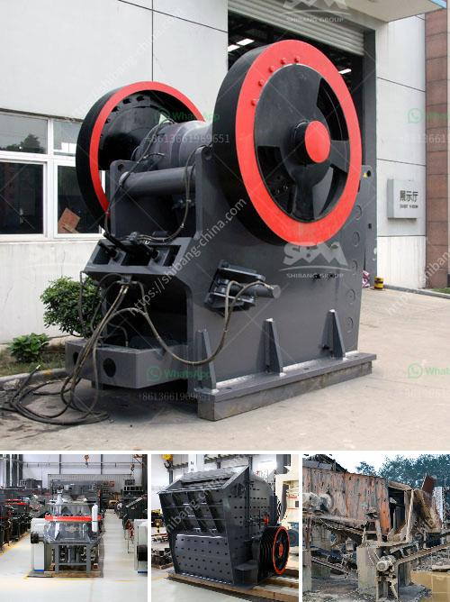

<h3>quarry machinery for sale</h3>
The quarrying industry plays a vital role in the extraction of natural resources needed for various construction and development projects. From gravel and stone to sand and limestone, quarries provide the essential building blocks for our modern infrastructure. One crucial component to expedite the extraction process and maximize productivity is the utilization of efficient quarry machinery. With the ever-growing demand for high-quality aggregates, there is an increasing need for top-notch equipment to meet these requirements. Luckily, there is a wide range of quarry machinery available for sale, catering to diverse quarrying needs.

One of the primary requirements for quarrying is the extraction of mineral resources from the earth's crust. To accomplish this, heavy-duty machinery such as excavators and loaders are utilized. Excavators are used to dig deep into the quarry's surface and extract the desired aggregates. With various sizes and capacities, these machines can remove large quantities of materials in a short period. Coupled with advanced hydraulic systems and specialized attachments, excavators serve as the backbone of any quarrying operation.

Another critical piece of machinery in a quarry is the loader. Loaders are responsible for efficiently transporting the extracted materials, whether it be sand, gravel, or crushed stone, from the quarry floor to the processing area. With their robust design, loaders can handle heavy loads while ensuring minimal downtime. Innovative features like advanced bucket designs and automated systems enhance productivity and safety.

Apart from extraction and transportation, quarry machinery also includes equipment for size reduction and screening. Crushers and screens are employed to break down the extracted materials into smaller, more manageable sizes. Crushers use immense force to pulverize the rocks, while screens help segregate the aggregates based on size criteria. Efficient crushers and screens are essential to producing the desired gradation without compromising on quality.

In addition to primary machinery, ancillary equipment such as conveyors and hoppers play a crucial role in streamlining the quarrying process. Conveyors transport the extracted materials from the crushers and screens to the storage area or designated delivery points. They eliminate the need for manual labor and provide a continuous flow of aggregates, ensuring a smooth operation. Hoppers, on the other hand, act as a buffer zone, receiving the extracted materials and regulating a steady supply to the conveyors.

As technology continues to advance, so does the capability of quarry machinery. Modern machines are equipped with advanced features like GPS tracking systems and real-time monitoring, which aid in efficient operation, maintenance, and troubleshooting. Additionally, environmentally friendly options such as electric-powered machinery provide a sustainable alternative to conventional diesel-powered equipment.

In conclusion, quarry machinery for sale offers an extensive range of solutions to optimize the extraction process, enhance productivity, and ensure superior quality aggregates. These machines, ranging from excavators and loaders to crushers and screens, are designed to meet the specific needs of the quarrying industry. With the constant demand for construction materials, it is essential for quarry operators to invest in high-performance machinery to unlock the full potential of mineral extraction. By keeping up with technological advancements and embracing sustainable options, the quarrying industry can meet the ever-growing requirements of the global construction sector.
<h3>Contact us</h3><ul><li><strong>Whatsapp:&nbsp;<a href="https://wa.me/8613661969651">+8613661969651</a></strong></li><li><a href="https://swt.shibang-china.com/?git&amp;zhl&amp;quarry machinery for sale"><strong>Online Service(chat now)</strong></a></li></ul><h3>Related</h3><ul><li><a href='buy stone crusher india.md'>buy stone crusher india</a></li><li><a href='how to make a iron ore crusher machine.md'>how to make a iron ore crusher machine</a></li><li><a href='cement vertical mill tph kenya.md'>cement vertical mill tph kenya</a></li><li><a href='mobile crushing provider.md'>mobile crushing provider</a></li><li><a href='iron ore mines equipments.md'>iron ore mines equipments</a></li></ul>