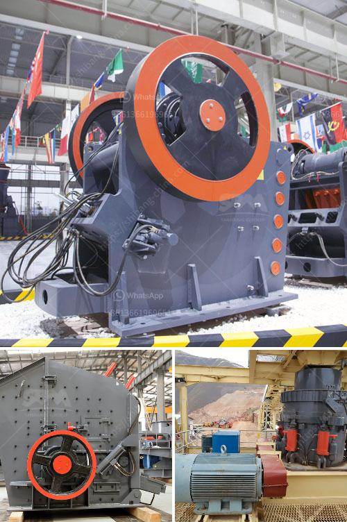

<h3>quarry machines for sale in kenya</h3>
In a quarry site, the productivity and profitability of the quarry machine are determined by the type of machine being used and the quality of the materials obtained. One of the leading quarry machines manufacturers in Kenya is Hard Stone Engineering Works. They design and manufacture stone-cutting machines that are suitable for multiple quarry applications.

1. Stone-cutting machine: This machine is used for cutting large stones into smaller pieces that can be used for various construction purposes. It utilizes a diamond-tipped saw blade to achieve precise and efficient stone cutting. The stone-cutting machine is versatile and can be used for cutting different types of stones, including granite and marble.

2. Stone polishing machine: After the stones have been cut, they often require polishing to enhance their appearance. The stone polishing machine manufactured by Hard Stone Engineering Works is designed to give stones a glossy finish. It is equipped with rotating abrasive wheels that smooth the stones, giving them a polished texture.

3. Stone crusher machine: This machine is used to crush stones into smaller sizes for construction purposes. It also helps in reducing the cost of transportation by hauling stones from the quarry site to the construction site. Hard Stone Engineering Works manufactures different types of stone crusher machines, including jaw crushers and impact crushers.

4. Vibrating screen machine: This machine is used to separate stones of different sizes. It helps in the efficient processing of crushed stones by ensuring that only the desired sizes of stones pass through to the next stage of the construction process. The vibrating screen machine manufactured by Hard Stone Engineering Works is reliable and easy to maintain.

All these quarry machines are designed with the latest technology to ensure high productivity and durability. Hard Stone Engineering Works takes pride in manufacturing quality machines that meet customers' specific requirements. The machines have undergone rigorous testing to guarantee their performance in harsh quarry conditions.

1. Cost: Compare prices from different manufacturers to ensure you get value for your money. Additionally, consider the cost of maintenance and repair services that may be required in the future.

2. Efficiency: Look for machines that have high productivity rates and can handle various quarrying tasks effectively. Efficiency is crucial in maximizing profit and reducing operational costs.

3. Durability: Quarry machines experience heavy wear and tear due to the nature of their work. Choose machines made from robust materials that can withstand the demanding quarry conditions.

4. After-sales support: Consider buying from manufacturers that offer after-sales support, including training, maintenance, and replacement parts. This ensures that you can effectively operate and maintain the machines.

In conclusion, quarry machines for sale in Kenya play a crucial role in the quarrying industry. When selecting a machine, it is essential to consider factors such as cost, efficiency, durability, and after-sales support. Hard Stone Engineering Works offers a wide range of quarry machines that are suitable for various quarry applications. Their machines are known for their high productivity, durability, and efficiency. Upgrade your quarry operations today with top-quality machines manufactured by Hard Stone Engineering Works.
<h3>Contact us</h3><ul><li><strong>Whatsapp:&nbsp;<a href="https://wa.me/8613661969651">+8613661969651</a></strong></li><li><a href="https://swt.shibang-china.com/?git&amp;zhl&amp;quarry machines for sale in kenya"><strong>Online Service(chat now)</strong></a></li></ul><h3>Related</h3><ul><li><a href='stone crusher to make gravel.md'>stone crusher to make gravel</a></li><li><a href='stone crusher company india mastro.md'>stone crusher company india mastro</a></li><li><a href='china gold dry washer manufacturer in australia.md'>china gold dry washer manufacturer in australia</a></li><li><a href='italia dry production line supplier.md'>italia dry production line supplier</a></li><li><a href='river sand washing machine portable india.md'>river sand washing machine portable india</a></li></ul>