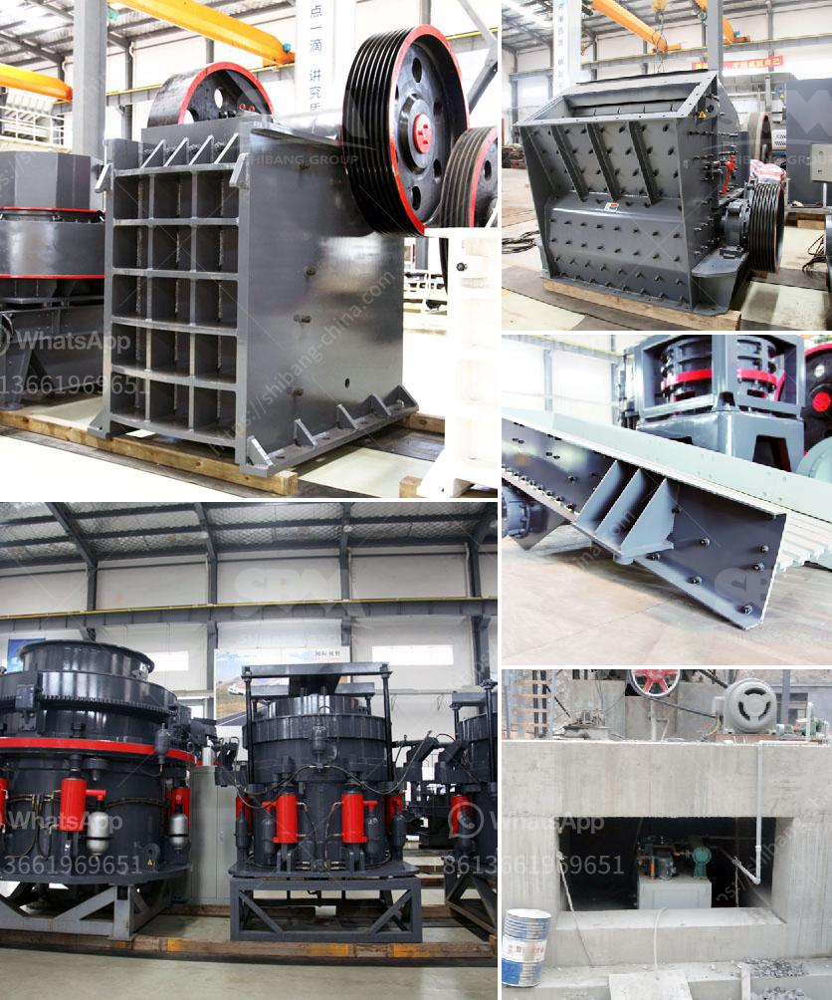

<h3>quarry stone machine in uk</h3>
The construction industry plays a vital role in any country's economy. As the demand for infrastructural development continues to grow, so does the need for efficient and innovative machinery. In the United Kingdom, the introduction of quarry stone machines has revolutionized the way construction projects are executed, contributing to faster completion times and enhanced productivity.

Quarries have served as essential sources of construction materials for centuries. In the UK, quarrying practices have evolved significantly over time, embracing automation and advanced technologies. One of the most significant advancements in this industry is the quarry stone machine, a piece of heavy machinery specifically designed for cutting and shaping stone blocks.

The quarry stone machine has transformed the UK construction industry by streamlining the process of stone extraction and cutting. Traditionally, quarrying involved manual labor, relying on human strength and basic tools. This method was time-consuming, labor-intensive, and often resulted in inconsistencies in the quality and size of the produced stone blocks.

With the introduction of quarry stone machines, these challenges have been overcome. These innovative machines are equipped with diamond-wire saws and hydraulic rock drillers, enabling precise cutting and shaping of stone blocks. This technology not only saves time but also ensures uniformity and accuracy in the dimension of the stones. The machine's cutting efficiency has significantly increased, allowing for larger stone slabs to be extracted within shorter time frames than ever before.

Furthermore, the quarry stone machine has improved worker safety. By replacing manual labor with automated machinery, the risk of accidents and injuries associated with traditional quarrying practices has been greatly reduced. Workers no longer need to physically exert themselves in the extraction and cutting process, minimizing the strain on their bodies and eliminating potential hazards.

The adoption of quarry stone machines has also led to cost savings in the construction industry. These machines not only increase productivity but also minimize material wastage. The precision and accuracy of the cutting process prevent the loss of stone due to uncertainties, ultimately resulting in reduced expenses. Additionally, the efficiency of these machines allows for faster completion of projects, reducing labor costs and enabling construction companies to take on more projects simultaneously.

Moreover, the use of quarry stone machines in the UK has a positive environmental impact. Traditional quarrying practices often resulted in excessive noise and dust pollution, contributing to adverse effects on the surrounding environment. However, the advanced technology in these machines has significantly reduced noise levels and dust emissions, making quarrying operations more environmentally friendly.

In conclusion, the introduction of quarry stone machines in the UK has revolutionized the construction industry. These machines have improved efficiency, precision, and worker safety while also reducing costs and environmental impact. As the demand for infrastructure continues to grow, the use of quarry stone machines will undoubtedly play an integral role in meeting these needs and driving the future growth of the construction industry in the United Kingdom.
<h3>Contact us</h3><ul><li><strong>Whatsapp:&nbsp;<a href="https://wa.me/8613661969651">+8613661969651</a></strong></li><li><a href="https://swt.shibang-china.com/?git&amp;zhl&amp;quarry stone machine in uk"><strong>Online Service(chat now)</strong></a></li></ul><h3>Related</h3><ul><li><a href='to see models of vibrating screens.md'>to see models of vibrating screens</a></li><li><a href='south africa mobile rock crusher.md'>south africa mobile rock crusher</a></li><li><a href='cement process making in ashaka.md'>cement process making in ashaka</a></li><li><a href='gypsum board machinery manufacturers turkey.md'>gypsum board machinery manufacturers turkey</a></li><li><a href='cost cone crusher.md'>cost cone crusher</a></li></ul>