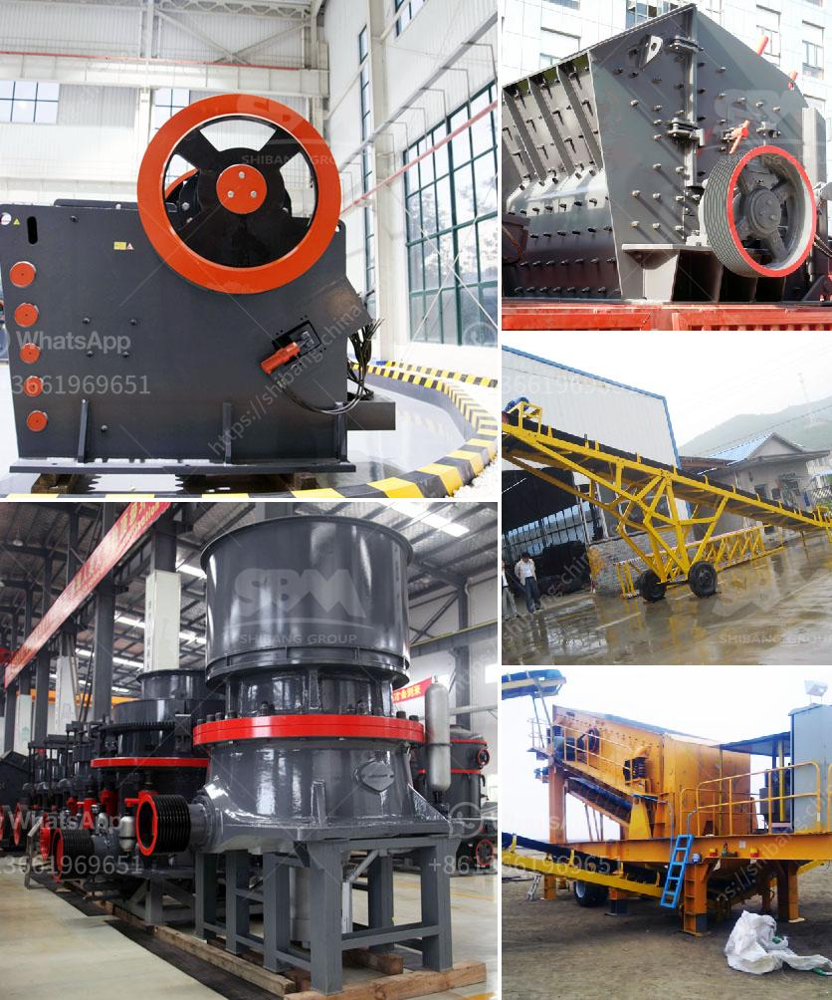

<h3>quarrying crusher machine</h3>
Quarrying is the process of extracting natural resources from the earth's surface. These resources include minerals, rocks, limestone, construction materials, and more. To carry out this process efficiently and effectively, a quarrying crusher machine is used. This type of machinery plays an essential role in breaking down large rocks into smaller, more manageable sizes for further processing.

A quarrying crusher machine typically consists of a jaw crusher, impact crusher, cone crusher, and vibrating screen. These machines work together to break down rocks into specific sizes, allowing for individual production requirements to be met. The primary crusher, such as a jaw crusher, is used to reduce ore into smaller particles, enabling easy transportation and further processing. The secondary crushers, like impact crushers and cone crushers, perform the final crushing of the rock material.

One of the primary benefits of using a quarrying crusher machine is its versatility and adaptability. It can process a wide range of materials, from soft limestone to hard granite and everything in between. This versatility makes it ideal for various industries, such as mining, construction, cement, and road building.

Furthermore, quarrying crusher machines are designed to be durable and robust, capable of withstanding harsh working conditions. They are engineered to handle high volumes of rock materials and operate efficiently for prolonged periods. This reliability makes them an essential tool in any quarrying operation.

In addition to breaking down rocks, quarrying crusher machines also play a crucial role in sorting, screening, and grading the extracted materials. Vibrating screens are used to separate the crushed rocks into different sizes. This process allows for the production of different grades of materials, each suited for specific applications. For example, larger rocks can be used for structural purposes, while smaller ones may be suitable for aggregate production.

Overall, a quarrying crusher machine is an integral part of quarry operations. It enables efficient rock extraction, processing, and sorting, contributing to the production of a wide range of construction materials. With their durability, versatility, and reliability, these machines are a valuable asset in the quarrying industry.
<h3>Contact us</h3><ul><li><strong>Whatsapp:&nbsp;<a href="https://wa.me/8613661969651">+8613661969651</a></strong></li><li><a href="https://swt.shibang-china.com/?git&amp;zhl&amp;quarrying crusher machine"><strong>Online Service(chat now)</strong></a></li></ul><h3>Related</h3><ul><li><a href='stone crusher and quarry plant in galway ireland.md'>stone crusher and quarry plant in galway ireland</a></li><li><a href='schredder and grinding mille for sale.md'>schredder and grinding mille for sale</a></li><li><a href='how much is jaw crusher.md'>how much is jaw crusher</a></li><li><a href='functions of the hammer mill.md'>functions of the hammer mill</a></li><li><a href='stone crushers for sale in philippines.md'>stone crushers for sale in philippines</a></li></ul>