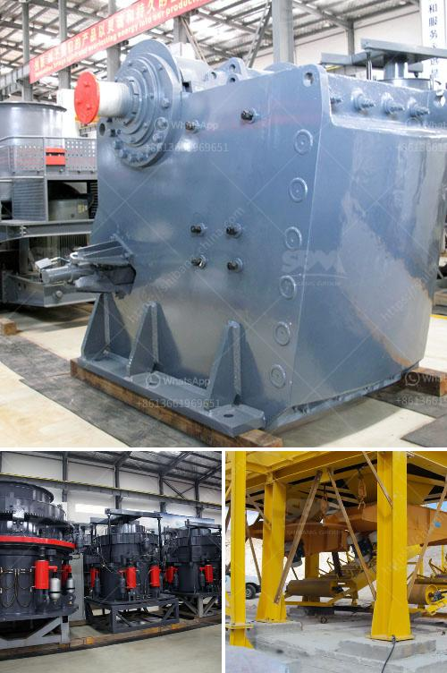

<h3>quartz beneficiation</h3>
Quartz beneficiation refers to the process of removing impurities from quartz ore and improving its purity. The process involves crushing, scrubbing, sizing, attrition, gravity separation, magnetic separation, acid leaching, and high-temperature treatment.

Quartz is one of the most abundant minerals found on Earth. It is widely used in various industries such as glass manufacturing, ceramics, electronics, and solar panels. However, quartz ore often contains impurities such as iron oxide, clay, mica, and organic matter, which lower its quality and hinder its applications.

To enhance the quality and value of quartz, the beneficiation process is employed. The first step involves crushing the quartz ore into small particles to facilitate further processing. Scrubbing is then performed to remove surface coatings and iron oxide, which can be achieved through attrition or mechanical stirring.

After scrubbing, the quartz is sized to obtain the desired particle size. Smaller particles are desirable for some applications, while larger particles are preferred for others. Gravity separation is commonly used to separate quartz particles based on their density differences.

Magnetic separation is another technique used in quartz beneficiation that utilizes the magnetic properties of certain minerals. By subjecting the quartz ore to a magnetic field, magnetic minerals can be separated from non-magnetic ones. This process is particularly effective in removing iron oxide impurities.

Acid leaching is employed to remove impurities that are resistant to physical separation techniques. By using strong acids, such as hydrochloric acid or sulfuric acid, undesirable minerals such as clay and mica can be dissolved, leaving behind purified quartz.

Finally, high-temperature treatment is often applied to achieve further purification and improve the quality of quartz. This involves heating the quartz at elevated temperatures to remove any remaining impurities and enhance its crystal structure.

Overall, quartz beneficiation plays a crucial role in ensuring the quality and purity of quartz used in various industries. By removing impurities, the quartz can be transformed into a high-quality material with improved properties, making it suitable for a wide range of applications.
<h3>Contact us</h3><ul><li><strong>Whatsapp:&nbsp;<a href="https://wa.me/8613661969651">+8613661969651</a></strong></li><li><a href="https://swt.shibang-china.com/?git&amp;zhl&amp;quartz beneficiation"><strong>Online Service(chat now)</strong></a></li></ul><h3>Related</h3><ul><li><a href='ball mill in malaysia.md'>ball mill in malaysia</a></li><li><a href='hammer mills for sale at saro zambia.md'>hammer mills for sale at saro zambia</a></li><li><a href='metal conveyor belts malaysia.md'>metal conveyor belts malaysia</a></li><li><a href='feldspar crusher machine.md'>feldspar crusher machine</a></li><li><a href='mobile coal crusher in philippines.md'>mobile coal crusher in philippines</a></li></ul>