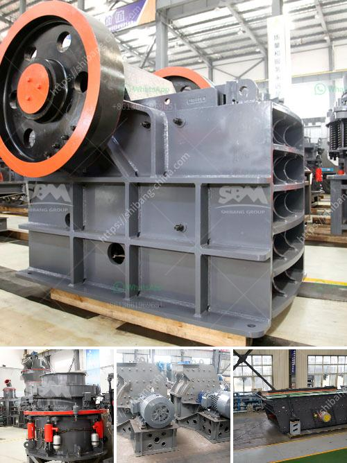

<h3>quartz crushing machine price</h3>
The price of quartz crushing machines is an important consideration for those looking to invest in the quartz mining industry. However, the price of quartz crushing machines is different based on specific factors. Prices vary according to the type, capacity, and power output of the machine. Here, we will discuss the factors affecting the price range of quartz crushing machines in more detail.

Firstly, one of the main determinants of price is the type of machine being purchased. There are various types of quartz crushing machines available in the market, such as jaw crushers, cone crushers, impact crushers, and hammer crushers. Each type has its own unique features, advantages, and limitations. Typically, jaw crushers are more expensive due to their larger size and higher capacity, while cone crushers are more affordable but still offer reliable performance.

Secondly, the capacity of the machine plays a crucial role in determining its price. Quartz crushing machines come in a range of capacities, starting from small machines with a capacity of a few tons per hour to larger machines capable of handling hundreds of tons per hour. The higher the capacity, the higher the price of the machine.

Another important factor is power consumption. Higher power output usually indicates more durable components and better performance, but it also results in a higher price. Machines with lower power outputs tend to be cheaper, but they might not be suitable for heavy-duty applications.

Lastly, the brand and reputation of the manufacturer can affect the price of quartz crushing machines. Well-established and reputable manufacturers tend to charge higher prices, as their machines are known for their quality and reliability. These manufacturers often provide warranties and after-sales support, which adds to the overall cost.

In conclusion, the price of quartz crushing machines can vary significantly based on factors such as machine type, capacity, power output, and brand reputation. Buyers should carefully consider these factors before making a purchase. Checking multiple suppliers and comparing prices can also help in finding the best deal. Investing in a high-quality machine might require a higher initial investment, but it can lead to better long-term returns.
<h3>Contact us</h3><ul><li><strong>Whatsapp:&nbsp;<a href="https://wa.me/8613661969651">+8613661969651</a></strong></li><li><a href="https://swt.shibang-china.com/?git&amp;zhl&amp;quartz crushing machine price"><strong>Online Service(chat now)</strong></a></li></ul><h3>Related</h3><ul><li><a href='quarry and mining crusher equipment.md'>quarry and mining crusher equipment</a></li><li><a href='to separate manganese and iron ore.md'>to separate manganese and iron ore</a></li><li><a href='mobile concrete crusher trailer mounted.md'>mobile concrete crusher trailer mounted</a></li><li><a href='quarry machine and crusher plant sale in philippines.md'>quarry machine and crusher plant sale in philippines</a></li><li><a href='crawler mobile crushing plants.md'>crawler mobile crushing plants</a></li></ul>