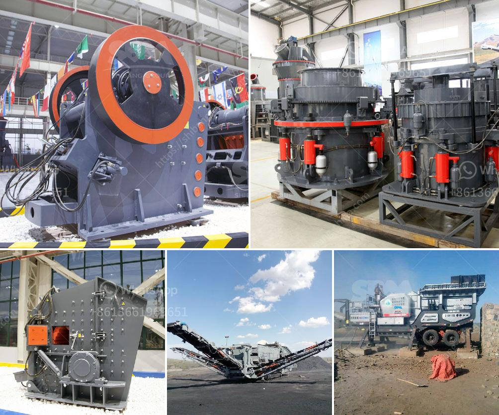

<h3>quartz grinding machines</h3>
Quartz is a mineral that is widely used in various industries, such as glass, ceramics, and electronics. With its abundance and durability, it has become an essential component in many products. However, before it can be used in these applications, quartz needs to be processed and ground into fine particles. This is where quartz grinding machines come into play.

Quartz grinding machines are specifically designed to reduce the size of quartz stone to the desired size. The process involves the use of different grinding tools, such as mills, ball mills, and Raymond mills. The grain size of quartz sand can be controlled by sieving equipment, such as vibrating screens.

Quartz grinding machines are used to grind quartz into extremely fine powder for use in various applications. It is also called quartz sand grinding machine. Quartz is classified into ordinary quartz sand, fine quartz sand, high-purity quartz sand, and fused silica sand. Quartz stone is widely used in the glass industry, casting industry, ceramics, and refractory materials, metallurgy, construction, chemicals, plastics, rubber, abrasives, and other industries.

The grinding process of quartz sand usually includes several stages, such as crushing, grinding, grading, and powder collection. Firstly, the quartz stone is crushed by the coarse crusher, and then the coarse material is conveyed to the fine crusher for further crushing. After that, the fine crushed material enters the vibrating screen to screen out different grain sizes. The qualified quartz particles enter the Raymond mill for grinding. The ground quartz powder is classified by the powder separator, and the unqualified powder returns to the host machine for re-grinding.

There are several types of quartz grinding machines available in the market. The most common ones include Raymond mill, vertical roller mill, and ball mill. Each machine is designed to handle different quartz grinding tasks and achieve the desired fineness.

Raymond mill is commonly used for grinding non-metallic minerals with Mohs hardness below 7 and humidity within 6%, such as activated carbon, bentonite, kaolin, cement, phosphate rock, gypsum, glass, thermal insulation materials, etc. The particle size of the finished product produced by Raymond mill can be adjusted within the range of 80-600 mesh.

Vertical roller mill is a grinding equipment that integrates drying, grinding, grading, and conveying. It can be used for grinding quartz stone with a Mohs hardness of less than 9.3 and a humidity below 6% of various non-flammable and explosive mineral materials.

Ball mill is the key equipment for grinding crushed materials. It is widely used in cement, silicate, new building materials, refractories, fertilizers, black and non-ferrous metal beneficiation, and glass ceramics.

In conclusion, quartz grinding machines are essential in the quartz processing industry. They are used to grind quartz into fine powder for various applications. With different grinding tools and machines available, quartz grinding can be done efficiently and effectively. Whether it is coarse crushing, fine crushing, or powder grinding, there is a suitable machine for every quartz grinding task.
<h3>Contact us</h3><ul><li><strong>Whatsapp:&nbsp;<a href="https://wa.me/8613661969651">+8613661969651</a></strong></li><li><a href="https://swt.shibang-china.com/?git&amp;zhl&amp;quartz grinding machines"><strong>Online Service(chat now)</strong></a></li></ul><h3>Related</h3><ul><li><a href='used gold mining equipment for sale in south africa.md'>used gold mining equipment for sale in south africa</a></li><li><a href='coal processing machine.md'>coal processing machine</a></li><li><a href='kaolin crusher plant machinery.md'>kaolin crusher plant machinery</a></li><li><a href='capital cost for iron ore pellet plant in india.md'>capital cost for iron ore pellet plant in india</a></li><li><a href='crusher machine capacity 5 tons per hour.md'>crusher machine capacity 5 tons per hour</a></li></ul>