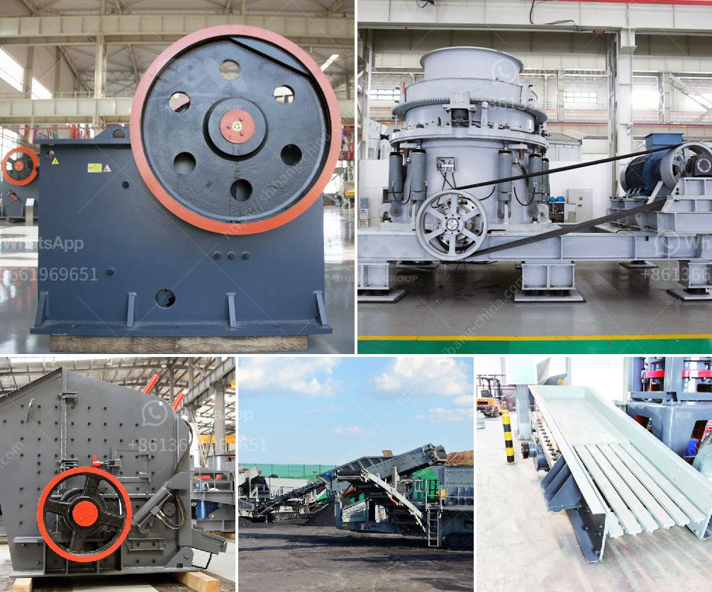

<h3>quartz grinding unit sale in nigeria</h3>
Quartz is a mineral that is abundant on the earth’s surface. It is a form of crystalline silica, which is primarily composed of silicon dioxide. Quartz is found in various colors and forms, including white, clear, rose, smoky, and amethyst. Due to its hardness and resistance to chemical reactions, quartz is widely used in various industries, including glass manufacturing, foundries, ceramics, and electronics.

In Nigeria, quartz is found in large quantities, especially in the northern part of the country. With the growing demand for quartz products both locally and internationally, there is a need for reliable and efficient grinding units to process these quartz stones into desired sizes and shapes.

A quartz grinding unit is specialized equipment used in the manufacturing process of quartz products. It can range from a small plant with a capacity of a few hundred kilograms per hour to a large plant with a capacity of several thousand kilograms per hour. The size of the grinding unit depends on the size of the quartz stones and the desired final product.

The grinding process involves the use of crushing equipment to break the quartz stones into smaller particles and then grinding machinery to achieve the desired size and shape. The grinding unit may use various types of mills, such as ball mills, vertical roller mills, and Raymond mills, among others. These mills work by applying force to the quartz particles, causing them to break and grind against each other.

Once the quartz stones are ground to the desired size, they can be used in various applications such as the production of glass, ceramics, paints, and electronics. In Nigeria, the demand for quartz products is increasing due to the rapid growth of the construction and manufacturing industries. As a result, there is a need for more quartz grinding units to meet this growing demand.

Investing in a quartz grinding unit in Nigeria can be a lucrative business opportunity. The country has a large reserve of quartz, and the demand for quartz products is expected to continue to rise in the coming years. By establishing a grinding unit, entrepreneurs can tap into this market and supply high-quality quartz products to local and international customers.

However, starting a quartz grinding unit requires careful planning and consideration. Entrepreneurs need to research the market, identify potential customers, and understand the requirements for setting up a grinding unit. They also need to invest in suitable machinery and equipment, hire skilled workers, and ensure the availability of raw materials.

Additionally, entrepreneurs need to consider the environmental impact of the grinding unit. Quartz dust generated during the grinding process can be harmful if inhaled, so proper dust control measures need to be implemented to ensure the health and safety of workers.

In conclusion, the sale of quartz grinding units in Nigeria presents a lucrative business opportunity. With the abundant quartz deposits in the country and the growing demand for quartz products, entrepreneurs can establish grinding units to process quartz stones into desired sizes and shapes. However, careful planning, market research, and compliance with environmental regulations are essential for the success of such ventures.
<h3>Contact us</h3><ul><li><strong>Whatsapp:&nbsp;<a href="https://wa.me/8613661969651">+8613661969651</a></strong></li><li><a href="https://swt.shibang-china.com/?git&amp;zhl&amp;quartz grinding unit sale in nigeria"><strong>Online Service(chat now)</strong></a></li></ul><h3>Related</h3><ul><li><a href='south africa mobile rock crusher.md'>south africa mobile rock crusher</a></li><li><a href='stone crusher machine in zimbabwe.md'>stone crusher machine in zimbabwe</a></li><li><a href='used limestone pulverizers crusher for sale texas.md'>used limestone pulverizers crusher for sale texas</a></li><li><a href='gypsum powder production business plan.md'>gypsum powder production business plan</a></li><li><a href='how much is a gold crusher in kenya.md'>how much is a gold crusher in kenya</a></li></ul>