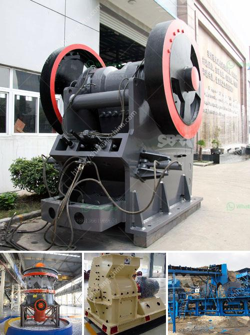

<h3>quartz plant in india</h3>
India, a country rich in minerals, has witnessed a significant rise in the quartz plant industry. With an abundance of quartz reserves, India has become a major player in producing and exporting quartz products. This burgeoning sector is driving economic growth, creating employment opportunities, and solidifying India's position as a global leader in the minerals market.

Quartz, one of the most abundant minerals on Earth, has long been valued for its beauty and versatility. In recent years, it has gained immense popularity across various industries. Largely composed of silicon dioxide, quartz is prized for its clarity, durability, and wide range of colors. India holds a substantial share of global quartz reserves, particularly in the states of Rajasthan, Andhra Pradesh, and Telangana. These reserves have been the catalyst for the establishment of numerous quartz processing plants across the country.

The quartz plant industry in India has experienced remarkable growth over the past decade. The country's favorable geological conditions, coupled with state-of-the-art processing facilities and skilled workforce, have attracted both domestic and international investors. Quartz plants are primarily engaged in processing raw quartz into various products such as engineered stone, quartz powder, quartz tiles, and quartz slabs, among others. These products are widely used in construction, electronics, jewelry manufacturing, and other sectors, making the quartz plant industry a vital component of India's economic backbone.

The rapid expansion of the quartz plant industry in India has had a positive effect on employment generation. These plants require a skilled workforce for mining, processing, and marketing, thereby creating numerous job opportunities for local communities. Additionally, the growth of this sector has a cascading effect on various related industries, including transportation, logistics, and machinery manufacturing. This leads to increased economic activity and contributes to the overall development of the regions where the plants are located.

India's quartz plant industry has also emerged as a significant exporter of quartz products. The country exports a vast range of quartz-based products to countries such as the United States, China, Japan, Germany, and various Middle Eastern nations. This export potential further strengthens India's position as a prominent player in the global minerals market. The quality, variety, and competitive pricing of Indian quartz products have made them highly sought-after worldwide. As a result, the quartz plant industry has become a key contributor to India's total export revenue, further stimulating economic growth.

The remarkable growth of the quartz plant industry in India is a testament to the country's rich mineral resources and growing capabilities in processing and manufacturing. It has not only provided employment opportunities but also bolstered India's economic growth and global standing. With continued investments and advancements in technology, India's quartz plant industry is poised for even greater success in the future.
<h3>Contact us</h3><ul><li><strong>Whatsapp:&nbsp;<a href="https://wa.me/8613661969651">+8613661969651</a></strong></li><li><a href="https://swt.shibang-china.com/?git&amp;zhl&amp;quartz plant in india"><strong>Online Service(chat now)</strong></a></li></ul><h3>Related</h3><ul><li><a href='mini copper ore extraction plant.md'>mini copper ore extraction plant</a></li><li><a href='difference between ball mills and tube mills.md'>difference between ball mills and tube mills</a></li><li><a href='tpd cement grinding plant cost and project report.md'>tpd cement grinding plant cost and project report</a></li><li><a href='roller mill grinder.md'>roller mill grinder</a></li><li><a href='prices of stone crushers.md'>prices of stone crushers</a></li></ul>