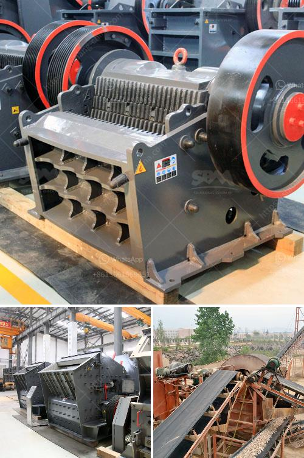

<h3>quartz powder mill shanghaiu</h3>
Shanghai is bustling with the latest advancements in technology, infrastructure, and industry. One such industry that has seen significant growth in recent years is the production and utilization of quartz powder. The city boasts numerous quartz powder mills, with one of the most prominent being the Shanghai quartz powder mill.

The Shanghai quartz powder mill is located in the outskirts of the city, providing easy access to transportation networks, including highways and railways. This strategic location allows for efficient distribution of quartz powder to various industries, both within Shanghai and beyond.

Quartz powder is derived from quartz stones, which are mined from quarries located in different regions. These stones undergo a series of processes, including crushing, grinding, and refining, before being transformed into quartz powder. The Shanghai quartz powder mill is equipped with state-of-the-art machinery and equipment, ensuring high-quality production and consistency in particle size.

One of the most significant advantages of quartz powder is its high chemical and physical properties. This fine powder is known for its hardness, resistance to heat, and excellent electrical conductivity. These unique characteristics make quartz powder a versatile material used in various industries, including construction, electronics, and ceramics.

In the construction industry, quartz powder is commonly utilized in the manufacturing of cement and concrete. Its hardness and resistance to abrasion make it an ideal additive, enhancing the durability and strength of these building materials. Additionally, its electrical conductivity properties are beneficial in the production of anti-static coatings for floors and walls, making them safer and more efficient.

The electronics industry heavily relies on quartz powder in the production of semiconductors and computer chips. The exceptional thermal stability and electrical conductivity of quartz powder ensure the efficient functioning of these electronic devices, contributing to their overall performance and longevity.

Quartz powder is also extensively used in the ceramics industry. Its controlled particle size distribution and consistent physical properties enable the production of high-quality ceramic products with excellent strength and resistance to heat. From sanitary ware to tableware, quartz powder adds value and enhances the aesthetic appeal of these products.

The Shanghai quartz powder mill is not only focused on production but also places great importance on environmental sustainability. The mill is equipped with advanced pollution control technologies to minimize emissions, ensuring a clean and healthy working environment for employees. Additionally, the mill actively seeks to minimize waste and optimize water and energy consumption in its operations.

With its commitment to quality, sustainability, and innovation, the Shanghai quartz powder mill has become a reliable supplier of quartz powder to various industries. Its products are highly sought after both domestically and internationally, thanks to their consistent quality and competitive pricing.

In conclusion, the quartz powder mill in Shanghai plays a crucial role in meeting the growing demand for quartz powder in various industries. Its strategic location, advanced technology, and commitment to sustainability have made it a leader in the field. As Shanghai continues to flourish, the quartz powder mill is set to contribute significantly to the city's economic growth and development.
<h3>Contact us</h3><ul><li><strong>Whatsapp:&nbsp;<a href="https://wa.me/8613661969651">+8613661969651</a></strong></li><li><a href="https://swt.shibang-china.com/?git&amp;zhl&amp;quartz powder mill shanghaiu"><strong>Online Service(chat now)</strong></a></li></ul><h3>Related</h3><ul><li><a href='febcoal coal mining plant in ethiopia.md'>febcoal coal mining plant in ethiopia</a></li><li><a href='mobile crusher machine manufacturer.md'>mobile crusher machine manufacturer</a></li><li><a href='philippines mining equipment companies.md'>philippines mining equipment companies</a></li><li><a href='italia crusher machine.md'>italia crusher machine</a></li><li><a href='price list of washing of rock phosphate.md'>price list of washing of rock phosphate</a></li></ul>