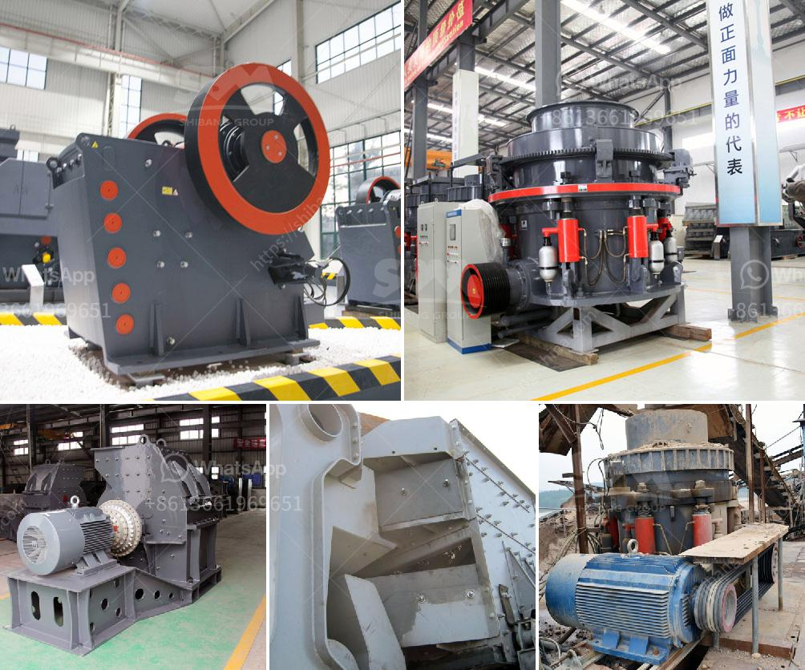

<h3>quartz powder special production line for mining</h3>
Quartz powder is a versatile and important industrial mineral raw material used in various manufacturing processes. It is primarily derived from quartz ore, which is extracted from quarries and mines. Quartz powder has a wide range of applications in various industries such as ceramics, glass, electronics, and chemical manufacturing.

To meet the increasing demand for high-quality quartz powder, mining companies are investing in special production lines that can efficiently process and refine quartz ore into fine powder. These production lines consist of several stages, each designed to maximize the quality and purity of the final quartz powder product.

The first stage in the production line is the extraction of quartz ore from the mine. This is done through a combination of drilling, blasting, and excavation techniques. The extracted ore is then transported to the processing plant, where it undergoes several steps to remove impurities and transform it into the desired quartz powder.

The next stage is crushing and grinding. The quartz ore is crushed into smaller pieces by jaw crushers and cone crushers. It is then ground into a fine powder in ball mills and vibrating mills. The grinding process ensures that the quartz particles are evenly sized and thoroughly mixed with any additives or binders that may be required.

After grinding, the quartz powder undergoes a process called classification. This involves separating the powder into different grades based on its size and purity. High-quality quartz powder is essential in industries such as electronics, where even minor impurities can affect the performance of electronic components. Therefore, the classification process is critical in ensuring that the final product meets the desired specifications.

Once the quartz powder is classified, it is ready for packaging and distribution. In this stage, the powder is carefully packaged into bags or containers, taking into consideration the specific requirements of different industries. For example, in the ceramics industry, quartz powder is often stored in moisture-proof containers to prevent any moisture absorption that could affect the quality of the final product.

The special production line for quartz powder mining is equipped with advanced technologies and equipment to ensure efficient and precise processing. These include automated systems for material handling, grinding, and classification. Additionally, strict quality control measures are implemented throughout the production process to maintain the consistency and purity of the quartz powder.

Investing in a special production line for quartz powder mining not only enables mining companies to meet the growing demand for this valuable industrial mineral but also ensures that the final product is of the highest quality. This, in turn, enhances customer satisfaction and strengthens the company's position in the industry.

In conclusion, the special production line for quartz powder mining plays a crucial role in meeting the demand for high-quality quartz powder in various industries. The extraction, crushing, grinding, classification, and packaging processes are undertaken with precision and care to ensure the production of a consistent and pure final product. With the increasing demand for quartz powder, investing in a specialized production line is a strategic move for mining companies looking to capitalize on this lucrative market.
<h3>Contact us</h3><ul><li><strong>Whatsapp:&nbsp;<a href="https://wa.me/8613661969651">+8613661969651</a></strong></li><li><a href="https://swt.shibang-china.com/?git&amp;zhl&amp;quartz powder special production line for mining"><strong>Online Service(chat now)</strong></a></li></ul><h3>Related</h3><ul><li><a href='rock pulverizer crusher technologies.md'>rock pulverizer crusher technologies</a></li><li><a href='how to improve technology of mining low grade ore.md'>how to improve technology of mining low grade ore</a></li><li><a href='rock milling and grinding machine.md'>rock milling and grinding machine</a></li><li><a href='crusher on rent in india.md'>crusher on rent in india</a></li><li><a href='clay ball mill machine browns.md'>clay ball mill machine browns</a></li></ul>