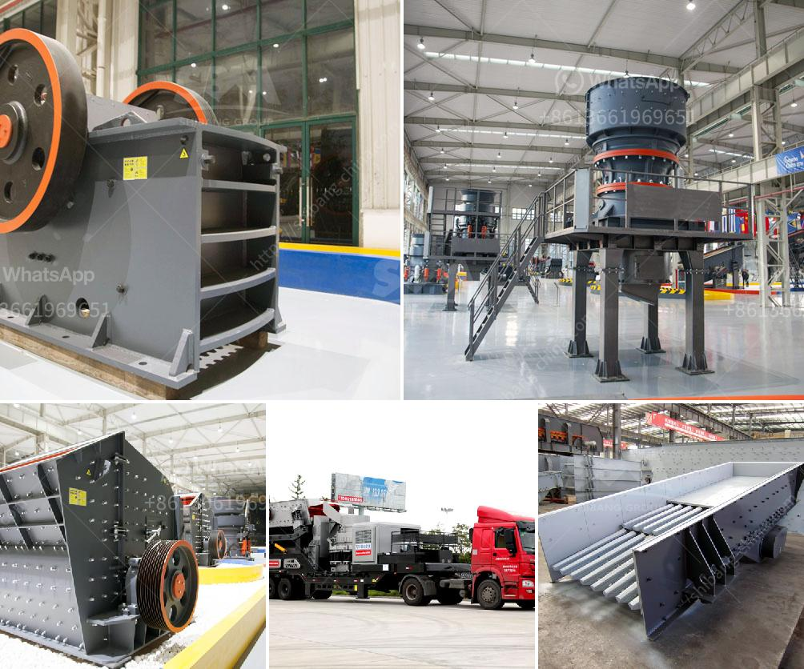

<h3>quartz stone crusher manufacturing machines</h3>
Quartz stone crusher manufacturing machines are essential components in the crushing and grinding process of quarrying and mining industries. With the continuous development of technology, the automation and intelligence of these machines have gradually increased, thus reducing the labor intensity and improving the production efficiency.

Quartz stone is a kind of non-metallic minerals, which is characterized by its hardness and brittleness. It can be used in building materials, ceramics, glass and other industries after being crushed and processed. The quartz stone crusher manufacturing machines supplied by reliable suppliers are characterized by their sturdy structure, durability, high productivity, and reliable performance.

The manufacturing process of quartz stone crushers involves several different stages. First, the quartz stone is uniformly fed into the coarse crusher by the vibrating feeder for rough crushing, and then the finely crushed material is transported by the belt conveyor to the fine crusher for further crushing. Then, vibrating screens separate the crushed stones according to their size, and the qualified ones are transported to the sand making machine for shaping and sand production. Finally, the finished product is sent to the vibrating screen for screening, and different specifications of stones are sorted out according to their size.

One of the most important factors for determining the efficiency of quartz stone crusher manufacturing machines is the choice of crusher type. Compared with traditional crushers, modern quartz stone crushers have several advantages. For example, the jaw crusher has a simple structure, reliable operation, and low operating costs, making it a popular choice for primary crushing. The impact crusher is suitable for secondary crushing, and the cone crusher can be used for fine crushing. Different crushers have different features and functions, and the choice should be based on the specific needs of the production line.

In addition to the crusher type, the crushing process also determines the efficiency of quartz stone crusher manufacturing machines. The optimal process includes multiple stages of crushing, which can ensure the complete and full utilization of the raw materials. Moreover, the use of advanced crushing equipment and technologies, such as hydraulic adjustment, automatic control, and intelligent operation, can further improve the crushing efficiency and reduce the labor intensity.

In conclusion, quartz stone crusher manufacturing machines play a crucial role in the processing and production of quartz stone. The choice of crusher type and the optimization of the crushing process are the key factors for achieving high efficiency and high quality. It is recommended to choose reliable manufacturers and suppliers to ensure the performance and durability of the machines. Continuous technological innovation and improvement in manufacturing machines will further promote the development of the quartz stone industry.
<h3>Contact us</h3><ul><li><strong>Whatsapp:&nbsp;<a href="https://wa.me/8613661969651">+8613661969651</a></strong></li><li><a href="https://swt.shibang-china.com/?git&amp;zhl&amp;quartz stone crusher manufacturing machines"><strong>Online Service(chat now)</strong></a></li></ul><h3>Related</h3><ul><li><a href='jaw crusher price list 150 x 200mm.md'>jaw crusher price list 150 x 200mm</a></li><li><a href='roller crusher for coal.md'>roller crusher for coal</a></li><li><a href='lime processing plant.md'>lime processing plant</a></li><li><a href='quick lime production process.md'>quick lime production process</a></li><li><a href='nigeria c125 jaw crusher.md'>nigeria c125 jaw crusher</a></li></ul>