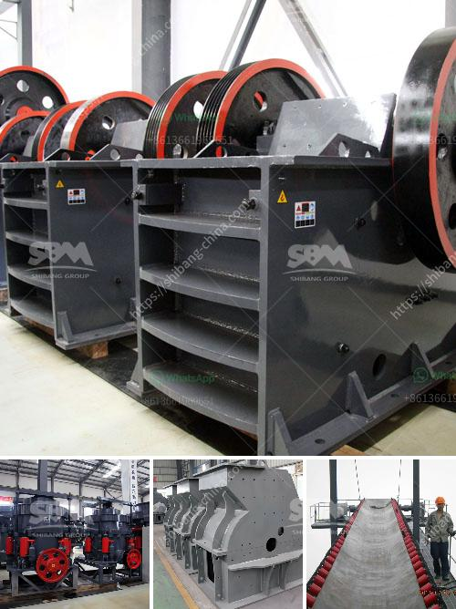

<h3>quartz stone machine in turkey</h3>
Turkey has long been known for its rich history, stunning landscapes, and unique culture. However, in recent years, the country has also gained recognition for its thriving quartz stone industry. With the demand for quartz stone on the rise worldwide, Turkey has emerged as a significant producer and exporter of quartz stone machines.

Quartz stone, also known as engineered stone, is a composite material made of crushed quartz and resin. It offers a variety of benefits, including durability, versatility, and a wide range of color and pattern options. As a result, quartz stone has become increasingly popular in the construction and interior design sectors.

The rise of the quartz stone industry in Turkey can be attributed to several key factors. Firstly, the country is blessed with abundant natural resources, including high-quality quartz deposits. This availability of raw materials has allowed Turkish manufacturers to produce quartz stone of exceptional quality.

Secondly, Turkey has a long history of stone craftsmanship and expertise. The country's skilled workforce and extensive knowledge in working with stone have been crucial in the development of the quartz stone industry. Turkish manufacturers have been able to combine traditional techniques with modern technology to create state-of-the-art quartz stone machines.

Furthermore, Turkey's strategic location plays a significant role in its success in the quartz stone industry. The country serves as a gateway between Asia and Europe, facilitating trade and making it an ideal export hub. Turkish quartz stone machines can be easily transported to various markets around the world, ensuring timely delivery and cost-effective solutions for international buyers.

The quartz stone machine market in Turkey is diverse and competitive. Numerous manufacturers offer a wide range of machines, including block cutting machines, polishing machines, calibration machines, and edge profiling machines. These machines are manufactured with precision and efficiency in mind, ensuring high productivity and excellent quality output.

One of the leading quartz stone machine manufacturers in Turkey is XYZ Company. The company prides itself on its commitment to innovation, customer satisfaction, and environmental responsibility. XYZ Company's machines are known for their advanced technology, user-friendly features, and robust construction.

In addition to manufacturing quartz stone machines, Turkish companies also provide comprehensive after-sales services. This includes installation, training, maintenance, and technical support. These services ensure that customers can maximize the performance and lifespan of their quartz stone machines, providing them with a competitive edge in the market.

The success of the quartz stone machine industry in Turkey has not gone unnoticed. Turkish manufacturers have gained recognition globally, with their machines being exported to countries such as the United States, Germany, China, and Italy. This international demand further fuels the growth of the industry and strengthens Turkey's position as a leading player in the quartz stone machine market.

In conclusion, the quartz stone machine industry in Turkey is experiencing rapid growth and success. The country's rich natural resources, skilled workforce, strategic location, and commitment to innovation have contributed to its rise as a significant player in the global market. As the demand for quartz stone continues to increase, Turkish manufacturers are well-positioned to meet the needs of customers worldwide and solidify their place in the industry.
<h3>Contact us</h3><ul><li><strong>Whatsapp:&nbsp;<a href="https://wa.me/8613661969651">+8613661969651</a></strong></li><li><a href="https://swt.shibang-china.com/?git&amp;zhl&amp;quartz stone machine in turkey"><strong>Online Service(chat now)</strong></a></li></ul><h3>Related</h3><ul><li><a href='quartz stone crusher manufacturing machines.md'>quartz stone crusher manufacturing machines</a></li><li><a href='iron ore used crusher machine.md'>iron ore used crusher machine</a></li><li><a href='stone crusher sri lanka.md'>stone crusher sri lanka</a></li><li><a href='aggregate crushing process.md'>aggregate crushing process</a></li><li><a href='jaw crusher in egypt.md'>jaw crusher in egypt</a></li></ul>