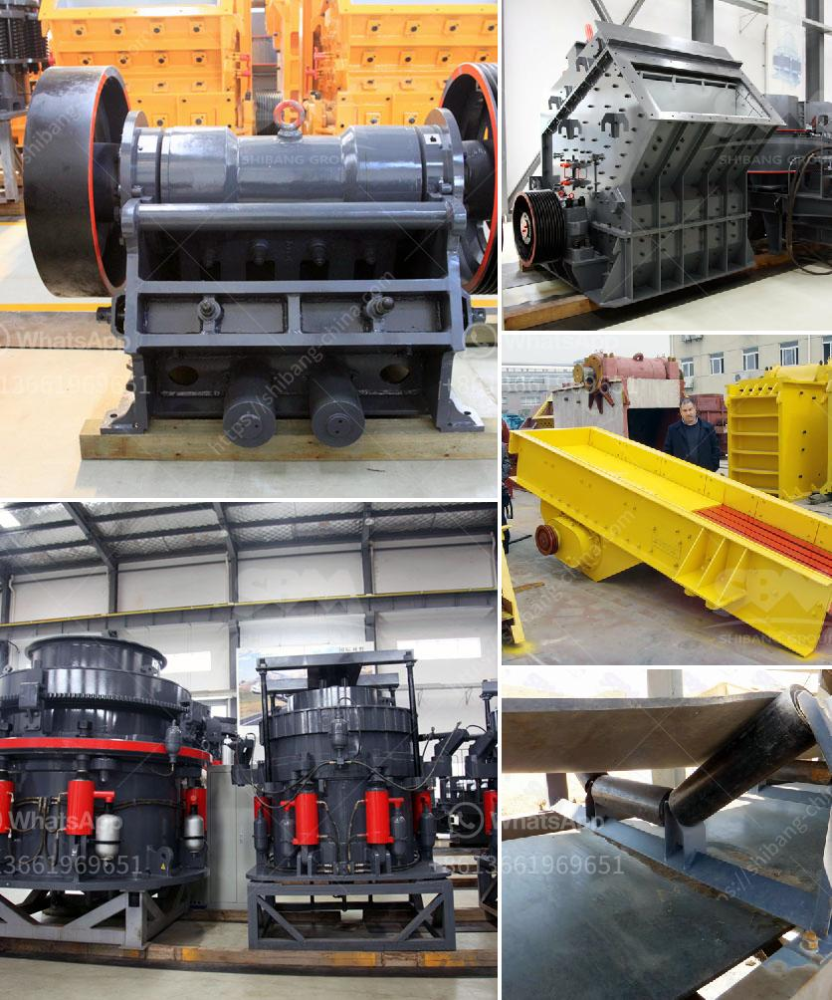

<h3>quartz stone plant in china</h3>
China is a significant hub for the manufacturing industry, providing a diverse range of products to meet global demand. One such industry that has witnessed tremendous growth in recent years is the quartz stone plant. With its cutting-edge technology and superior craftsmanship, the quartz stone plant in China has become a prominent player in the international market, supplying high-quality quartz stone products to various industries.

Quartz stone, also known as engineered stone or artificial stone, is a composite material made of crushed quartz and resin. It is highly durable, non-porous, and resistant to scratches, stains, and heat. These properties make it an excellent alternative to natural stones like granite and marble, which are more expensive and require regular maintenance.

China's quartz stone plant has adopted advanced production techniques and state-of-the-art machinery to produce a wide range of quartz stone products. The process begins with the selection of premium quality raw materials, followed by the precise mixing and blending of quartz, resins, and pigments. The mixture is then compacted under high pressure and cured at controlled temperatures to create durable slabs or tiles.

The quartz stone plant in China boasts a vast production capacity, allowing for efficient mass production to meet the ever-growing global demand. Moreover, the plants are equipped with sophisticated cutting and polishing machinery, enabling them to produce quartz stone products in various sizes, thicknesses, and finishes. This flexibility allows customers to tailor the products to their unique requirements, whether it be for residential or commercial applications.

One of the main advantages of Chinese quartz stone plants is their ability to produce a wide range of colors and patterns. By incorporating various pigments and additives during the production process, they can create exquisite quartz stone designs that mimic the natural beauty of marble, granite, or other stones. This versatility appeals to architects, designers, and homeowners seeking a cost-effective and visually stunning alternative to natural stone.

In addition to its aesthetic appeal, quartz stone is also highly functional. Its non-porous nature makes it resistant to bacteria, mold, and mildew, making it an ideal choice for kitchens and bathrooms. Furthermore, its heat resistance and durability make it suitable for high-usage areas such as countertops and flooring. These qualities, coupled with its easy maintenance and long lifespan, have made quartz stone a popular choice for both residential and commercial projects worldwide.

With its focus on innovation and quality, the quartz stone industry in China has significantly contributed to the growth of the global construction and interior design markets. The high production capacity, coupled with competitive pricing, has attracted buyers from all corners of the globe. Chinese quartz stone plants export their products to Europe, North America, the Middle East, and other regions, meeting the diverse needs of customers worldwide.

In conclusion, the quartz stone plant industry in China has emerged as a global player, meeting the increasing demand for high-quality and affordable quartz stone products. With advanced manufacturing techniques, a wide range of design options, and superior functionality, Chinese quartz stone plants continue to make their mark in the international market. As the construction and interior design industries witness rapid growth, China's quartz stone plants will undoubtedly play a crucial role in shaping the future of the industry.
<h3>Contact us</h3><ul><li><strong>Whatsapp:&nbsp;<a href="https://wa.me/8613661969651">+8613661969651</a></strong></li><li><a href="https://swt.shibang-china.com/?git&amp;zhl&amp;quartz stone plant in china"><strong>Online Service(chat now)</strong></a></li></ul><h3>Related</h3><ul><li><a href='conveyor belt manufacturer in indonesia in philippines.md'>conveyor belt manufacturer in indonesia in philippines</a></li><li><a href='renting of screens and crushers in middelburg.md'>renting of screens and crushers in middelburg</a></li><li><a href='used conveyor belt for sale europe.md'>used conveyor belt for sale europe</a></li><li><a href='jaw crusher in egypt.md'>jaw crusher in egypt</a></li><li><a href='small concrete crusher for sale.md'>small concrete crusher for sale</a></li></ul>