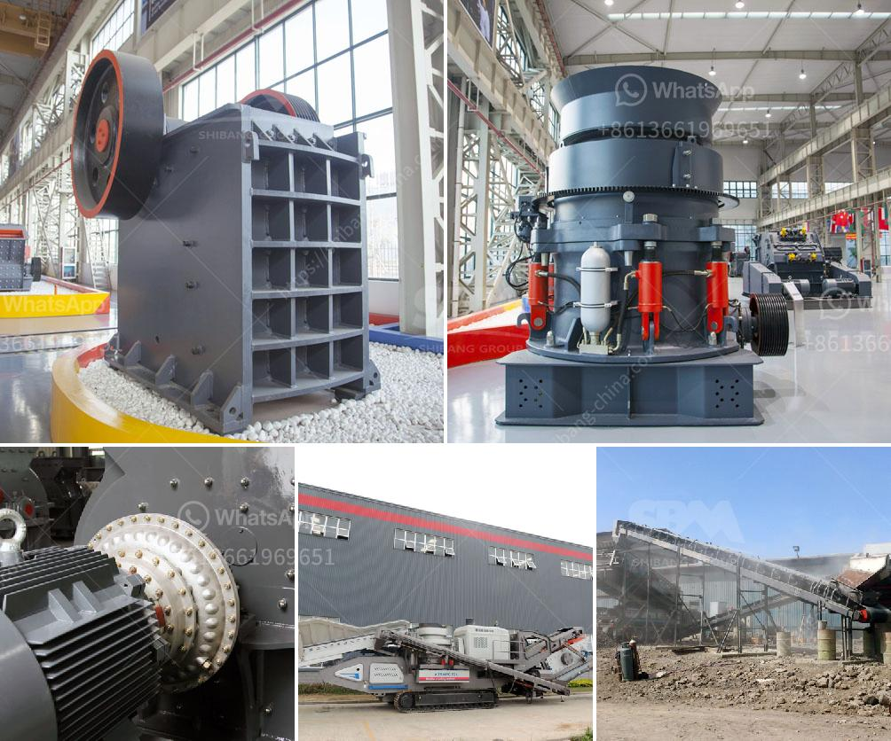

<h3>quartz stone production line machinery</h3>
Quartz has become an increasingly popular material for the construction industry due to its durability, aesthetics, and low maintenance requirements. With the growing demand for quartz countertops, tiles, and other surfaces, the need for efficient quartz stone production line machinery has become crucial to meet the high-quality standards of this material.

A quartz stone production line machinery consists of various machinery equipment that will obtain the finished quartz meets the required standards. These machinery equipment include crushers, ball mills, vibrating feeders, magnetic separators, and various electric control systems.

The first step in the production line is quartz crushing. It is done by using a crusher to break down the quartz stone into smaller pieces for easy transportation and further processing. The crushing process involves the use of jaw crushers, impact crushers, or cone crushers. These crushers are designed to reduce the size of the quartz stone to achieve the desired particle size for later processing.

After crushing, the quartz stone is then milled by a ball mill to obtain the desired fine powder for further processing. The ball mill is a key piece of equipment in the quartz stone production line machinery and consists of a horizontal cylindrical structure. The material is fed into the mill chamber through a hollow shaft, where steel balls of various sizes grind the quartz stone to achieve the desired particle size.

In order to remove impurities from the quartz stone, a vibrating feeder is used to transport the crushed quartz to a magnetic separator. The magnetic separator is responsible for removing any magnetic materials or impurities from the quartz particles. This ensures that the final product is clean and free from any impurities that could affect its quality.

The final step in the quartz stone production line machinery is the electric control system. This system is responsible for controlling and monitoring the entire production process to ensure smooth operation and high-quality output. It includes various electrical components such as motor starters, control panels, and sensors.

In conclusion, quartz stone production line machinery plays a vital role in the efficient production of high-quality quartz surfaces. From crushing to milling and magnetic separation, each step in the production process is carried out by specialized machinery equipment designed to achieve the desired particle size and remove any impurities. The electric control system ensures the smooth operation and quality control of the entire process. With the increasing demand for quartz surfaces, investing in advanced production line machinery is essential to meet the growing market requirements and maintain a competitive edge in the industry.
<h3>Contact us</h3><ul><li><strong>Whatsapp:&nbsp;<a href="https://wa.me/8613661969651">+8613661969651</a></strong></li><li><a href="https://swt.shibang-china.com/?git&amp;zhl&amp;quartz stone production line machinery"><strong>Online Service(chat now)</strong></a></li></ul><h3>Related</h3><ul><li><a href='screen jaw crusher from china.md'>screen jaw crusher from china</a></li><li><a href='vsi crusher manufacturers.md'>vsi crusher manufacturers</a></li><li><a href='difference between ball mills and tube mills.md'>difference between ball mills and tube mills</a></li><li><a href='construction aggregates crusher.md'>construction aggregates crusher</a></li><li><a href='dealers of mobile jaw crusher in kenya.md'>dealers of mobile jaw crusher in kenya</a></li></ul>