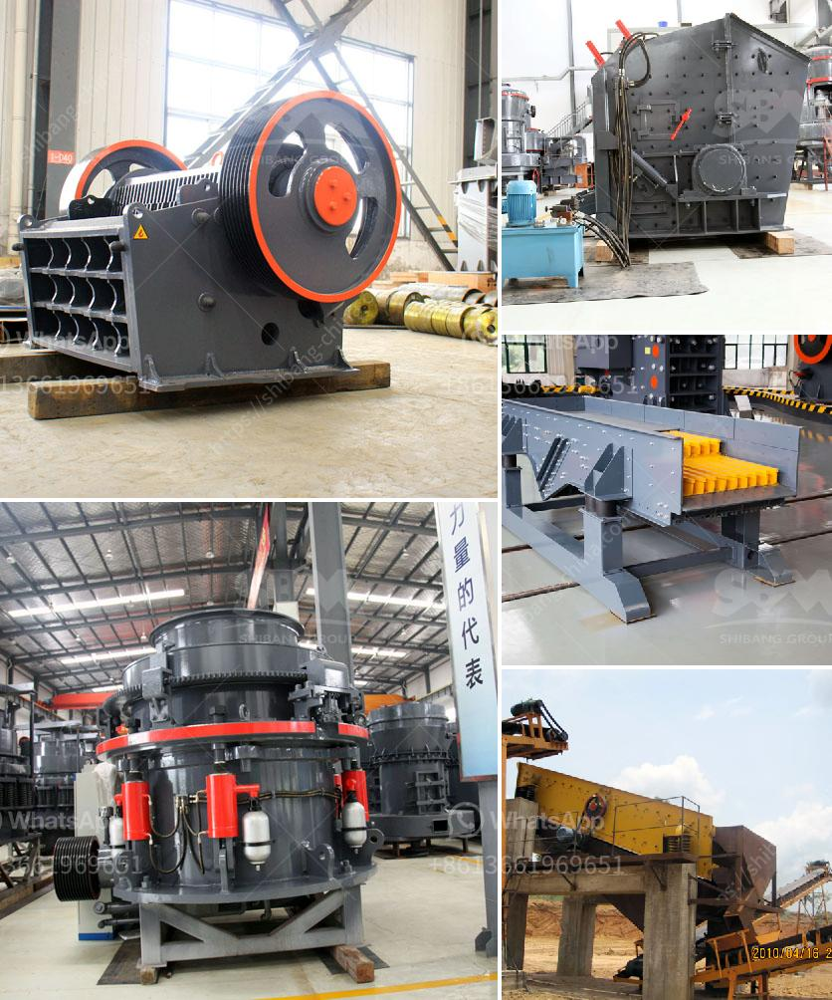

<h3>quartz stone quarry in nigeria</h3>
Quartz has been in use for thousands of years as a building material and decorative accent. It is durable, versatile, and extremely beautiful. With its abundance of mineral resources, Nigeria is one of the leading producers of quartz stones in Africa.

The country has numerous quartz stone quarries within its borders, covering over 167 million square kilometers. According to research conducted by experts, it is estimated that Nigeria has over 2.7 billion metric tonnes of quartz deposits. This vast amount of resources makes the country a prime location for quartz stone quarrying.

Quartz stone quarrying involves the extraction of quartz deposits from the earth's crust. These deposits can be found in different geological formations across Nigeria, such as granite, schist, gneiss, quartzite, and sandstone. The extraction process involves drilling, blasting, crushing, and grinding the quartz stone to obtain the desired size and shape.

One of the major quartz stone quarries in Nigeria is located in Ekiti state. The quarry is fully mechanized for mining operations. It has the capacity to produce thousands of metric tonnes of crushed quartz stones per month. The quartz stones extracted from this quarry are primarily used for various construction purposes, such as roads, bridges, buildings, and pavements.

Apart from construction purposes, quartz stones from Nigerian quarries are also in high demand for decorative purposes. The unique patterns, colors, and durability make them ideal for countertops, flooring tiles, bathroom vanities, and wall cladding. International buyers from countries like China, the United States, and India frequently import Nigerian quartz stones for these purposes.

In addition to the economic benefits, quartz stone quarrying also provides employment opportunities for the local communities. Quarrying operations require a skilled workforce to operate heavy machinery, conduct inspections, and manage logistics. This contributes to job creation and ultimately improves the quality of life in Nigerian communities.

However, it is important to note that quarrying, like any other industry, can have environmental implications. The extraction process can result in habitat destruction, noise pollution, and dust emissions. To mitigate these impacts, the Nigerian government has environmental regulations in place that require quarry operators to adhere to specific guidelines to minimize their ecological footprint.

Overall, the quartz stone quarry industry in Nigeria plays a vital role in the country's economy. It provides a wide range of construction and decorative materials, generates employment opportunities, and contributes to the country's GDP. With proper regulation and sustainable practices, Nigeria can continue to harness its abundant quartz stone resources for the benefit of its citizens and the international market.
<h3>Contact us</h3><ul><li><strong>Whatsapp:&nbsp;<a href="https://wa.me/8613661969651">+8613661969651</a></strong></li><li><a href="https://swt.shibang-china.com/?git&amp;zhl&amp;quartz stone quarry in nigeria"><strong>Online Service(chat now)</strong></a></li></ul><h3>Related</h3><ul><li><a href='crushing aggregates companies in philippines.md'>crushing aggregates companies in philippines</a></li><li><a href='stone crusher for tractors.md'>stone crusher for tractors</a></li><li><a href='gypsum manufacturers in azerbaijan.md'>gypsum manufacturers in azerbaijan</a></li><li><a href='zevith simple stone crushers kenya.md'>zevith simple stone crushers kenya</a></li><li><a href='raymond mills usa.md'>raymond mills usa</a></li></ul>