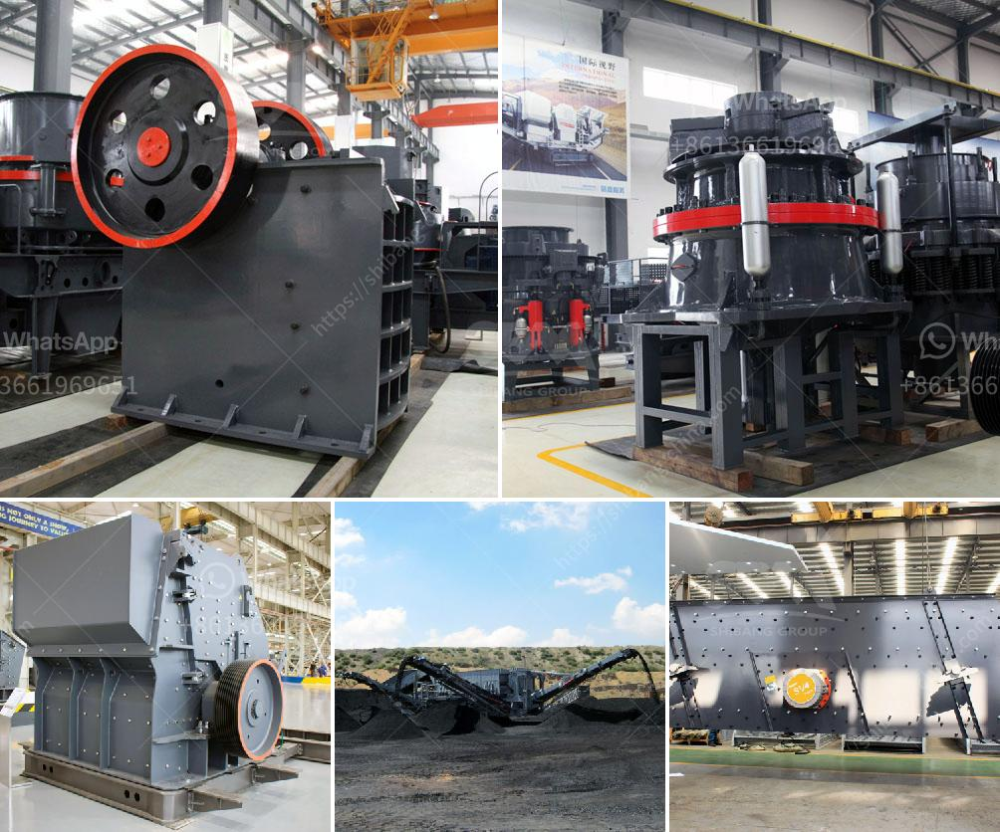

<h3>quick lime production process</h3>
Quick lime, also known as calcium oxide (CaO), is a versatile compound used in various industries. The production of quick lime involves a simple and efficient process that requires minimal energy input. This article will provide an overview of the quick lime production process.

The first step in the production of quick lime is the heating of limestone rocks. Limestone, mainly composed of calcium carbonate (CaCO3), is typically extracted from quarries and mines. The limestone is then crushed into smaller pieces to facilitate the heating process.

The crushed limestone is transferred into a kiln, also known as a lime kiln. The kiln is a large, cylindrical oven that is inclined slightly to facilitate the flow of limestone from one end to the other. At the lower end of the kiln, fuel (usually coal or natural gas) is injected, providing the necessary heat for the process.

As the limestone moves through the kiln, it is heated to extreme temperatures, typically ranging from 900 to 1200 degrees Celsius. This high temperature causes the limestone to undergo a chemical reaction known as calcination. During calcination, carbon dioxide (CO2) is released from the limestone, leaving behind quick lime.

The quick lime is then cooled and stored for further processing or immediate use. It is important to handle quick lime with care as it is highly reactive and can cause burns or injuries if not properly regulated.

Quick lime has a wide range of applications across various industries. It is commonly used in the production of cement, as a flux agent in steel manufacturing, and as a component in the production of chemical compounds. It is also used in water treatment processes to neutralize acidity and remove impurities.

In conclusion, the production of quick lime involves a straightforward and efficient process. By heating limestone rocks in a lime kiln, quick lime is obtained through a chemical reaction called calcination. Quick lime finds extensive use in numerous industries due to its versatility and chemical properties.
<h3>Contact us</h3><ul><li><strong>Whatsapp:&nbsp;<a href="https://wa.me/8613661969651">+8613661969651</a></strong></li><li><a href="https://swt.shibang-china.com/?git&amp;zhl&amp;quick lime production process"><strong>Online Service(chat now)</strong></a></li></ul><h3>Related</h3><ul><li><a href='aggregate crushing process.md'>aggregate crushing process</a></li><li><a href='roller crusher machine manufacturer.md'>roller crusher machine manufacturer</a></li><li><a href='ball grinding machine in india.md'>ball grinding machine in india</a></li><li><a href='portable limestone jaw crusher for hire in south africa.md'>portable limestone jaw crusher for hire in south africa</a></li><li><a href='magnetic enrichment of manganese ore.md'>magnetic enrichment of manganese ore</a></li></ul>