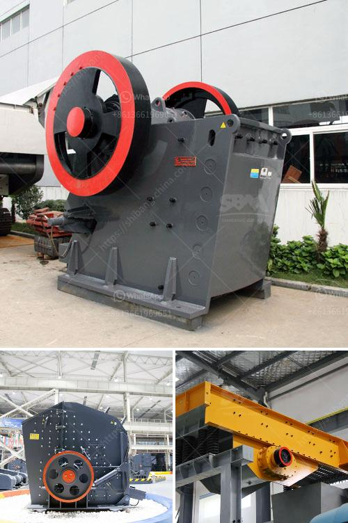

<h3>quratz crusher price</h3>
Quartz is a popular mineral that is used in various industries, including construction, electronics, and jewelry-making. As a result, the demand for quartz crushers has been steadily increasing. If you are considering purchasing a quartz crusher, it’s important to know the factors that can affect its price and how to find the best deals.

The price of quartz crushers can vary significantly depending on several factors. One of the main factors is the brand or manufacturer. Well-established and reputable brands often offer higher-quality crushers, but they also come at a higher price. On the other hand, lesser-known or generic brands may offer more affordable options, but the quality and durability might be compromised.

The type and size of the crusher also play a role in determining its price. There are different types of quartz crushers available, such as jaw crushers, cone crushers, and impact crushers. Each type has its own advantages and disadvantages, and the price can vary accordingly. Larger crushers are generally more expensive than smaller ones because they require more materials and have higher production capacities.

Another factor that affects the price of quartz crushers is the features and specifications they offer. Some crushers may come with advanced features, such as adjustable settings, automatic lubrication systems, or noise-reducing technology. These additional features can enhance the performance and convenience of the crusher, but they also add to the price. It’s important to consider your specific needs and budget when deciding which features are essential for your purpose.

In addition to the factors mentioned above, market demand and supply can also influence the price of quartz crushers. During periods of high demand, the prices may increase due to limited supply. On the other hand, during times of low demand or when new models are introduced, the prices may decrease. Therefore, it’s advisable to keep an eye on the market trends and make a purchase during favorable conditions.

Now that you are aware of the factors that can affect the price of quartz crushers, let’s discuss how to find the best deals. One of the most effective ways is to compare prices from different sellers or online platforms. This allows you to get an idea of the average price range and identify any outliers. Additionally, you can read product reviews and ratings to gauge the quality and reliability of the crusher.

It’s also important to consider the after-sales service provided by the seller. A reputable seller should offer warranties, technical support, and efficient customer service. This ensures that any issues or concerns you may have after purchasing the crusher will be promptly addressed.

Lastly, be cautious of any excessively low prices, especially if they seem too good to be true. While it’s natural to want to save money, extremely cheap crushers may indicate poor quality or fraudulent activity. It’s better to spend a little more to ensure you get a durable and efficient crusher that will meet your needs in the long run.

In conclusion, when looking for a quartz crusher, it’s crucial to consider factors such as brand, type, size, features, and market conditions. By comparing prices, reading reviews, and evaluating after-sales service, you can find the best deals and make an informed decision. Remember, it’s not just about finding the lowest price, but also getting a high-quality crusher that will provide value for your money.
<h3>Contact us</h3><ul><li><strong>Whatsapp:&nbsp;<a href="https://wa.me/8613661969651">+8613661969651</a></strong></li><li><a href="https://swt.shibang-china.com/?git&amp;zhl&amp;quratz crusher price"><strong>Online Service(chat now)</strong></a></li></ul><h3>Related</h3><ul><li><a href='how to improve technology of mining low grade ore.md'>how to improve technology of mining low grade ore</a></li><li><a href='clay brick making machine zimbabwe.md'>clay brick making machine zimbabwe</a></li><li><a href='copper ore refinement processors philippines.md'>copper ore refinement processors philippines</a></li><li><a href='china jaw crusher pe 150 250 in philippines.md'>china jaw crusher pe 150 250 in philippines</a></li><li><a href='hammer mill for ldpe grinding.md'>hammer mill for ldpe grinding</a></li></ul>