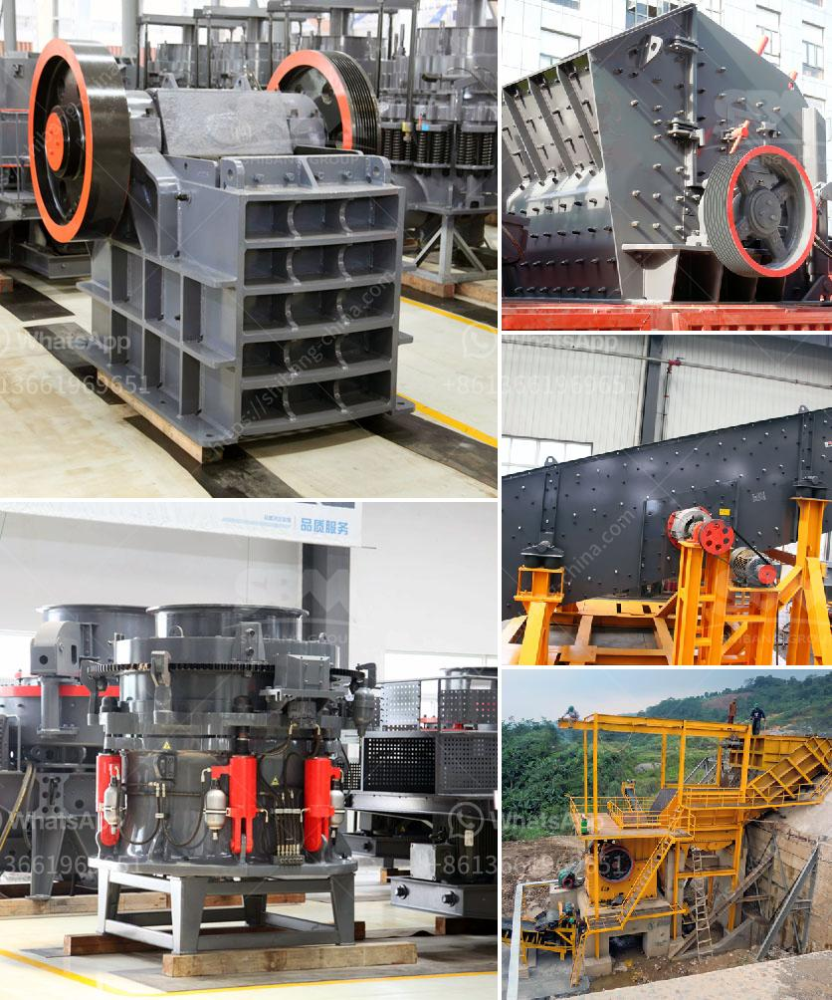

<h3>raymond mill and high pressure difference</h3>
Raymond Mill and High Pressure Grinding Mill are two popular grinding mills in the market. But what is the difference between them? Let's take a closer look.

Raymond Mill, named after its inventor, is the first generation of medium speed pendulum miller which uses American technology. It was introduced into China in the early 20th century. It is mainly used for grinding barite, calcite, potash feldspar, talc, marble, limestone, dolomite, fluorite, lime, activated clay, activated carbon, bentonite, kaolin, cement, phosphate rock, gypsum, glass, insulation materials, etc. Mohs hardness is not more than 9.3, humidity is below 6%, non-flammable and explosive minerals can be processed with Raymond Mill.

High Pressure Grinding Mill, also known as high pressure suspension roller mill, is a high-pressure grinding equipment developed by Shanghai Clirik Machinery Co., Ltd., based on Raymond mill technology. It has many advantages such as high pressure spring design, smooth vibration, low noise, and low wear. Compared to ball mills and vertical mills, it consumes 20% to 30% less energy, has a longer lifespan, and is easier to maintain and operate.

The main structural differences between Raymond Mill and High Pressure Grinding Mill can be summarized as follows:

1. The grinding ring diameter and the grinding roller diameter of Raymond Mill are larger than those of High Pressure Grinding Mill, and its output is higher than that of High Pressure Grinding Mill under the same power condition.

2. The grinding roller pressure of Raymond Mill is within the range of 0 to 500 kg, so the pressure is adjustable. However, the grinding roller pressure of High Pressure Grinding Mill is fixed within the range of 500 to 800 kg, making it suitable for processing larger materials and achieving higher grinding efficiency. 

3. The fineness of Raymond Mill can be adjusted from 80-400 mesh, while the fineness of High Pressure Grinding Mill can be adjusted from 30-425 mesh. These different fineness ranges provide more targeted options for users to meet their specific processing needs.

In conclusion, both Raymond Mill and High Pressure Grinding Mill are effective grinding mills commonly used in mineral processing, building materials, metallurgy, and other industries. The choice between the two depends on the specific requirements of the user. Raymond Mill has a wider range of applications and adjustable fineness, while High Pressure Grinding Mill is more suitable for processing larger materials and achieving higher grinding efficiency.
<h3>Contact us</h3><ul><li><strong>Whatsapp:&nbsp;<a href="https://wa.me/8613661969651">+8613661969651</a></strong></li><li><a href="https://swt.shibang-china.com/?git&amp;zhl&amp;raymond mill and high pressure difference"><strong>Online Service(chat now)</strong></a></li></ul><h3>Related</h3><ul><li><a href='crushing plants pawer screen.md'>crushing plants pawer screen</a></li><li><a href='quartz stone quarry in nigeria.md'>quartz stone quarry in nigeria</a></li><li><a href='how much is jaw crusher.md'>how much is jaw crusher</a></li><li><a href='diamants usine de lavage mobiles.md'>diamants usine de lavage mobiles</a></li><li><a href='slag processing plant in india.md'>slag processing plant in india</a></li></ul>