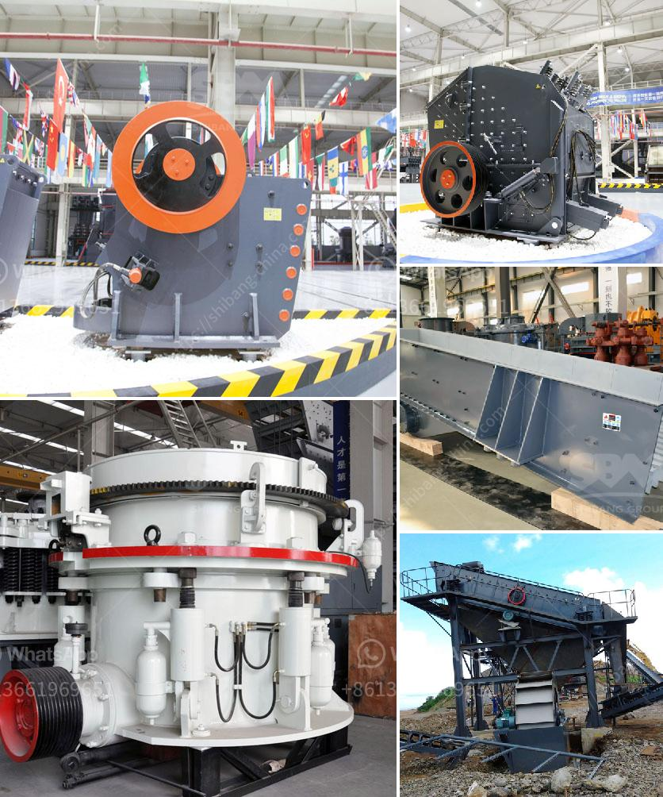

<h3>raymond mill for limestone supplier in india</h3>
Raymond mill is commonly used grinding plant, which is mainly used for the grinding and processing of barite, calcite, marble, limestone, dolomite, activity white soil, activated carbon, kaolin, cement, phosphorus ore, gypsum, glass and other non-flammable and explosive materials whose Mo's hardness is not than 9.3 level and humidity is below 6% in chemical and building, industry.

The particle size of the final product can be adjusted from 80-325 mesh at random, which can meet the different user requirements. With the constant increasing demands for particle fineness, the application field of limestone after being processed by Raymond mill is becoming more and more wide. In addition, Raymond mill has the advantages of high efficiency, low energy consumption, small footprint, wide application range, high reliability and convenient maintenance.

As a professional Raymond mill manufacturer, Guilin Hongcheng Mining Machinery Co., Ltd. provides you with a wide range of mill equipment options. Nowadays, there are many Raymond mill manufacturers in India. However, among all these manufacturers, Guikuang is the largest Raymond mill manufacturer in China. With a production capacity of 20 tons per hour, the Raymond mill is estimated to have a market price of around 25,000-27,500 USD.

The sales market has higher competitiveness. In order to meet the growing demands of the market, the company has made continuous innovation. In terms of product performance and service, Guikuang has achieved high praise and recognition from customers all over the world. At the same time, it has also attracted the attention of many limestone powder buyers.

In summary, Raymond mill plays an important role in the milling and processing of limestone, widely used in cement, energy, metallurgy, chemical industry, non-metallic mineral and other industries. Its high efficiency, low energy consumption, small footprint, convenient maintenance, and its high market competitiveness make Raymond mill will inevitably bring a new development opportunity for the limestone powder industry in India.
<h3>Contact us</h3><ul><li><strong>Whatsapp:&nbsp;<a href="https://wa.me/8613661969651">+8613661969651</a></strong></li><li><a href="https://swt.shibang-china.com/?git&amp;zhl&amp;raymond mill for limestone supplier in india"><strong>Online Service(chat now)</strong></a></li></ul><h3>Related</h3><ul><li><a href='thailand about stone crusher plant.md'>thailand about stone crusher plant</a></li><li><a href='propel mobile crusher.md'>propel mobile crusher</a></li><li><a href='china gold dry washer manufacturer in philippines.md'>china gold dry washer manufacturer in philippines</a></li><li><a href='pakistan chromite crusher equipment.md'>pakistan chromite crusher equipment</a></li><li><a href='crusher stone prices.md'>crusher stone prices</a></li></ul>