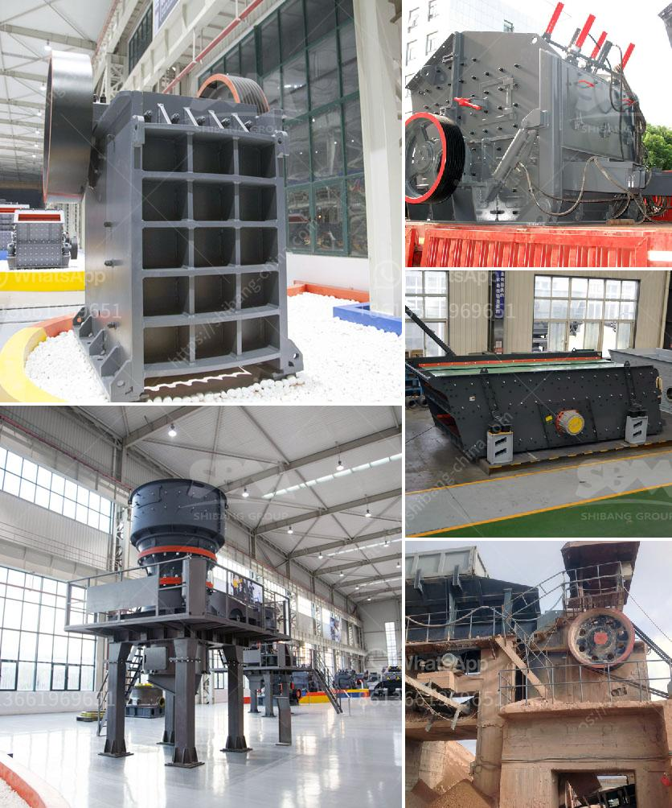

<h3>raymond mill machine upgrades powder mill machine</h3>
Raymond mill machine has been widely used in various industries. With the continuous development of industry, Raymond mill machine has also experienced continuous updates and improvements. These upgrades have made the powder mill machine more efficient and convenient for users.

One of the significant upgrades to the Raymond mill machine is the improved grinding efficiency. The new generation Raymond mill machine is equipped with advanced technology and adopts a new mechanical structure design. This design not only increases the grinding area but also improves the grinding efficiency. As a result, the production capacity of the mill has increased significantly, allowing users to produce more powder in a shorter time.

Another upgrade to the Raymond mill machine is the optimization of the wearing parts. The wearing parts of the mill, such as grinding roller and grinding ring, play a crucial role in the grinding process. With the continuous improvement of materials and manufacturing technology, the wearing parts are made of high-quality materials, which greatly prolongs their service life. This not only saves the cost of replacement but also reduces the downtime of the mill.

In addition, the Raymond mill machine is also upgraded in terms of operation and maintenance. The new generation of Raymond mill machine is equipped with an intelligent control system, which can adjust the grinding fineness, output, and other parameters according to different materials and requirements. Moreover, the machine is easy to operate, and the maintenance process is simple and convenient. Users can save a lot of time and effort in operation and maintenance.

In summary, the upgrades of the Raymond mill machine have brought significant improvements to the powder mill machine. With increased grinding efficiency, optimized wearing parts, and improved operation and maintenance, the Raymond mill machine is more productive and user-friendly. These upgrades make the Raymond mill machine a perfect choice for powder production in various industries.
<h3>Contact us</h3><ul><li><strong>Whatsapp:&nbsp;<a href="https://wa.me/8613661969651">+8613661969651</a></strong></li><li><a href="https://swt.shibang-china.com/?git&amp;zhl&amp;raymond mill machine upgrades powder mill machine"><strong>Online Service(chat now)</strong></a></li></ul><h3>Related</h3><ul><li><a href='crusher plant in india.md'>crusher plant in india</a></li><li><a href='portable stone crusher and prices.md'>portable stone crusher and prices</a></li><li><a href='italy rotary cement packing machine.md'>italy rotary cement packing machine</a></li><li><a href='cost setting up silica sand ball mill.md'>cost setting up silica sand ball mill</a></li><li><a href='primary crusher price in bolivia.md'>primary crusher price in bolivia</a></li></ul>