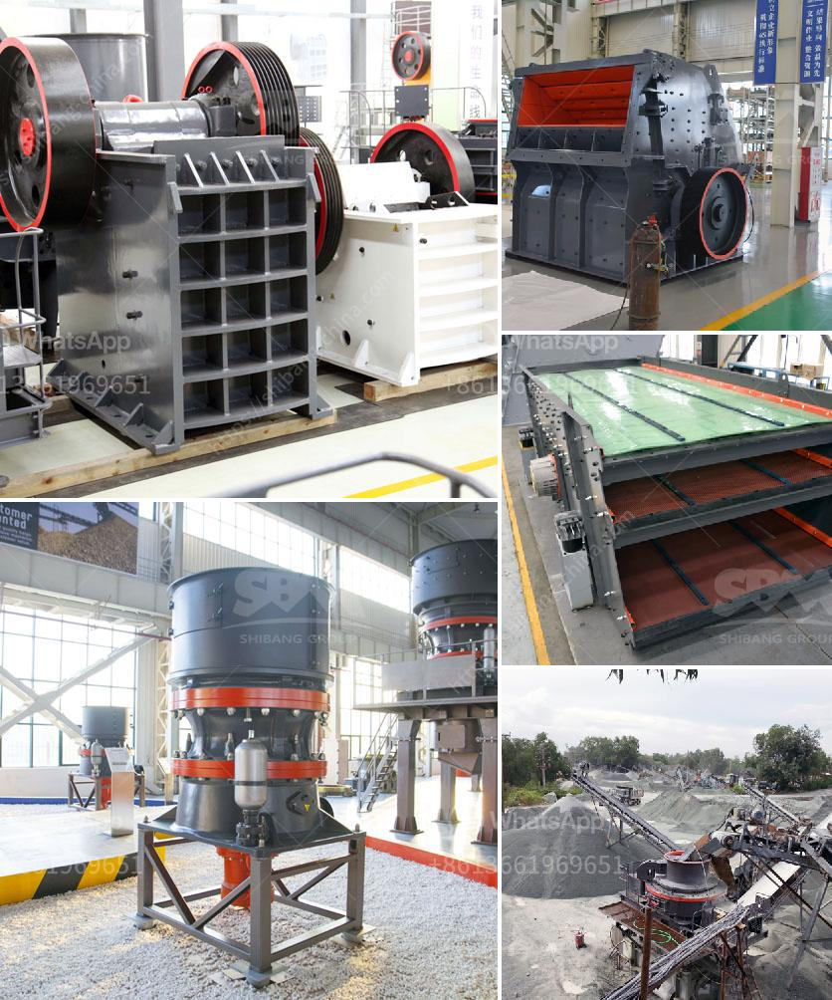

<h3>raymond mill model</h3>
Grinding mills have been an essential part of various industries for many years. They play a crucial role in the process of converting raw materials into finished products. One such grinding mill that has been gaining immense popularity is the Raymond Mill Model.

The Raymond Mill Model is a high-efficiency grinding machine that is utilized in a wide range of industries. It is designed to grind various types of materials, including minerals, cement, chemicals, and more. What sets this model apart is its ability to deliver consistent and reliable performance, resulting in superior product quality.

One of the key features of the Raymond Mill Model is its advanced grinding technology. It is equipped with a powerful and efficient motor that ensures smooth and precise grinding operations. This model also comes with a unique airflow system that enables better control over the flow of materials, thereby minimizing power consumption and maximizing grinding efficiency.

Moreover, the Raymond Mill Model boasts a robust construction that ensures durability and longevity. It is made from high-quality materials that can withstand the most demanding grinding applications. This, combined with its low maintenance requirements, makes it a cost-effective choice for industries looking to optimize their grinding processes.

The Raymond Mill Model also comes in various sizes, ranging from small-scale models to larger ones capable of handling high volumes of materials. This versatility makes it suitable for a wide range of operations, from small-scale workshops to large production plants. Additionally, its compact design allows for easy installation and space-saving.

In conclusion, the Raymond Mill Model is an excellent choice for industries looking to improve their grinding efficiency. Its advanced technology, robust construction, and versatile design make it a valuable asset for any operation. When it comes to grinding mills, the Raymond Mill Model proves to be a reliable and efficient solution that delivers consistent results.
<h3>Contact us</h3><ul><li><strong>Whatsapp:&nbsp;<a href="https://wa.me/8613661969651">+8613661969651</a></strong></li><li><a href="https://swt.shibang-china.com/?git&amp;zhl&amp;raymond mill model"><strong>Online Service(chat now)</strong></a></li></ul><h3>Related</h3><ul><li><a href='used excavators prices in uae.md'>used excavators prices in uae</a></li><li><a href='mobile crusher stone.md'>mobile crusher stone</a></li><li><a href='granite crushers and screeners.md'>granite crushers and screeners</a></li><li><a href='crushing stone machines for sale in usa.md'>crushing stone machines for sale in usa</a></li><li><a href='used dolomite jaw crusher price malaysia.md'>used dolomite jaw crusher price malaysia</a></li></ul>