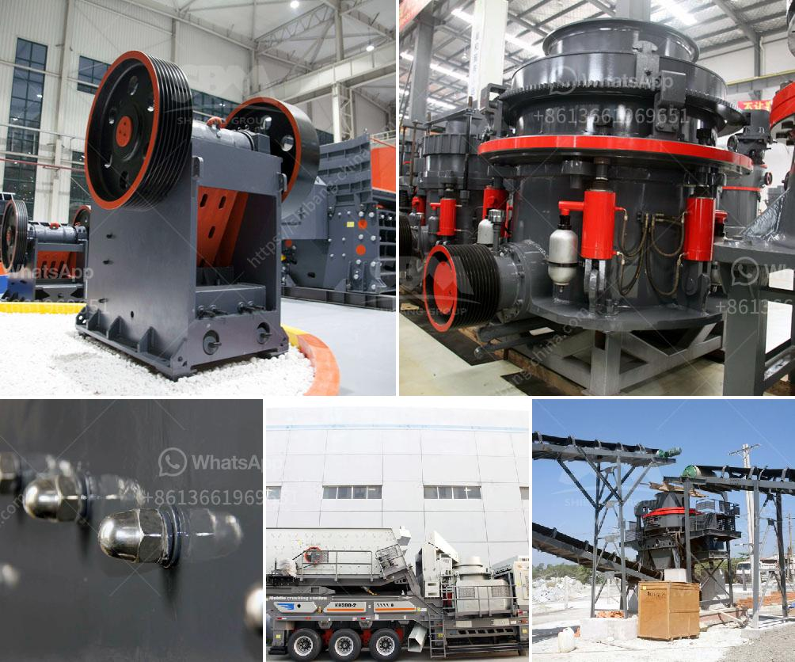

<h3>raymond mill production line</h3>
Raymond mill is a popular grinding equipment widely used in various industries. With the continuous development of new grinding equipment and technology, Raymond mill has become one of the most important powder grinding machines for industries such as mining, metallurgy, chemical industry, building materials, etc. Raymond mill production line is an ideal choice for improving production efficiency and reducing energy consumption.

Raymond mill is a newly upgraded environmental protection mill equipment. It has a number of patented technologies and features high grinding efficiency, low energy consumption, large capacity, and low pollution. This makes Raymond mill a leading choice in the industry.

The key to the high efficiency of Raymond mill lies in the optimization and upgrading of its components. The grinding roller assembly, for example, adopts high-quality wear-resistant materials, which greatly prolongs the service life of the equipment. The grinding ring is also made of wear-resistant materials, ensuring a stable and even grinding effect. In addition, the classifier adopts a high-precision grading system, which improves the accuracy and efficiency of powder selection.

In the Raymond mill production line, the main equipment for grinding is the Raymond mill. The machine is composed of a large mill frame, grinding roller, grinding ring, blade, air inlet volute, and other components. The production line can realize the automatic operation of the equipment. The grinding fineness of the Raymond mill can be adjusted between 80-400 mesh. The fineness is controllable and adjustable, which meets various production requirements.

In order to further improve the efficiency of the Raymond mill production line, it is necessary to properly configure the auxiliary equipment. The bucket elevator is an important auxiliary equipment in the Raymond mill production line. It can automatically transport the materials to the required height, which greatly saves labor and improves production efficiency. The electromagnetic vibrating feeder can evenly and continuously feed the materials into the Raymond mill, which ensures the smooth operation of the equipment.

Another important part of the Raymond mill production line is the dust removal equipment. The dust removal system is designed according to the characteristics of the material to be processed, which effectively reduces the pollution caused by dust and ensures the cleanliness of the production environment. The dust removal effect is up to the standard, meeting the requirements of environmental protection.

In conclusion, the Raymond mill production line is a high-efficiency grinding system that combines drying, grinding, grading, and conveying. It has the characteristics of high grinding efficiency, low power consumption, large feed size, easy adjustment of product fineness, and uniform particle size distribution. With the continuous improvement of technology, the Raymond mill production line will play an increasingly important role in various industries, bringing considerable economic benefits and environmental protection benefits.
<h3>Contact us</h3><ul><li><strong>Whatsapp:&nbsp;<a href="https://wa.me/8613661969651">+8613661969651</a></strong></li><li><a href="https://swt.shibang-china.com/?git&amp;zhl&amp;raymond mill production line"><strong>Online Service(chat now)</strong></a></li></ul><h3>Related</h3><ul><li><a href='300tpd cement plant price.md'>300tpd cement plant price</a></li><li><a href='stone crusher finding.md'>stone crusher finding</a></li><li><a href='used mobile crusher in nigeria.md'>used mobile crusher in nigeria</a></li><li><a href='how much is jaw crusher.md'>how much is jaw crusher</a></li><li><a href='philippines second hand stone crusher.md'>philippines second hand stone crusher</a></li></ul>