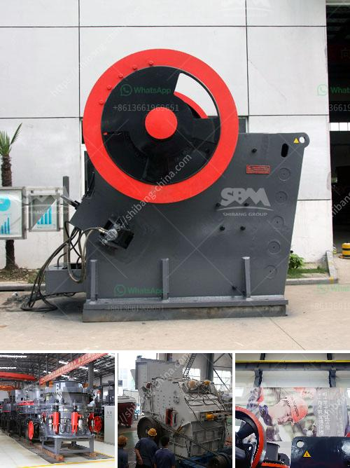

<h3>raymond mill vs ball mill</h3>
Raymond mill and ball mill are both grinding equipment used in mining industry. Both are similar in that they both use a rotating container, inner lining, and grinding media to grind materials. However, Raymond mill is more commonly used for powder making applications in industries such as construction, metallurgy and chemical. Ball mill, on the other hand, is specifically designed for ore grinding in mining industry.

Raymond mill has a more uniform particle size range, in the powder making industry, the particle size of the materials handled by Raymond mill is generally between 80-325 mesh, and the finished product has a good granularity, uniformity, fineness and consistency. However, the processing capacity of Raymond mill is relatively small, and the output concentrates in the small size range.

Ball mill, on the other hand, is applied for high grinding fineness and can handle materials with a wide range of hardness. It is applied in the mineral processing industry as well as in cement plants. Compared to Raymond mill, ball mill has higher processing capacity and finer output size. The finished fineness of ball mill is usually between 0.074-0.4 mm.

Another key difference between Raymond mill and ball mill is their different structure. Raymond mill uses the vertical structure with a small footprint, while ball mill is horizontal structure, which can save the installation area. The height difference between the two machines helps to reduce the civil engineering cost.

In conclusion, Raymond mill and ball mill are both widely used grinding equipment, but there are significant differences between them in terms of processing capacity, fineness, output size, and structure. Users should carefully compare and choose the appropriate grinding equipment based on their specific needs and requirements.
<h3>Contact us</h3><ul><li><strong>Whatsapp:&nbsp;<a href="https://wa.me/8613661969651">+8613661969651</a></strong></li><li><a href="https://swt.shibang-china.com/?git&amp;zhl&amp;raymond mill vs ball mill"><strong>Online Service(chat now)</strong></a></li></ul><h3>Related</h3><ul><li><a href='conveyor belts for material.md'>conveyor belts for material</a></li><li><a href='ball mill zenit crusher china.md'>ball mill zenit crusher china</a></li><li><a href='ultra fine milling machines.md'>ultra fine milling machines</a></li><li><a href='mobile stone crushing plant.md'>mobile stone crushing plant</a></li><li><a href='gypsum powder production business plan.md'>gypsum powder production business plan</a></li></ul>