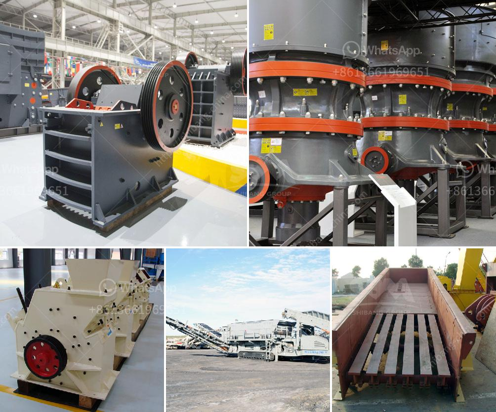

<h3>raymond mills usa</h3>
Raymond Mills was born in the small town of Carthage, Tennessee. At a very young age, Raymond displayed an entrepreneurial spirit and a talent for leadership. His early years were spent building businesses and honing his skills as a businessman.

In the early 1960s, Raymond moved to the big city, seeking new opportunities and a chance to make a name for himself. He settled in New York City, where he quickly established himself as a rising star in the business world. Raymond's strong work ethic, determination, and innovative ideas propelled him to great heights.

By the late 1960s, Raymond had built a reputation as an astute businessman, and his success caught the attention of investors and industry leaders. In 1970, he founded Raymond Mills USA, a manufacturing company specializing in high-quality products for various industries. The company experienced immediate success, thanks to Raymond's dedication to quality, efficiency, and customer satisfaction.

Under Raymond's leadership, the company expanded rapidly, establishing a strong presence in the domestic market and eventually branching out to international markets. Raymond's commitment to innovation and cutting-edge technology allowed the company to remain at the forefront of its industry.

One of Raymond's greatest achievements was the development of the Raymond Mill, a patented machine that revolutionized the manufacturing process. The Raymond Mill allowed for faster and more precise production, significantly reducing costs and increasing productivity. This groundbreaking invention became the cornerstone of Raymond Mills USA's success and solidified Raymond's reputation as an industry pioneer.

Despite his remarkable success, Raymond never forgot his humble beginnings. He always made an effort to give back to the community and support charitable organizations. Raymond Mills USA became known for its philanthropic efforts and its commitment to corporate social responsibility, setting the standard for other businesses.

Throughout his career, Raymond received numerous accolades and awards for his achievements. His dedication to excellence and his unwavering commitment to his employees and customers earned him a reputation as an outstanding leader and businessman.

Today, Raymond Mills USA continues to thrive under the leadership of Raymond's son, David Mills. The company remains true to its core values of quality, innovation, and customer satisfaction, upholding the legacy that Raymond built.

Raymond Mills represents the American dream. His journey from a small town in Tennessee to the heights of success is a testament to hard work, determination, and unwavering dedication. Raymond's story is an inspiration to aspiring entrepreneurs and business leaders, reminding us that with the right mindset and relentless pursuit of excellence, anything is possible.

In conclusion, Raymond Mills USA stands as a shining example of American ingenuity and success. Raymond's entrepreneurial spirit, leadership abilities, and dedication to his craft have left an indelible mark on the business world. His legacy serves as a reminder that the American dream is alive and well for those willing to work hard, take risks, and never give up on their dreams.
<h3>Contact us</h3><ul><li><strong>Whatsapp:&nbsp;<a href="https://wa.me/8613661969651">+8613661969651</a></strong></li><li><a href="https://swt.shibang-china.com/?git&amp;zhl&amp;raymond mills usa"><strong>Online Service(chat now)</strong></a></li></ul><h3>Related</h3><ul><li><a href='small scale crushing plant.md'>small scale crushing plant</a></li><li><a href='grinding machinery manufecture in africa.md'>grinding machinery manufecture in africa</a></li><li><a href='portable rock crusher.md'>portable rock crusher</a></li><li><a href='roller crusher cad detail drawing.md'>roller crusher cad detail drawing</a></li><li><a href='indonesia quality crusher conveyor belts.md'>indonesia quality crusher conveyor belts</a></li></ul>