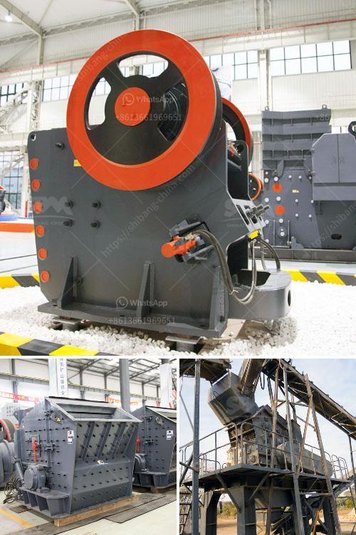

<h3>raymond roller mill drawings</h3>
In the world of industrial grinding, few pieces of equipment can stand the test of time like the Raymond roller mill. This powerful machine has been used for decades by mining, cement, and chemical industries to grind materials into extremely fine powders. And now, with the introduction of advanced technology and precision engineering, it is even more efficient and reliable than ever before.

One of the key reasons behind the success of the Raymond roller mill lies in its unique design and engineering. To ensure the utmost precision and accuracy in its operation, each mill undergoes meticulous planning and meticulous drawing. These drawings serve as the blueprint for engineers and technicians, guiding them in the construction and assembly of the equipment.

The Raymond roller mill drawings include detailed descriptions of each component, from the grinding ring and roller assembly to the classifier and fan system. Every aspect of the mill is carefully considered, with particular attention paid to the materials used, tolerances, and operational parameters. This attention to detail guarantees that each mill performs optimally, delivering the highest possible production rates and energy efficiency.

Moreover, the drawings also showcase the safety features integrated into the design of the Raymond roller mill. Safety guards, emergency stops, and interlocking mechanisms are meticulously planned to protect both the operator and the equipment. This emphasis on safety ensures that the mill can be operated with confidence, minimizing the risk of accidents or equipment damage.

The precision and efficiency of the Raymond roller mill drawings have revolutionized the industrial grinding industry. With their implementation, companies have witnessed significant increases in productivity and profitability. Fine powders are now produced at a faster rate and with higher consistency, allowing for better quality control in product manufacturing.

In conclusion, the Raymond roller mill drawings epitomize the marriage of advanced technology and meticulous engineering. They represent the pinnacle of industrial grinding equipment, delivering unparalleled performance and reliability. As companies strive to optimize their grinding processes and achieve greater efficiency, the Raymond roller mill remains the go-to solution.
<h3>Contact us</h3><ul><li><strong>Whatsapp:&nbsp;<a href="https://wa.me/8613661969651">+8613661969651</a></strong></li><li><a href="https://swt.shibang-china.com/?git&amp;zhl&amp;raymond roller mill drawings"><strong>Online Service(chat now)</strong></a></li></ul><h3>Related</h3><ul><li><a href='how different impact crusher and hammer mill.md'>how different impact crusher and hammer mill</a></li><li><a href='iron crushing machine.md'>iron crushing machine</a></li><li><a href='price rock crusher peru.md'>price rock crusher peru</a></li><li><a href='trapezium mill south africa.md'>trapezium mill south africa</a></li><li><a href='quarry and mining crusher equipment.md'>quarry and mining crusher equipment</a></li></ul>