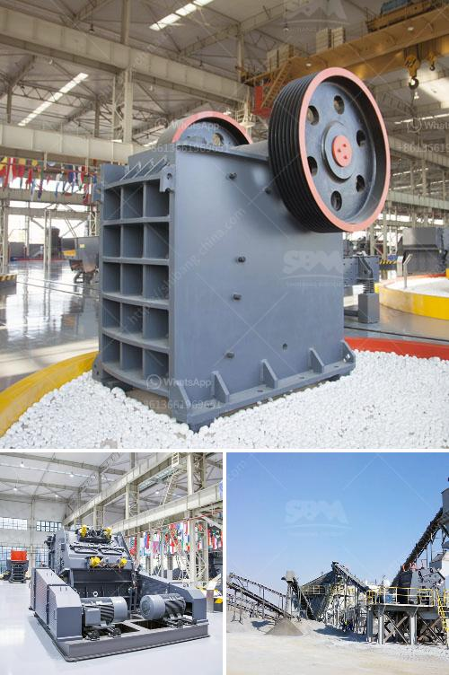

<h3>raymond ultra fine grinding mill</h3>
Raymond Ultra Fine Grinding Mill is a highly efficient mechanical mill designed for mining and processing of non-metallic minerals. With advanced technology and outstanding performance, it is widely used for grinding limestone, calcite, marble, calcium carbonate, kaolin, barite, bentonite, pyrophyllite etc.

Raymond Ultra Fine Grinding Mill utilizes a combination of size reduction mechanisms, including impact, attrition, and particle-to-particle collision, to reduce the material to ultra-fine sizes. The mill is designed with a high-efficiency dynamic classifier that can achieve ultra-fine powders from d97 5 to d97 70 microns, depending on the application.

The mill has a unique design that allows for easy maintenance and operation. The grinding ring and grinding roller are made of special wear-resistant materials to ensure longer service life. The advanced sealing design prevents dust leakage, and the integrated automatic lubrication system ensures smooth and reliable operation.

Raymond Ultra Fine Grinding Mill offers excellent grinding performance on a wide range of materials. It is particularly well suited for processing heat-sensitive materials, such as chemical, food, and pharmaceutical products. The mill can be used for dry or wet grinding, making it suitable for both batch and continuous operation.

In addition to its versatility in processing different materials, Raymond Ultra Fine Grinding Mill can also be used in various industries, such as mining, metallurgy, building materials, chemical engineering, and environmental protection. It is an essential equipment for the production of ultra-fine powders, which are widely used in paints, coatings, plastics, rubber, ceramics, papermaking, cosmetics, and other industries.

Raymond Ultra Fine Grinding Mill is designed with advanced dust collection system to ensure clean and green operation. The dust collector has high dust collection efficiency and low emission concentration, which meets the national environmental protection requirements. Additionally, the noise level of the mill is well below the national standard, reducing the impact on the surrounding environment.

In summary, Raymond Ultra Fine Grinding Mill is an advanced and efficient grinding machine with a wide range of applications. It delivers high output, low energy consumption, and excellent grinding performance. With its advanced technology, environmental friendliness, and easy operation, it is a preferred choice for processing non-metallic minerals in various industries.
<h3>Contact us</h3><ul><li><strong>Whatsapp:&nbsp;<a href="https://wa.me/8613661969651">+8613661969651</a></strong></li><li><a href="https://swt.shibang-china.com/?git&amp;zhl&amp;raymond ultra fine grinding mill"><strong>Online Service(chat now)</strong></a></li></ul><h3>Related</h3><ul><li><a href='zevith simple stone crushers kenya.md'>zevith simple stone crushers kenya</a></li><li><a href='pulverizer crusher manufacturer in chennai.md'>pulverizer crusher manufacturer in chennai</a></li><li><a href='selling stone crusher plant.md'>selling stone crusher plant</a></li><li><a href='stone crushing making machine.md'>stone crushing making machine</a></li><li><a href='iron ore crusher machine price.md'>iron ore crusher machine price</a></li></ul>