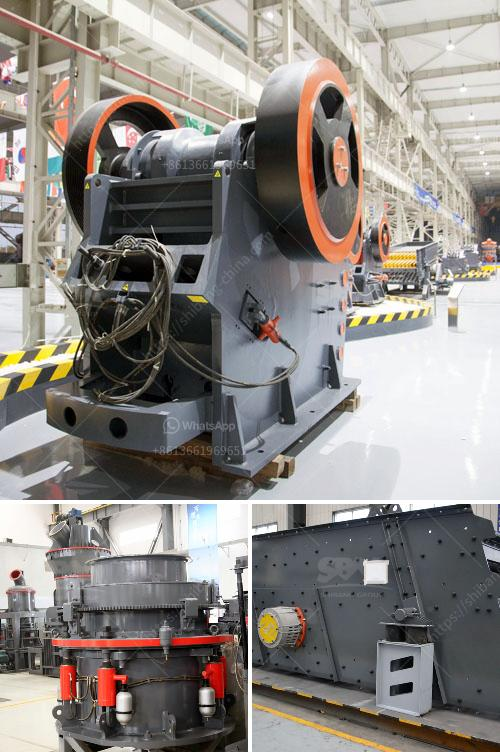

<h3>rent stone crusher in gresik</h3>
Renting a stone crusher in Gresik has never been easier or more affordable. With a wide range of options available, it's now possible to access this equipment at rates that are suitable for any budget.

Stone crushers are powerful machines used to crush and grind materials into smaller pieces for various applications. They are commonly used in the construction industry, mining industry, and recycling industry. Whether you need to crush rocks, concrete, or asphalt, renting a stone crusher in Gresik can help you get the job done efficiently.

One of the main advantages of renting a stone crusher is that it eliminates the cost of purchasing the equipment outright. Buying a stone crusher can be a significant investment, especially for larger projects. Renting allows you to access the equipment without a large upfront cost, making it more accessible for small to medium-sized businesses or individuals.

Another advantage of renting a stone crusher in Gresik is flexibility. Renting gives you the option to choose the size and type of stone crusher that best suits your project's requirements. Whether you need a small, portable stone crusher for a temporary project or a larger stationary crusher for a long-term job, rental options are available to meet your needs.

Renting also offers the advantage of accessing the latest technology and equipment. Stone crushers are constantly evolving, with new models and features being introduced regularly. By renting, you can access the most up-to-date equipment without having to worry about maintenance or outdated technology. This ensures that you can complete your project efficiently and effectively.

Additionally, renting a stone crusher in Gresik gives you peace of mind when it comes to maintenance and repairs. Equipment breakdowns can be costly and time-consuming. When you rent, the responsibility of maintenance and repairs lies with the rental company. This means that you can focus on your project, knowing that any issues with the stone crusher will be handled promptly by professionals.

When considering renting a stone crusher in Gresik, it's important to do your research and choose a reputable rental company. Look for a company that offers reliable equipment, flexible rental terms, competitive rates, and excellent customer service. Reading customer reviews and comparing prices from different providers will help you make an informed decision.

In conclusion, renting a stone crusher in Gresik provides a cost-effective and efficient solution for crushing and grinding materials. With the ability to access modern equipment on flexible terms, you can complete your projects with ease. Take advantage of the convenience and benefits offered by renting a stone crusher in Gresik for your next project.
<h3>Contact us</h3><ul><li><strong>Whatsapp:&nbsp;<a href="https://wa.me/8613661969651">+8613661969651</a></strong></li><li><a href="https://swt.shibang-china.com/?git&amp;zhl&amp;rent stone crusher in gresik"><strong>Online Service(chat now)</strong></a></li></ul><h3>Related</h3><ul><li><a href='suppliers of mining equipment in south africa.md'>suppliers of mining equipment in south africa</a></li><li><a href='clay ceromic manufacturing process.md'>clay ceromic manufacturing process</a></li><li><a href='malaysia memproses peralatan bijih besi.md'>malaysia memproses peralatan bijih besi</a></li><li><a href='jaw crusher in dar es salaam.md'>jaw crusher in dar es salaam</a></li><li><a href='ball mill in malaysia.md'>ball mill in malaysia</a></li></ul>