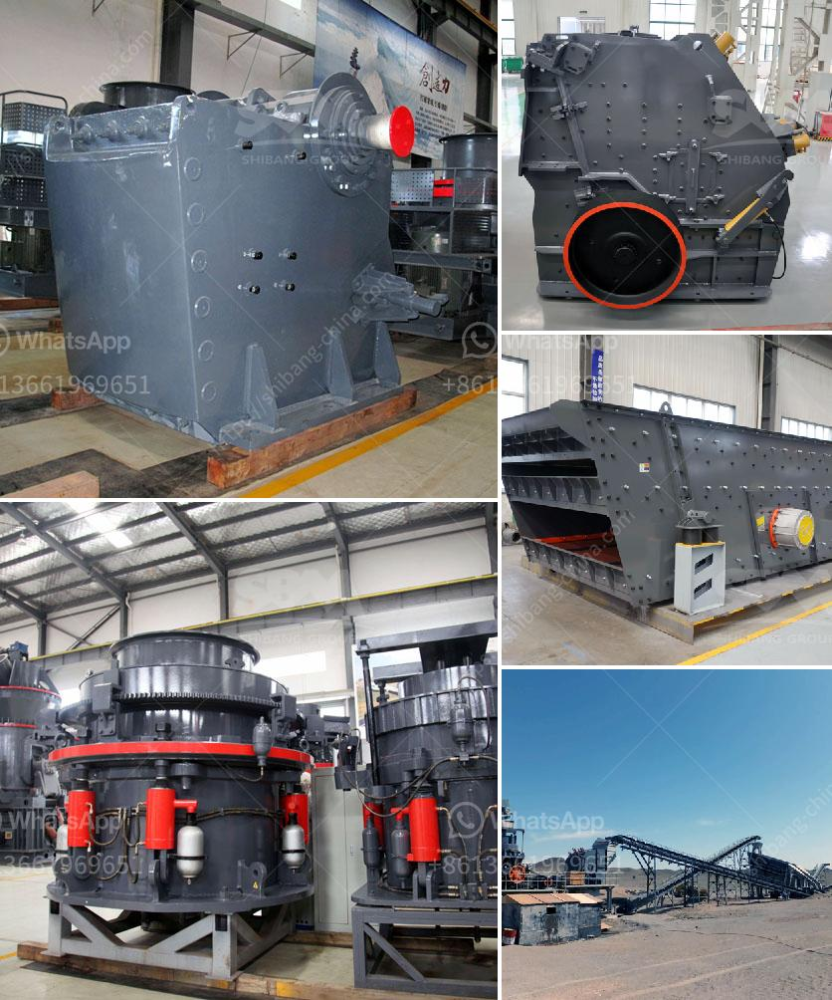

<h3>renting of screens and crushers in middelburg</h3>
In the bustling city of Middelburg, where industries thrive and constant development is seen, the need for efficient material processing is essential. From construction sites to mining areas, the demand for high-quality processed materials has never been higher. That's where the renting of screens and crushers in Middelburg comes into play.

With advancements in technology and machinery, the option to rent screens and crushers has become a popular and economical choice for many businesses. Gone are the days of investing large sums of money in purchasing such equipment, as businesses now have the freedom to rent them, tailored to their specific project needs.

One of the vital advantages of renting screens and crushers is cost-efficiency. Rather than committing significant capital to purchasing the equipment, businesses can allocate those funds to other areas of their operation, such as hiring skilled labor or expanding their fleet of vehicles. Renting proves to be a more economical option, especially for smaller businesses and startups in Middelburg looking to optimize their budget.

Flexibility is another key benefit of renting screens and crushers. Projects often vary in scale and duration, with different materials requiring different processing techniques. By being able to rent equipment for specific periods, businesses have the luxury of selecting the most suitable screens and crushers for each project. This adaptability ensures that the desired results are achieved efficiently, without the headache of handling equipment not designed for the task at hand.

Additionally, by renting screens and crushers, maintenance, repair, and storage costs are effectively eliminated. Rental companies in Middelburg take responsibility for the upkeep and repairs of their own equipment, saving businesses valuable time and effort. Moreover, storage can also be a challenge, particularly for small to medium-sized businesses. Renting alleviates the need to find suitable storage spaces, further reducing costs and logistics associated with equipment maintenance.

Furthermore, renting screens and crushers provides access to the latest and most advanced equipment. Technology is constantly evolving, particularly in the material processing sector. Rental companies regularly update their inventory with the latest models, ensuring that businesses can enjoy the benefits of state-of-the-art technology without the financial burden of actually purchasing it. This access to cutting-edge machinery enables businesses in Middelburg to stay competitive in the market, boosting their productivity and overall efficiency.

Finally, renting screens and crushers promotes environmental sustainability. Instead of businesses constantly purchasing new equipment and contributing to the cycle of waste, renting ensures that existing machinery is efficiently utilized. By reusing equipment through rentals, the consumption of resources and energy needed for manufacturing new machines is significantly reduced, contributing to a greener and more sustainable future.

In conclusion, the renting of screens and crushers in Middelburg unlocks a myriad of benefits for businesses in need of efficient material processing. From cost-efficiency and flexibility to access to the latest technology and environmental sustainability, renting provides the ideal solution for projects of varying scales and durations. As the city continues to thrive, the renting option stands as a reliable partner for any business looking to optimize their material processing capabilities in Middelburg.
<h3>Contact us</h3><ul><li><strong>Whatsapp:&nbsp;<a href="https://wa.me/8613661969651">+8613661969651</a></strong></li><li><a href="https://swt.shibang-china.com/?git&amp;zhl&amp;renting of screens and crushers in middelburg"><strong>Online Service(chat now)</strong></a></li></ul><h3>Related</h3><ul><li><a href='stone crusher for hire in durban.md'>stone crusher for hire in durban</a></li><li><a href='ball mill prices and for sale ghana.md'>ball mill prices and for sale ghana</a></li><li><a href='stone hammer mill.md'>stone hammer mill</a></li><li><a href='amp gravel conveyor belt.md'>amp gravel conveyor belt</a></li><li><a href='philippines second hand stone crusher.md'>philippines second hand stone crusher</a></li></ul>