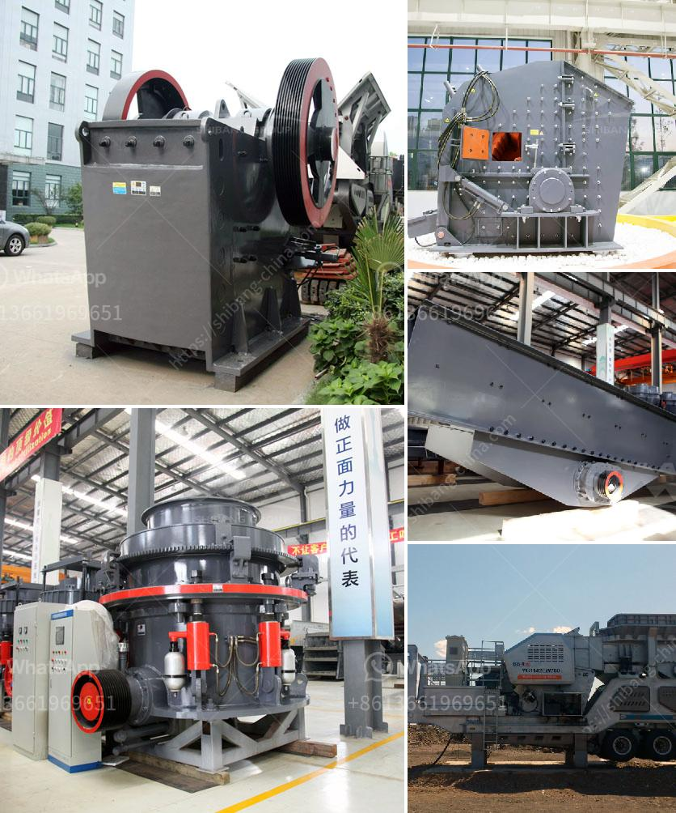

<h3>river sand washing machine portable india</h3>
In India, the importance of sand washing machine has grown as the cities are getting bigger and the construction projects are becoming immense. Sand is widely used in construction, particularly in the production of concrete and cement, which are the building blocks for the country's infrastructure. With the rapid urbanization and development, the demand for sand has dramatically increased, leading to the depletion of natural river sand resources.

One of the solutions to tackle this issue is the use of river sand washing machines. These machines are instrumental in cleaning and washing the sand, thereby removing impurities and making it suitable for construction purposes. As the name suggests, these machines are portable, allowing them to be easily transported to different locations where they are needed the most.

The river sand washing machines in India come in different types and sizes, each catering to a specific need of the construction industry. One of the most common types of these machines is the portable sand washing machine. It is a compact and mobile sand washing machine, with an integrated washing, dewatering, and screening system that provides efficient washing of sand and ensures the highest quality output.

The portable sand washing machine operates on the principle of cyclone separation, with high-pressure water jets that effectively remove silt and clay from the sand particles. It also comes with vibrating screens that help in removing any unwanted debris or foreign materials. The washed sand is then dewatered through a unit, which uses centrifugal force to remove excess moisture from the sand, resulting in a dry and clean product.

One of the main advantages of using a portable sand washing machine in India is its mobility. Construction sites are often located in remote areas or at a considerable distance from the sources of natural sand. The ability to transport the sand washing machine to these locations eliminates the need to transport sand from one place to another, saving both time and cost. Moreover, the portable nature of these machines also enables easy maintenance, as they can be easily moved to a workshop or service center if required.

Another significant advantage of using river sand washing machines in India is the environmental impact. By removing impurities and contaminants, these machines contribute to the preservation of the environment. They help in maintaining the ecological balance of rivers and other water bodies, as less contaminated water is discharged back into these sources. Additionally, the high-efficiency operation of these machines consumes less water and electricity, reducing the overall carbon footprint.

In conclusion, the introduction of portable river sand washing machines in India has revolutionized the construction industry. With their ability to effectively clean and wash sand, these machines have become an indispensable tool in ensuring the availability of high-quality sand for construction projects. Their portability, efficiency, and eco-friendly nature make them a preferred choice for contractors and builders throughout the country. As the demand for sand continues to rise, the use of river sand washing machines will play a crucial role in meeting this demand while preserving the environment.
<h3>Contact us</h3><ul><li><strong>Whatsapp:&nbsp;<a href="https://wa.me/8613661969651">+8613661969651</a></strong></li><li><a href="https://swt.shibang-china.com/?git&amp;zhl&amp;river sand washing machine portable india"><strong>Online Service(chat now)</strong></a></li></ul><h3>Related</h3><ul><li><a href='crushed sand manufacturing.md'>crushed sand manufacturing</a></li><li><a href='manufacturing equipments of lime stone milling.md'>manufacturing equipments of lime stone milling</a></li><li><a href='quartz grinding unit sale in nigeria.md'>quartz grinding unit sale in nigeria</a></li><li><a href='sand and gravel separator machine for sale philippines.md'>sand and gravel separator machine for sale philippines</a></li><li><a href='cost of crushing equipments in nigeria.md'>cost of crushing equipments in nigeria</a></li></ul>