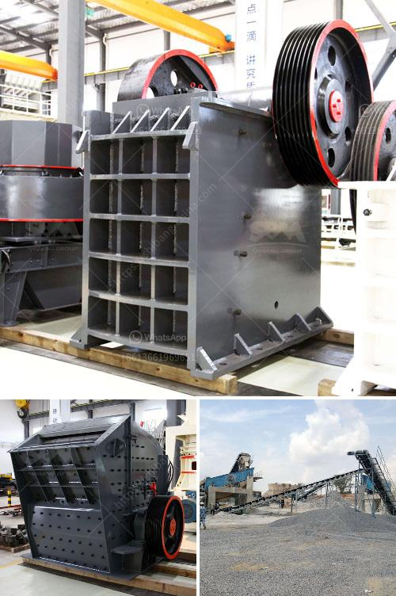

<h3>river stone crushing equipment</h3>
River stones are commonly used in construction and landscaping projects due to their durability, beauty, and versatility. They are often found in streams, rivers, and other bodies of water, where the constant flow of water has worn them smooth and rounded over time. To process river stones into specific sizes and shapes, crushing equipment is needed.

River stone crushing equipment has two major types: jaw crusher and impact crusher, which are named according to their crushing plates and second crushing chamber structures. Jaw crusher is ideal for primary crushing, while impact crusher is for secondary crushing. Besides, different final sizes are also needed for different projects.

River stones can be commonly found in various sizes, ranging from small pebbles to larger rocks. The size of river stones can affect the crushing efficiency of equipment, especially the impact crusher. Therefore, when choosing the equipment, it is necessary to select a suitable crushing machine according to the size of the river stone you have.

At present, there are multiple crushers and crushing plants for river stones. These equipment vary in configurations, feeding sizes, and final output sizes. The common secondary crushers are cone crusher, hammer crusher, impact crusher, and VSI sand maker. With the rise of mining and construction industries, more and more river stone materials are processed and utilized in these industries, resulting in higher requirements for crushing equipment.

In response to this market trend, Liming Heavy Industry has developed a complete range of river stone crushing equipment for both domestic and international markets. We provide jaw crusher, impact crusher, cone crusher, VSI sand maker, vibrating screen, vibrating feeder, belt conveyor, etc. All these machines are specifically designed to produce high-quality gravel and aggregate for various construction applications.

Our river stone crushing equipment has the following characteristics: reliable performance, reasonable design, convenient operation, and high work efficiency. Due to the low hardness of river stones, the specific requirements for the crushing process are relatively low. Therefore, we optimize the equipment for the crushing of river stones, ensuring that crushing efficiency and final product quality are both highly improved.

Furthermore, our crushing equipment has a wide application range. It can be used to crush river stones of different sizes and shapes, from cobblestones to pebbles, even large river rocks can be processed effortlessly. The final products can be used for construction purposes, such as road construction, bridge construction, and building construction.

In conclusion, river stone crushing equipment is very popular in construction and landscaping industries these days. It is widely used for crushing river stones of various sizes, shapes, and colors. With the rapid development of engineering and mining industries, river stone crushing equipment will continue to boom in the future, which is of great significance to the construction of modern urban infrastructure.
<h3>Contact us</h3><ul><li><strong>Whatsapp:&nbsp;<a href="https://wa.me/8613661969651">+8613661969651</a></strong></li><li><a href="https://swt.shibang-china.com/?git&amp;zhl&amp;river stone crushing equipment"><strong>Online Service(chat now)</strong></a></li></ul><h3>Related</h3><ul><li><a href='business plan for crushing and screening.md'>business plan for crushing and screening</a></li><li><a href='500 ton hour coal crusher and screen.md'>500 ton hour coal crusher and screen</a></li><li><a href='marble processing plant.md'>marble processing plant</a></li><li><a href='price of medium quarry plant.md'>price of medium quarry plant</a></li><li><a href='manufacture of conveyor belts in mexico.md'>manufacture of conveyor belts in mexico</a></li></ul>