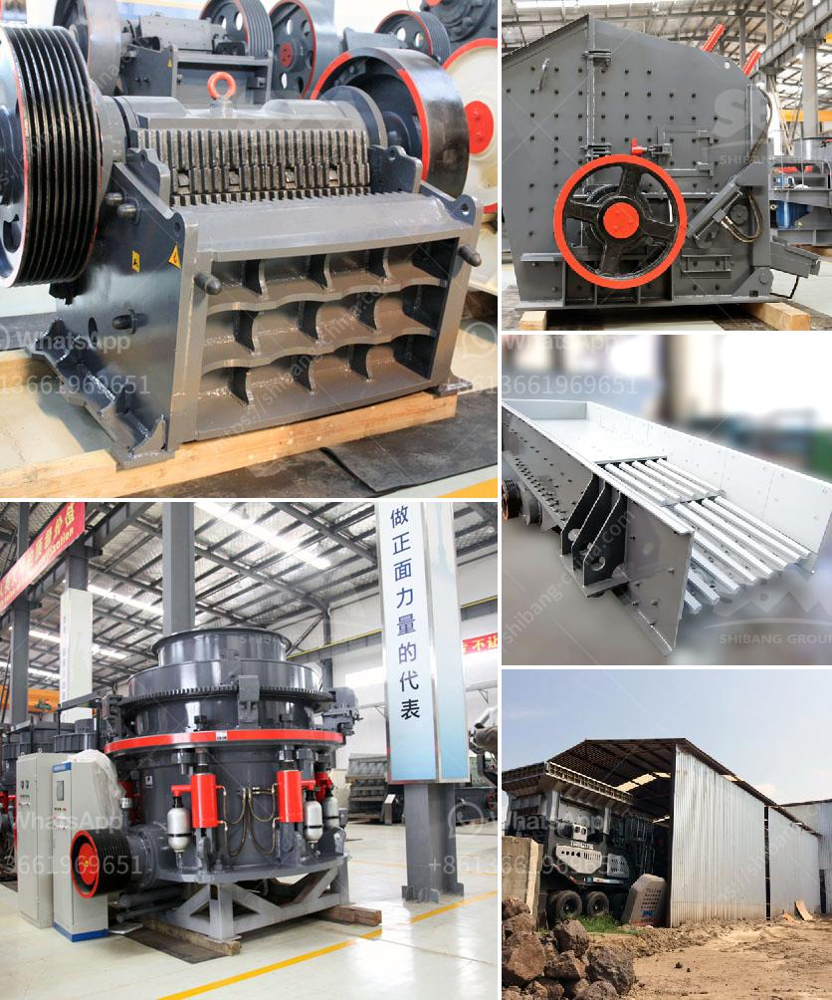

<h3>river stone processing plant</h3>
River stones, also known as river rocks, are natural stones that have been worn and shaped by moving water over time. They are commonly found in rivers and streams, and their smooth and rounded appearance makes them a popular choice for various applications. Due to their unique features and increasing demand, the river stone processing plant industry has emerged as a promising sector in the global market.

River stones are primarily used in construction and landscaping projects. Their attractive appearance and durability make them ideal for pathways, driveways, and garden accents. They can also be used for building decorative walls, water features, and outdoor fireplaces. Additionally, river stones are commonly used as an aggregate in concrete production, providing strength and stability to structures.

To meet the growing demand, river stone processing plants have been established in various locations across the world. These plants extract river stones and process them into different shapes and sizes to cater to specific customer requirements. The processing includes sorting, washing, crushing, and screening the stones to remove impurities and achieve the desired quality.

One of the main advantages of river stone processing plants is their ability to transform raw river stones into valuable products. By utilizing advanced machinery and technology, these plants efficiently process large quantities of river stones, ensuring a consistent supply for customers. The processed stones are often sold in bulk or packaged in bags, making them readily available for purchase.

River stone processing plants also contribute to the local economy. They create job opportunities for workers involved in the extraction, processing, and distribution processes. This boosts the employment rate and improves the standard of living in the surrounding communities. Furthermore, the establishment of such plants enhances the overall economic stability of the region, attracting investments and promoting growth.

In terms of environmental impact, river stone processing plants prioritize sustainable practices. They adhere to strict regulations and take necessary steps to minimize their carbon footprint and conserve natural resources. For example, water used in the processing plants is recycled and treated to minimize water consumption. Additionally, the plants actively participate in land reclamation and restoration, ensuring that the extraction sites are returned to their natural state.

Despite the promising prospects, river stone processing plants also face challenges. The availability of suitable riverstone deposits can be limited, requiring extensive exploration and evaluation processes. Additionally, market fluctuations and the availability of alternative materials can impact the demand for river stones. However, with proper planning, innovation, and diversification, these challenges can be overcome, ensuring the sustainability and growth of the industry.

In conclusion, the river stone processing plant industry is a promising sector that caters to the increasing demand for river stones in construction and landscaping projects. These plants extract and process river stones into valuable products, contributing to the local economy and adhering to sustainable practices. While challenges exist, the industry has the potential for growth and prosperity, making it an attractive investment opportunity for entrepreneurs and investors alike.
<h3>Contact us</h3><ul><li><strong>Whatsapp:&nbsp;<a href="https://wa.me/8613661969651">+8613661969651</a></strong></li><li><a href="https://swt.shibang-china.com/?git&amp;zhl&amp;river stone processing plant"><strong>Online Service(chat now)</strong></a></li></ul><h3>Related</h3><ul><li><a href='equipment of gold mining.md'>equipment of gold mining</a></li><li><a href='roll mill machine.md'>roll mill machine</a></li><li><a href='list of mineral processing plants in oman.md'>list of mineral processing plants in oman</a></li><li><a href='roll wheel pulverizer.md'>roll wheel pulverizer</a></li><li><a href='cement vertical mill tph kenya.md'>cement vertical mill tph kenya</a></li></ul>