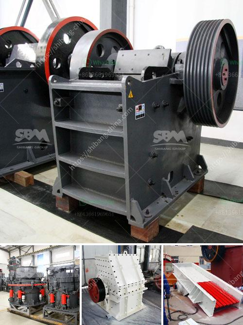

<h3>rock crusher machine malaysia</h3>
Rock crusher machine in Malaysia, also called rock crushing machine, is a stone crushing machine used for crushing rocks into small particles for building aggregates, sand production, construction waste recycling, and rock quarries. This rock crushing machine mainly consists of jaw crusher, impact crusher, cone crusher, hammer crusher, and mobile crusher. It can crush rocks of various hardnesses and sizes, making it an essential tool for any mining or construction project.

One of the main advantages of using a rock crusher machine is its versatility. It can be used to crush a variety of materials, including concrete, asphalt, and natural stones. This makes it ideal for different applications, such as road construction, building construction, and landscaping. The machine also comes with various attachments, such as grapples and hammers, which allow for even more versatility and efficiency in different tasks.

In Malaysia, the demand for rock crusher machines is growing rapidly due to the increasing construction projects, infrastructure development, and road construction projects. These projects require a large amount of aggregate and sand, which are essential for the construction process. Rock crusher machines are used to produce various sizes of rocks for different construction purposes. Rock crusher machines also play an important role in the recycling industry, where they are used to break down and recycle construction waste and old materials.

The rock crusher machines in Malaysia come in different sizes. Depending on the desired output size of the crushed stone, the raw material may be fed into the crusher machines manually or by using a conveyor belt system. These machines use a high-speed rotor that rotates at high speed, allowing the rocks to collide with the rotor and break into smaller pieces.

When using a rock crusher machine, safety is of utmost importance. Operators should be trained on how to operate the machine properly and follow all safety precautions. They should wear appropriate personal protective equipment, such as safety goggles, gloves, and ear protection. Regular maintenance and inspection of the machine are also essential to ensure its proper functioning and prevent accidents.

In conclusion, rock crusher machines are essential tools for various construction projects in Malaysia. They are used to crush rocks into smaller particles for the production of aggregates, sand, and recycling purposes. These machines come in different sizes and can be used in a variety of applications, such as road construction, building construction, and landscaping. Safety should be a priority when operating a rock crusher machine, and regular maintenance is necessary to ensure its proper functioning. Overall, the rock crusher machines in Malaysia provide an efficient and reliable solution for crushing rocks and contributing to the construction industry.
<h3>Contact us</h3><ul><li><strong>Whatsapp:&nbsp;<a href="https://wa.me/8613661969651">+8613661969651</a></strong></li><li><a href="https://swt.shibang-china.com/?git&amp;zhl&amp;rock crusher machine malaysia"><strong>Online Service(chat now)</strong></a></li></ul><h3>Related</h3><ul><li><a href='used raymond mill for sale.md'>used raymond mill for sale</a></li><li><a href='500 tone gypsum powder manufacture pant.md'>500 tone gypsum powder manufacture pant</a></li><li><a href='objective of ball mill machine.md'>objective of ball mill machine</a></li><li><a href='ykn vibrating screen manufacturer.md'>ykn vibrating screen manufacturer</a></li><li><a href='125 hp cone crusher.md'>125 hp cone crusher</a></li></ul>