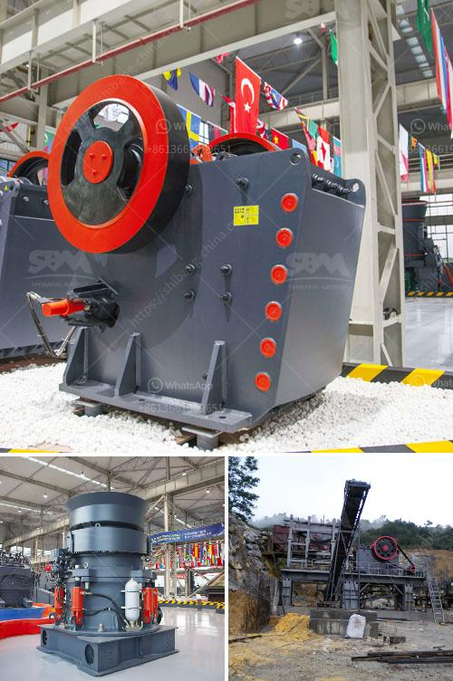

<h3>rock crusher plant cost</h3>
Rock Crusher Plant Cost: The choice of rock crusher machine equipment determines the cost of the entire production line. The parts and service cost of a rock crushing plant will increase as the size of the project increases. To estimate the cost of a rock crusher plant, certain factors that affect the cost of manufacturing must be taken into account.

The harder the material, the higher the crushing cost. For example, granite is harder to break than limestone. Therefore, the crusher's consumption of wear-resistant parts is higher when processing granite.

The input size of the raw materials affects the throughput rate of the crushing equipment. Smaller input size requires a smaller capacity crusher, reducing the cost of the rock crushing plant.

The capacity and output size requirement of the project determine the crusher model that needs to be selected. Higher capacity and smaller output size requirements often require more expensive equipment, which will increase the overall project cost.

The design and layout of the rock crushing plant impact the effectiveness and efficiency of the entire production line. A well-designed plant layout balances the initial investment cost and operational cost, while reducing the need for rework during construction.

The energy consumption of the rock crusher plant is directly related to the operating cost. Energy-efficient machines tend to have lower operating costs than less energy-efficient counterparts. It is essential to select an energy-efficient rock crusher plant to save operational costs in the long run.

Regular maintenance and prompt repair of the rock crushing plant can prolong its service life. Neglecting maintenance can lead to more significant repair costs or even equipment failure. Investing in a preventive maintenance program can help lower overall costs by reducing unexpected breakdowns and extending the life of equipment parts.

The number of staff required to operate the rock crushing plant affects the overall cost. Labor costs can be reduced by automation and advanced technology to optimize the entire production process. However, skilled operators may still be needed to ensure smooth operation and proper maintenance.

In conclusion, when estimating the cost of a rock crusher plant, various factors must be considered, including material hardness, input size, capacity and output size requirements, plant design and layout, energy consumption, maintenance and repair costs, and labor costs. Each factor contributes to the overall cost of the project. By carefully analyzing these factors and implementing cost-saving measures, the cost of a rock crusher plant can be minimized without compromising the quality and efficiency of the production line.
<h3>Contact us</h3><ul><li><strong>Whatsapp:&nbsp;<a href="https://wa.me/8613661969651">+8613661969651</a></strong></li><li><a href="https://swt.shibang-china.com/?git&amp;zhl&amp;rock crusher plant cost"><strong>Online Service(chat now)</strong></a></li></ul><h3>Related</h3><ul><li><a href='grinding machinery manufecture in africa.md'>grinding machinery manufecture in africa</a></li><li><a href='production of cement in guinee.md'>production of cement in guinee</a></li><li><a href='quick lime production process.md'>quick lime production process</a></li><li><a href='clay graphite grinding process.md'>clay graphite grinding process</a></li><li><a href='portable rock crusher for sale.md'>portable rock crusher for sale</a></li></ul>