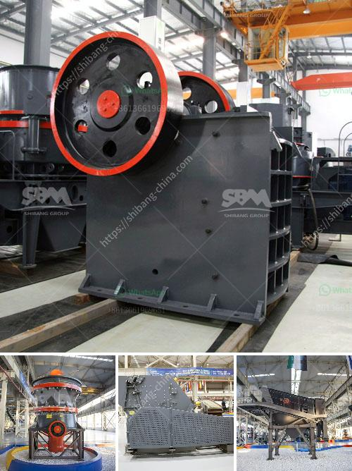

<h3>rock crusher plant</h3>
A rock crusher plant, also known as a stone crusher plant, can break rocks into gravel, smaller rocks, or even miniscule dust particles. It is designed to efficiently process a variety of materials, including crushed stones, rocks, and minerals, so it can be used for multiple applications. In many cases, it is also used as a primary crusher to reduce large rocks into smaller pieces before further processing.

The rock crusher plant works by using a high-speed rotating hammer to crush the rocks into smaller sizes. It features several hammers that spin rapidly and grind the rocks into pieces before they are expelled through an opening at the bottom. The crushed rocks can then be used for various construction purposes or as raw materials for manufacturing.

These plants are especially beneficial for construction companies and quarry operators. By having a rock crusher plant on-site, they can easily crush and reuse materials, reducing the need for hauling and disposing of waste rock. It also allows for the production of graded materials, ensuring that only high-quality materials are used for construction projects.

Moreover, a rock crusher plant can significantly increase productivity by efficiently handling a large volume of raw materials. With the capacity to process up to several hundred tonnes of rock per hour, it allows for faster and more efficient processing, thereby reducing downtime and increasing overall productivity.

Furthermore, a rock crusher plant is designed to be environmentally friendly. It incorporates dust suppression systems to minimize dust emissions, and modern models utilize advanced technology to reduce noise pollution. Additionally, some plants are equipped with advanced filtration systems to reduce air and water pollution generated during the crushing process.

In conclusion, a rock crusher plant is an essential piece of equipment for any construction company or quarry operator. It provides multiple benefits by efficiently crushing and processing a variety of materials. Its ability to handle large volumes and produce high-quality materials makes it a valuable asset in the construction industry.
<h3>Contact us</h3><ul><li><strong>Whatsapp:&nbsp;<a href="https://wa.me/8613661969651">+8613661969651</a></strong></li><li><a href="https://swt.shibang-china.com/?git&amp;zhl&amp;rock crusher plant"><strong>Online Service(chat now)</strong></a></li></ul><h3>Related</h3><ul><li><a href='stone crusher design.md'>stone crusher design</a></li><li><a href='feldspar grinding machine manufacturers in india.md'>feldspar grinding machine manufacturers in india</a></li><li><a href='cheap stone crushing plant.md'>cheap stone crushing plant</a></li><li><a href='stone crusher installation cost business.md'>stone crusher installation cost business</a></li><li><a href='marble processing plant in uae.md'>marble processing plant in uae</a></li></ul>