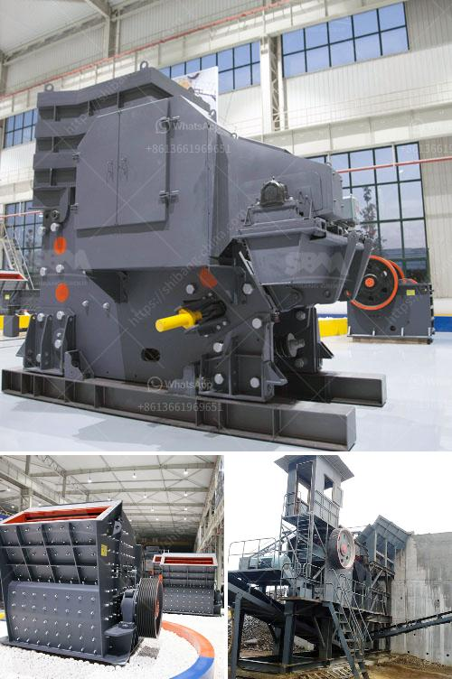

<h3>rock crusher portable</h3>
The mining industry has always been at the forefront of technological advancements. The entire process of extracting valuable minerals and resources from the earth demands an intricate network of heavy machinery, highly skilled workers, and cutting-edge equipment. In recent years, the rock crusher portable has emerged as a game-changer and revolutionized the mining sector.

A rock crusher is a machine used to break down big rocks into smaller pieces or gravel. It not only reduces the size of the raw material but also eliminates impurities or unwanted materials from the rocks. This process makes it easier for mining companies to extract the desired minerals and fuels efficiently.

The advent of portable rock crushers has brought tremendous convenience to the mining industry. Traditionally, rock crushers were massive structures fixed permanently at one location. They were not easily transportable and required significant effort to set up and dismantle. However, with advancements in technology, a portable rock crusher has become a reality. It eliminates the need for massive machinery and simplifies the mining process.

One key advantage of a portable rock crusher is its flexibility and mobility. Unlike their stationary counterparts, portable rock crushers can be transported to different locations as required. Whether it is a small-scale mining project or a large-scale excavation, the ability to move the rock crusher from one site to another significantly enhances efficiency. It allows mining companies to access remote and otherwise inaccessible areas, maximizing the potential for extraction.

Another benefit of a portable rock crusher is its ability to crush a variety of rocks and minerals. Mining sites often have different types of rocks with varying characteristics. A portable rock crusher can efficiently process a wide range of materials, including limestone, granite, marble, basalt, or any other type of stone. This versatile equipment saves time and effort in identifying the specific rock type and secures a continuous supply of crushed materials.

Furthermore, the rock crusher portable minimizes the environmental impact of mining activities. Traditionally, mining operations have often resulted in the destruction of vast areas of land. However, portable rock crushers are designed to be low-noise and environmentally friendly, reducing dust and noise pollution. This ensures a sustainable approach to mining by minimizing the impact on local ecosystems and communities.

The rock crusher portable, combined with technological advancements in automation and remote control capabilities, offers an added layer of safety to mining operations. Operators can remotely control and monitor the rock crusher, eliminating the risk of human error or accidents. Real-time monitoring systems provide accurate data and insights, enabling mining companies to make informed decisions and prevent potential hazards.

In conclusion, the rock crusher portable has revolutionized the mining industry by streamlining the extraction process. Its flexibility, mobility, and versatility make it an indispensable tool for mining companies worldwide. The ability to transport the crusher and process various rock types efficiently has not only improved productivity but also reduced the impact on the environment. As mining continues to evolve, the rock crusher portable is destined to remain a crucial innovation in this ever-growing industry.
<h3>Contact us</h3><ul><li><strong>Whatsapp:&nbsp;<a href="https://wa.me/8613661969651">+8613661969651</a></strong></li><li><a href="https://swt.shibang-china.com/?git&amp;zhl&amp;rock crusher portable"><strong>Online Service(chat now)</strong></a></li></ul><h3>Related</h3><ul><li><a href='cone crusher for sale.md'>cone crusher for sale</a></li><li><a href='manufacturing equipments of lime stone milling.md'>manufacturing equipments of lime stone milling</a></li><li><a href='crusher on rent basis in nigeria.md'>crusher on rent basis in nigeria</a></li><li><a href='aggregate for cement block making.md'>aggregate for cement block making</a></li><li><a href='rock cutting and grinding machine price.md'>rock cutting and grinding machine price</a></li></ul>