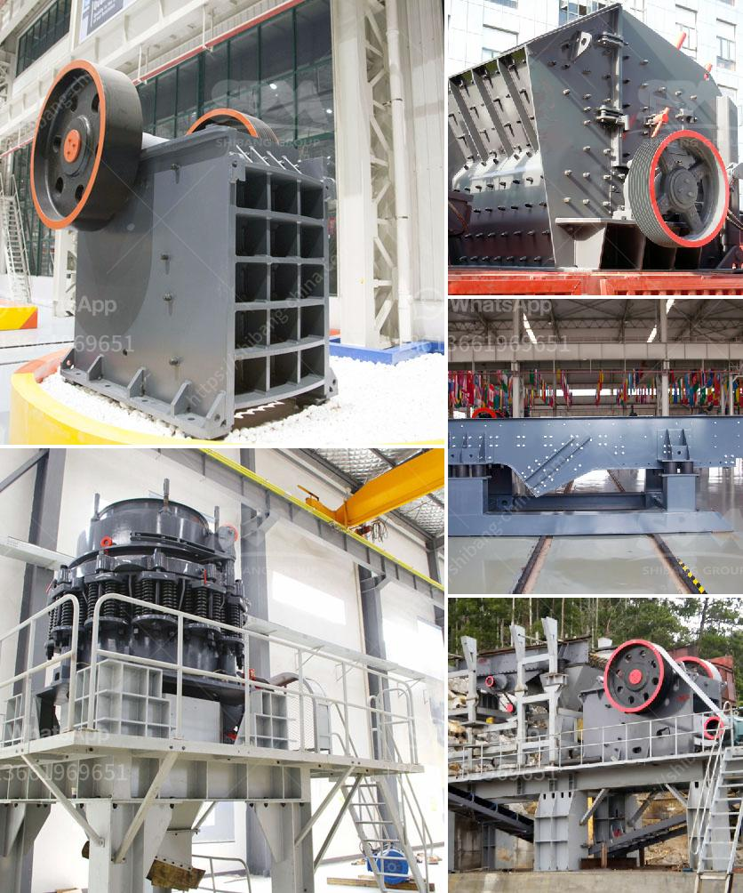

<h3>rock crusher suppliers in malaysia</h3>
Malaysia is a country with a rich natural resource of oil and gas. As such, there have been numerous rock crushing plants around Malaysia. These plants have been growing in number, and now the country seems to have enough crushing plants for all of them. However, the crushing plant sales in Malaysia have been growing steadily in recent years, which indicates that the industry is prospering.

By keeping a regular eye on the industry, you will be able to understand the market demand and find the best rock crusher suppliers in Malaysia. Just like in any other industry, there are good and bad suppliers. Therefore, it is essential to vet each potential supplier before making the final decision.

The first step in finding reliable rock crusher suppliers is conducting a proper market research. It's crucial to determine the specific requirements of your crushing plant, including the capacity, model, and brand of the machinery needed. Once you have a clear idea of what you need, you can start searching for potential suppliers.

One way to find reliable rock crusher suppliers is through online directories. These directories provide detailed information about various suppliers, including their contact details, product range, and customer reviews. By going through these directories, you can shortlist a few potential suppliers that meet your requirements.

Another way to find rock crusher suppliers in Malaysia is by attending trade shows and exhibitions related to the crushing industry. These events provide an excellent platform for suppliers to showcase their products and services. By attending these events, you can directly interact with suppliers and get a better understanding of their offerings.

Once you have shortlisted a few potential suppliers, it's essential to visit their manufacturing facilities or offices. This will give you a firsthand experience of their operations and help you assess their reliability and competence. During the visit, you can also discuss your requirements in detail and check if the supplier can meet them.

In addition to visiting suppliers, it's also necessary to check their track record by contacting their past clients. Ask for references and contact these clients to inquire about their experience with the supplier. This will help you gain insights into the supplier's professionalism, product quality, and customer service.

Finally, before making the final decision, compare the prices and offerings of different suppliers. Don't just focus on the cost, but also take into consideration the quality and reliability of the products. It's worth investing in a high-quality rock crusher that will offer long-term performance and minimal downtime.

In conclusion, finding reliable rock crusher suppliers in Malaysia is vital for the growth of the crushing industry. So, invest time and effort in the research process to weed out the bad suppliers and find the best ones that can cater to your specific needs. This will ensure that your crushing plant operates efficiently and effectively, leading to increased productivity and profitability.
<h3>Contact us</h3><ul><li><strong>Whatsapp:&nbsp;<a href="https://wa.me/8613661969651">+8613661969651</a></strong></li><li><a href="https://swt.shibang-china.com/?git&amp;zhl&amp;rock crusher suppliers in malaysia"><strong>Online Service(chat now)</strong></a></li></ul><h3>Related</h3><ul><li><a href='gold mining equipment nevada oregon used rock crushers.md'>gold mining equipment nevada oregon used rock crushers</a></li><li><a href='crushing stone machines for sale in usa.md'>crushing stone machines for sale in usa</a></li><li><a href='crawler mobile crushing plants.md'>crawler mobile crushing plants</a></li><li><a href='clay kaolin processing equipment.md'>clay kaolin processing equipment</a></li><li><a href='manufacture of vibrating screens.md'>manufacture of vibrating screens</a></li></ul>