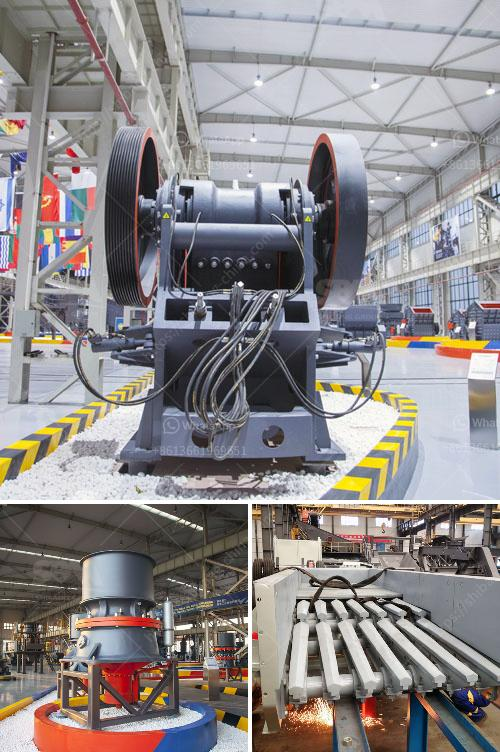

<h3>rock crushers in china</h3>
China is known for its bustling cities, ancient history, and rich culture. However, there is another side to this vast country that often goes unnoticed - its robust mining industry. At the heart of this industry are rock crushers, a fundamental piece of equipment used for breaking down rocks and minerals into smaller, more manageable pieces. In China, where the demand for construction materials is soaring, these machines are true unsung heroes.

Rock crushers, also known as stone crushers, are machines used to break down rocks and minerals into smaller pieces for further processing. They are commonly used in mining, construction, and recycling industries. The primary goal of a rock crusher is to produce high-quality aggregate for various applications, such as road construction, concrete production, and building materials.

China, with its rapid urbanization and massive infrastructure projects, has a significant demand for high-quality aggregates. This demand has led to a surge in the rock crusher industry within the country. Chinese manufacturers have taken advantage of this opportunity and have developed technologically advanced rock crushers that meet industry demands.

One of the key reasons China has become a leading force in the rock crusher industry is its abundance of natural resources. The country is home to a vast range of minerals and rocks that can be used as aggregates. From quartz to granite and limestone, China has an abundant supply of raw materials for rock crushing. This, coupled with the advanced machinery and skilled workforce, has enabled the country to become a global leader in rock crusher production.

Chinese rock crushers are renowned for their durability and efficiency. Many designs incorporate cutting-edge technology, such as hydraulic systems and advanced crushing mechanisms, which enable them to handle even the hardest rocks. These machines are built to withstand harsh conditions, ensuring longevity and maintaining high productivity levels.

In addition to their exceptional performance, Chinese rock crushers also boast competitive pricing. Chinese manufacturers have made significant investments in research and development, allowing them to optimize production processes and reduce overall costs. As a result, Chinese rock crushers often offer excellent value for money compared to their international counterparts.

Despite their importance to China's mining industry, rock crushers rarely receive the recognition they deserve. These machines work tirelessly, breaking rocks into smaller particles that eventually pave the way for construction projects that shape the nation's landscape. Yet, their contributions remain largely hidden behind the scenes, overshadowed by skyscrapers and bustling cities.

Moving forward, China's rock crusher industry is poised for further growth as the country continues to invest heavily in infrastructure development. Mega-projects like the Belt and Road Initiative, which aims to enhance connectivity and improve trade between China and the rest of the world, will drive demand for high-quality aggregates, requiring more robust rock crushers.

In conclusion, China's rock crushers are vital to the country's mining industry, playing a key role in the extraction and production of aggregates. These machines are durable, efficient, and competitively priced, making them indispensable for construction projects in China and beyond. As China's infrastructure ambitions continue to soar, rock crushers will remain unsung heroes powering the nation's development.
<h3>Contact us</h3><ul><li><strong>Whatsapp:&nbsp;<a href="https://wa.me/8613661969651">+8613661969651</a></strong></li><li><a href="https://swt.shibang-china.com/?git&amp;zhl&amp;rock crushers in china"><strong>Online Service(chat now)</strong></a></li></ul><h3>Related</h3><ul><li><a href='clinker grinding unit for cement clinker in india.md'>clinker grinding unit for cement clinker in india</a></li><li><a href='cracker roller mill limestone.md'>cracker roller mill limestone</a></li><li><a href='cheap used jaw rock crushers for sale.md'>cheap used jaw rock crushers for sale</a></li><li><a href='how to wash sand for construction.md'>how to wash sand for construction</a></li><li><a href='equipment used for crushing in activated carbon.md'>equipment used for crushing in activated carbon</a></li></ul>